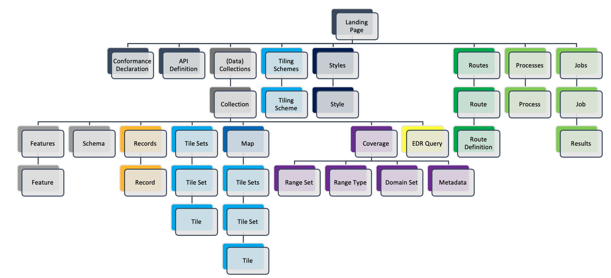

# OGC API - Common

!!! abstract Audience
    Students that are familiar with web services and APIs, and want to have
    an overview of OGC API - Common draft standard

!!! abstract "Learning Objectives"
    At the completion of the module students will be able to:

    - Explain what the OGC API - Common standard is
    - Describe what can be done with OGC API - Common as a building block

## Introduction

[OGC API - Common](https://ogcapi.ogc.org/common) specifies building blocks that are shared by most or all OGC API Standards to ensure consistency across the family.  In the course of developing Resource Oriented Architectures and Web APIs, some practices proved to be common accross all OGC API standards. The purpose of this standard is to document those practices. It also serves as a **common foundation** upon which all OGC APIs will be built. 

!!! note
    This tutorial module is not intended to be a replacement to the actual
    **OGC API - Common - Part 1: Core** standard. The tutorial
    intentionally focuses on a subset of capabilities in order to get the
    student started with using the standard. Please refer to the **OGC API -
    Common - Part 1: Core** standard for additional detail.

### Background

> History
 
  OGC API Common standard serves as the "OWS Common" standard for OGC Resource Oriented APIs. The OGC API - Common SWG charter was created in 2020 OGC API - Common - Part 1: Core was approved on February 2023.

> Versions

  **OGC API - Common - Part 1: Core** version 1.0.0 is the current
  latest version

#### Usage

This specification identifies resources, captures compliance classes, and specifies requirements which are applicable to all OGC API standards.  It should be included as a normative reference by all such standards.

* The **OGC API - Common - Part 1: Core** Standard defines the resources and operations which SHALL be common to all OGC API standards. This Standard defines the minimal requirements for an API to be discovered and used by any client.
* The Draft **OGC API - Common - Part 2: Geospatial Data** Standard provides a common connection between the API landing page and resource-specific details. That connection includes metadata which describes the collections of hosted resources, common parameters for selecting subsets of those collections, and URI templates for identifying the above.

In addition, OGC API - Common provides some non-normative information through the [OGC API-Common Users Guide](https://docs.ogc.org/DRAFTS/20-071.html).

#### Relation to other standards

The image below shows the resource architecture in OGC API. OGC API - Common provides a common foundation to all OGC APIs.

{width="100.0%"}

<!-- The [OpenAPI](https://www.openapis.org/) specification is used to define the reusable API building blocks. -->

### Overview of Resources

**OGC API - Common - Part 1: Core** defines the resources listed in
the following table:

<table>
  <tr>
    <th>Resource</th>
    <th>Method</th>
    <th>Path</th>
    <th>Purpose</th>
  </tr>
  <tr>
    <td>Landing page</td>
    <td>GET</td>
    <td>/</td>
    <td>Retrieves the landing page. The purpose of the landing page is to provide clients with a starting point for using the API. Any resource exposed through an API can be accessed by following paths or links starting from the landing page. The landing page includes three metadata elements; title, description, and attribution. Only the title is required. These three elements describe the API as a whole. Clients can expect to encounter metadata which is more resource-specific as they follow links and paths from the landing page.</td>
  </tr>
  <tr>
    <td>Conformance declaration</td>
    <td>GET</td>
    <td>/conformance</td>
    <td>Provides a list declaring the modules that are implemented by the API. These modules are referred to as Conformance Classes. The list of Conformance Classes is key to understanding and using an OGC Web API.</td>
  </tr>
  <tr>
    <td>API definition</td>
    <td>GET</td>
    <td>/api</td>
    <td>Retrieves the API definition which describes the capabilities provided by that API. This resource can be used by developers to understand the API, by software clients to connect to the server, and by development tools to support the implementation of servers and clients. Note use of /api on the server is optional and the API definition may be hosted on completely separate server.</td>
  </tr>
</table>

The purpose of the draft **OGC API - Common - Part 2: Geospatial Data** Standard is to provide a common connection between the API landing page and resource-specific details. The table below defines the resources listed in this part.

<table>
  <tr>
    <th>Resource</th>
    <th>Method</th>
    <th>Path</th>
    <th>Purpose</th>
  </tr>
  <tr>
    <td>Collections</td>
    <td>GET</td>
    <td>/collections </td>
    <td>Retrieves information which describes the set of supported Collections.</td>
  </tr>
  <tr>
    <td>Collection</td>
    <td>GET</td>
    <td>/collections/{collectionId}</td>
    <td>Retrieves descriptive information about a specific Collection.</td>
  </tr>
</table>

Providing a **common foundation**, OGC API - Common is meant to be implemented by "downstream" OGC API standards
in a uniform and consistent manner.  Examples of OGC API - Common resources will be shown in the context of other OGC API standards.
