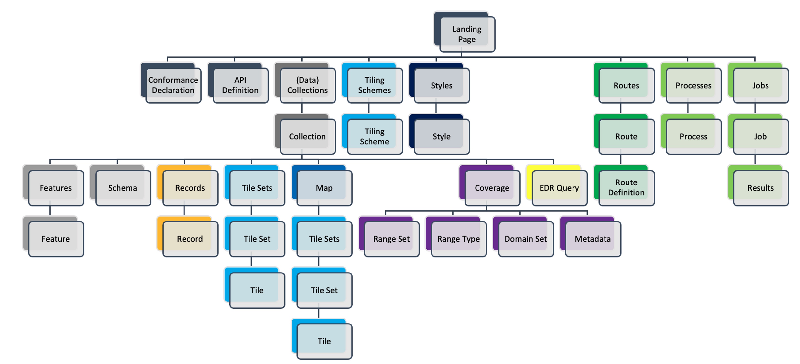

# OGC API - Common

!!! abstract "Público-alvo"
    Estudantes que estejam familiarizados com serviços web e APIs, e queiram ter
    uma visão geral do padrão de rascunho OGC API - Common

!!! abstract "Objetivos de Aprendizagem"
    Após a conclusão do módulo, os estudantes serão capazes de:

    - Explicar o que é o padrão OGC API - Common
    - Descrever o que pode ser feito com o OGC API - Common como bloco de construção

## Introdução

A [OGC API - Common](https://ogcapi.ogc.org/common) especifica blocos de construção que são partilhados pela maioria ou por todas as Normas da OGC API, a fim de garantir a consistência em toda a família. No decorrer do desenvolvimento de Arquiteturas Orientadas a Recursos e APIs Web, algumas práticas revelaram-se comuns a todos os padrões da OGC API. A finalidade deste padrão é documentar essas práticas. Também serve como uma **base comum** sobre a qual todas as OGC APIs serão construídas.

!!! note
    Este módulo de tutorial não tem a intenção de ser um substituto do próprio
    padrão **OGC API - Common - Part 1: Core** ou do padrão em rascunho **OGC API - Common - Part 2: Geospatial Data**. O tutorial
    foca-se intencionalmente num subconjunto de capacidades a fim de começar com
    a utilização do padrão. Consulte o [padrão **OGC API -
    Common - Part 1: Core**](https://docs.ogc.org/is/19-072/19-072.html) e o [padrão em rascunho **OGC API - Common - Part 2: Geospatial Data**](https://docs.ogc.org/DRAFTS/20-024.html) para mais detalhes.

### Antecedentes

> História

  O padrão OGC API Common serve como o padrão "OWS Common" para APIs Orientadas a Recursos da OGC. A carta do SWG da OGC API - Common foi criada em 2020 e a OGC API - Common - Part 1: Core foi aprovada em fevereiro de 2023.

> Versões

  A versão 1.0.0 da **OGC API - Common - Part 1: Core** é a versão
  mais recente atual

#### Utilização

Esta especificação identifica recursos, captura classes de conformidade e especifica requisitos que são aplicáveis a todos os padrões da OGC API. Deve ser incluída como referência normativa por todos esses padrões.

* O padrão **OGC API - Common - Part 1: Core** define os recursos e operações que DEVE ter em comum todos os padrões da OGC API. Este padrão define os requisitos mínimos para que uma API seja descoberta e utilizada por qualquer cliente.
* O padrão em rascunho **OGC API - Common - Part 2: Geospatial Data** fornece uma ligação comum entre a página de aterragem da API e os detalhes específicos do recurso. Essa ligação inclui metadados que descrevem as coleções de recursos alojados, parâmetros comuns para selecionar subconjuntos dessas coleções e modelos URI para identificar os mesmos.
* O padrão candidato em rascunho **OGC API - Common Part 3/OGC API - Features - Part 5: Schemas** permite descrever o esquema lógico associado a uma coleção de dados geoespaciais.
* O padrão candidato em rascunho **OGC API - Common Part 4: Discovery within many collections** estende o endpoint ```/collections``` definido na Parte 2 com parâmetros de consulta para recuperar apenas um subconjunto das coleções; útil para implementações de API onde um grande número de coleções está disponível.

Além disso, a OGC API - Common fornece alguma informação não normativa através do [Guia do Utilizador da OGC API - Common](https://docs.ogc.org/DRAFTS/20-071.html).

#### Relação com outros padrões

A imagem abaixo mostra a arquitetura de recursos na OGC API. A OGC API - Common fornece uma base comum a todas as OGC APIs.

{width="100.0%"}

<!-- A especificação [OpenAPI](https://www.openapis.org/) é utilizada para definir os blocos de construção de API reutilizáveis. -->

### Visão geral dos Recursos

**A OGC API - Common - Part 1: Core** define os recursos listados na
tabela seguinte:

<table>
  <tr>
    <th>Recurso</th>
    <th>Método</th>
    <th>Caminho</th>
    <th>Finalidade</th>
  </tr>
  <tr>
    <td>Página de aterragem</td>
    <td>GET</td>
    <td>/</td>
    <td>Recupera a página de aterragem. A finalidade da página de aterragem é fornecer aos clientes um ponto de partida para usar a API. Qualquer recurso exposto através de uma API pode ser acedido seguindo caminhos ou ligações a partir da página de aterragem. A página de aterragem inclui três elementos de metadados; título, descrição e atribuição. Apenas o título é obrigatório. Estes três elementos descrevem a API como um todo. Os clientes podem esperar encontrar metadados que sejam mais específicos do recurso à medida que seguem ligações e caminhos a partir da página de aterragem.</td>
  </tr>
  <tr>
    <td>Declaração de conformidade</td>
    <td>GET</td>
    <td>/conformance</td>
    <td>Fornece uma lista declarando os módulos que são implementados pela API. Estes módulos são chamados Classes de Conformidade. A lista de Classes de Conformidade é fundamental para compreender e utilizar uma API Web da OGC.</td>
  </tr>
  <tr>
    <td>Definição da API</td>
    <td>GET</td>
    <td>/api</td>
    <td>Recupera a definição da API, que descreve as capacidades fornecidas por essa API. Este recurso pode ser utilizado por programadores para compreender a API, por clientes de software para ligar ao servidor, e por ferramentas de desenvolvimento para apoiar a implementação de servidores e clientes. Note que o uso de /api no servidor é opcional e a definição da API pode estar alojada num servidor completamente separado.</td>
  </tr>
</table>

A finalidade do padrão em rascunho **OGC API - Common - Part 2: Geospatial Data** é fornecer uma ligação comum entre a página de aterragem da API e os detalhes específicos do recurso. A tabela abaixo define os recursos listados nesta parte.

<table>
  <tr>
    <th>Recurso</th>
    <th>Método</th>
    <th>Caminho</th>
    <th>Finalidade</th>
  </tr>
  <tr>
    <td>Coleções</td>
    <td>GET</td>
    <td>/collections</td>
    <td>Recupera informação que descreve o conjunto de Coleções suportadas.</td>
  </tr>
  <tr>
    <td>Coleção</td>
    <td>GET</td>
    <td>/collections/{collectionId}</td>
    <td>Recupera informação descritiva sobre uma Coleção específica.</td>
  </tr>
</table>

Fornecendo uma **base comum**, a OGC API - Common destina-se a ser implementada por padrões "a jusante" da OGC API
de forma uniforme e consistente. Exemplos de recursos da OGC API - Common serão apresentados no contexto de outros padrões da OGC API.

## Resumo

A OGC API - Common documenta o conjunto de práticas comuns e requisitos partilhados que emergiram do desenvolvimento de Arquiteturas Orientadas a Recursos e APIs Web dentro da OGC. O padrão define recursos e mecanismos de acesso que são úteis para um cliente que procura compreender as ofertas e capacidades de uma API, bem como uma ligação entre a página de aterragem da API e os detalhes específicos do recurso. Neste aprofundamento, proporcionámos uma visão geral do padrão e olhamos para os recursos na parte 1 e parte 2 (em rascunho).
