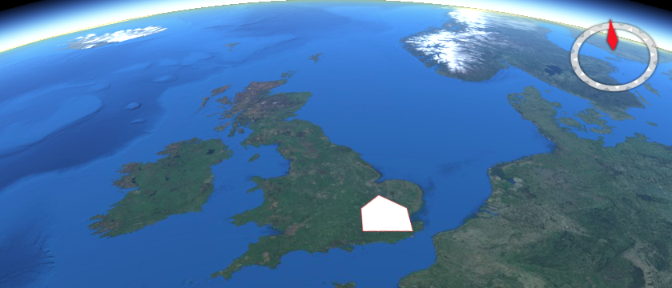
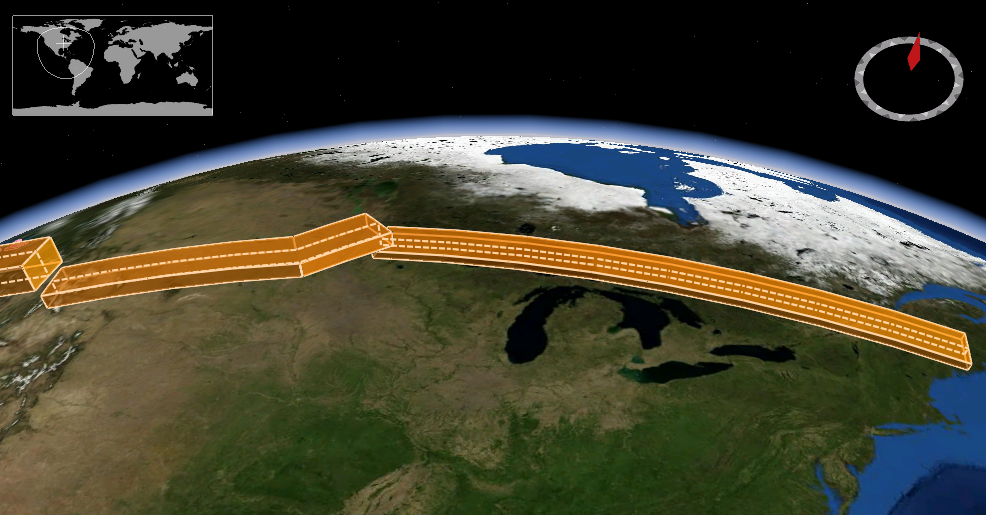
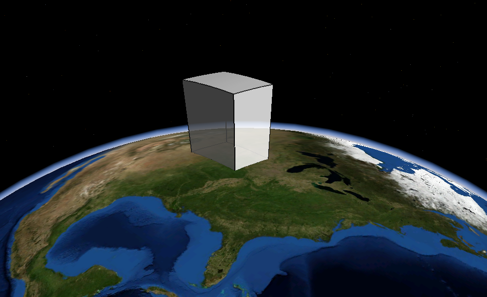
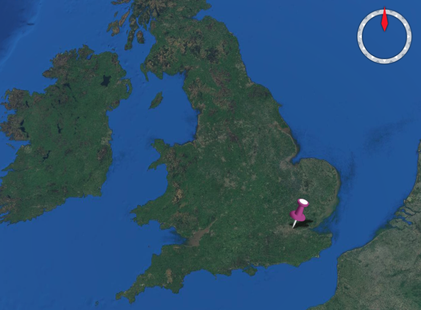
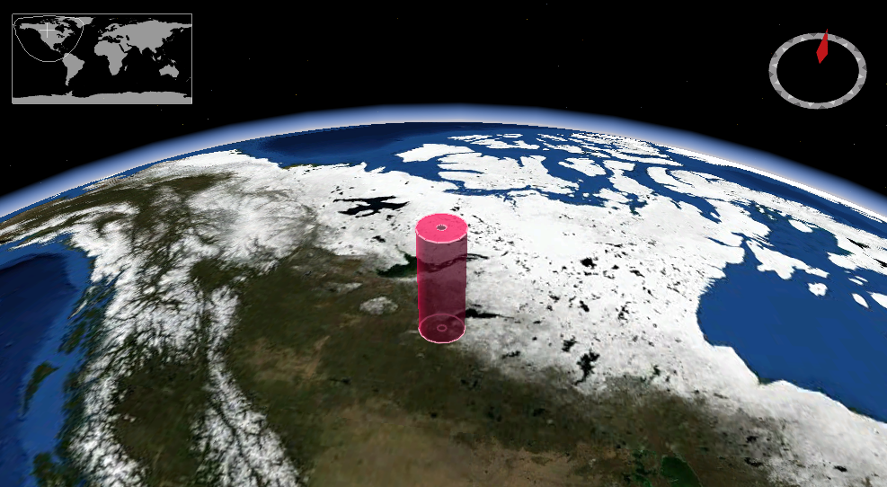
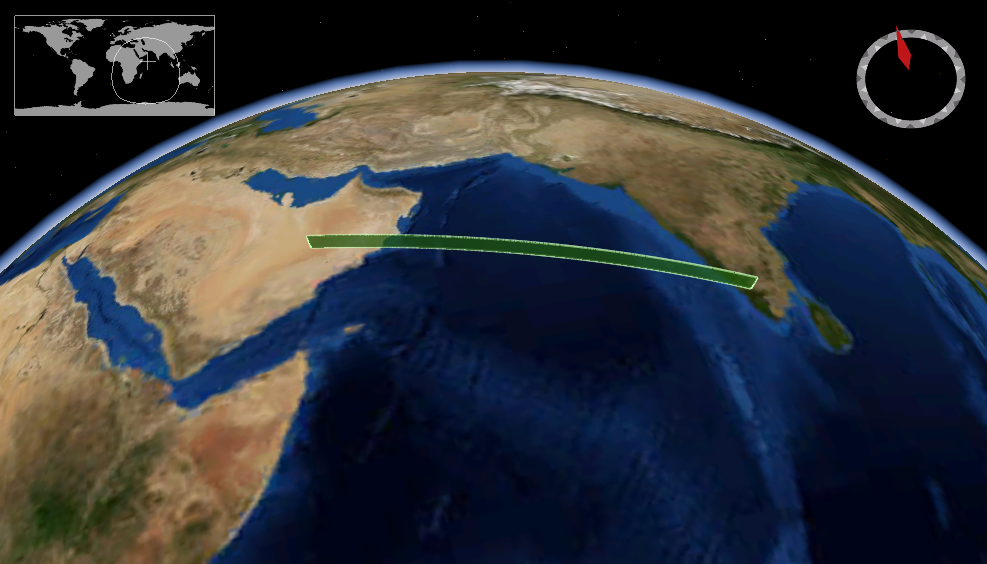

# OGC API - Environmental Data Retrieval

!!! abstract "Público-alvo"
    Estudantes que estejam familiarizados com serviços web e APIs, que desejam ter
    uma visão geral da norma OGC API - Environmental Data Retrieval

!!! abstract "Objetivos de Aprendizagem"
    Ao concluir o módulo, os estudantes serão capazes de:

    - Explicar o que é a norma OGC API - Environmental Data Retrieval
    - Descrever o que pode ser feito com implementações da OGC API - Environmental Data Retrieval
    - Compreender os principais recursos oferecidos por implementações da OGC API - Environmental Data Retrieval
    - Compreender como obter uma descrição das capacidades de uma implementação da OGC API - Environmental Data Retrieval
    - Compreender como fazer pedidos a uma implementação da OGC API - Environmental Data Retrieval
    - Conseguir encontrar um endpoint da OGC API - Environmental Data Retrieval e utilizá-lo através de um cliente

## Introdução

A [OGC API - Environmental Data Retrieval](https://ogcapi.ogc.org/edr) é uma norma que fornece uma
família de interfaces leves para aceder a recursos de dados ambientais.
A norma, também designada API de Recuperação de Dados Ambientais 
(EDR, pelas siglas em inglês), aborda duas operações fundamentais: descoberta e consulta.
As operações de descoberta permitem interrogar a API para determinar as suas
capacidades e recuperar informação (metadados) sobre a distribuição
de um recurso. Isto inclui a definição da API do servidor, bem como
metadados sobre os recursos de dados ambientais fornecidos pelo servidor.
As operações de consulta permitem recuperar recursos de dados ambientais a partir
da base de dados subjacente com base em critérios de seleção simples, definidos
por esta norma e selecionados pelo cliente.

!!! note
    Este módulo de tutorial não tem a intenção de substituir a própria norma
    **OGC API - Environmental Data Retrieval**. O tutorial concentra-se
    intencionalmente num subconjunto de capacidades com o propósito de ser uma iniciação à utilização da norma. Consulte a [norma da **OGC API -
    Environmental Data Retrieval**](https://docs.ogc.org/is/19-086r6/19-086r6.html) para mais detalhes.

### Antecedentes

> Histórico

  A versão 1.1.0 foi publicada em 2023-07-27.

> Versões

  A versão 1.1.0 do **OGC API - Environmental Data Retrieval** é a versão mais recente

> Suite de testes

  Está disponível uma suite de testes para:

  * OGC API - Environmental Data Retrieval - Parte 1

  Todas as suites de testes estão disponíveis no [OGC Validator](https://cite.ogc.org/teamengine/).

> Implementações

  As implementações podem ser encontradas na [página de implementações](https://github.com/opengeospatial/ogcapi-environmental-data-retrieval/tree/master/implementations).

#### Utilização

A **OGC API - Environmental Data Retrieval** fornece uma família de
interfaces de pesquisa leves para aceder a recursos de dados espácio-temporais
ao solicitar dados numa posição, numa área, ao longo de uma trajetória ou
através de um corredor. Um recurso de dados espácio-temporais é uma coleção de
dados espácio-temporais que pode ser amostrada utilizando as geometrias
de pesquisa da EDR.

A norma fornece uma interface padrão para solicitar dados
geoespaciais vetoriais, consistindo em entidades geográficas e respetivas propriedades.
A vantagem disto é que as aplicações cliente podem solicitar dados de origem
a múltiplas implementações da API e, em seguida, renderizar os dados para
exibição ou processá-los adicionalmente como parte de um fluxo de trabalho. A norma
permite que os dados sejam acedidos de forma consistente com outros dados. As propriedades
das entidades codificadas com tipos de dados comuns, como cadeias de texto, data
e hora, também podem ser acedidas de forma consistente.

#### Relação com outros standards da OGC

-   OGC API - Features: A API da EDR é completamente compatível com a OGC
    API - Features - Parte 1: Core (OGC 17-069r3), uma vez que
    suporta Collections e Items. Estende a funcionalidade de Collection
    permitindo «Instances», uma forma de «collection of
    collections». A API da EDR também suporta a recuperação de
    dados espácio-temporais por localização nomeada, bem como por coordenadas.
-   Moving Features: Os Standards Moving Features tratam de
    entidades que se movem ao longo de uma trajetória, mudando simultaneamente a sua
    orientação através de rotação de corpo rígido. A API da EDR não tem
    o conceito de orientação, foliação ou prismas. A Moving Features
    e a API da EDR partilham uma definição conceptual comum, da ISO, de
    Trajetória, mas a norma Moving Features codifica trajetórias em
    GML, CSV e Moving Features JSON, enquanto que a API da EDR codifica
    trajetórias em WKT.
-   Web Coverage Service (WCS) e Coverage Implementation Schema (CIS):
    O mecanismo principal de mensagens da API da EDR é JSON, incluindo
    CoverageJSON, sobre HTTP(S). As implementações da API da EDR são
    descritas utilizando a especificação OpenAPI V3.0. A API da EDR é
    consistente com as normas WCS e CIS, mas não exige que
    o utilizador final ou programador utilize os termos Domain e RangeSet. A API da EDR
    também pode ser utilizada para gerar uma única pesquisa contra uma coleção
    de coverages, desde que os sistemas de referência de coordenadas dos dados sejam
    consistentes.
-   A API OGC SensorThings: A API SensorThings segue a
    especificação OData para solicitar entidades. Em contraste, a API da EDR
    utiliza a especificação OpenAPI V3.0 para descrever recursos
    caminhos, opções de pesquisa, esquema JSON e outros aspetos. Além disso, a API da EDR permite a recuperação de
    dados de coverage e respostas HTML — ambos não sendo suportados pela API SensorThings.
-   Sensor Observation Service (SOS): A API da EDR permite a recuperação
    de dados de coverage e respostas HTML — ambos não sendo
    suportados pela norma SOS. Além disso, as implementações SOS utilizam a
    operação GetCapabilities para fornecer descrições de recursos
    disponíveis. Em contraste, a API da EDR utiliza definições
    OpenAPI para descrever as interfaces disponíveis.

### Visão geral dos recursos

A **norma OGC API - Environmental Data Retrieval** define os
recursos listados na tabela seguinte.

<table>
<caption>Visão geral dos recursos OGC API - EDR</caption>
  <tr>
    <th>Recurso</th>
    <th>Método</th>
    <th>Caminho</th>
    <th>Propósito</th>
  </tr>
  <tr>
    <td>Página de aterragem</td>
    <td>GET</td>
    <td>/</td>
    <td>Este é o recurso de nível superior, que serve como ponto de entrada.</td>
  </tr>
  <tr>
    <td>Declaração de conformidade</td>
    <td>GET</td>
    <td>/conformance</td>
    <td>Este recurso apresenta informação sobre a funcionalidade implementada pelo servidor.</td>
  </tr>
  <tr>
    <td>Definição da API</td>
    <td>GET</td>
    <td>/api</td>
    <td>Este recurso fornece metadados sobre a API propriamente dita. Note que a utilização de /api no servidor é opcional e a definição da API pode estar alojada num servidor completamente separado.</td>
  </tr>
  <tr>
    <td>Metadados das coleções</td>
    <td>GET</td>
    <td>/collections</td>
    <td>Metadados que descrevem as coleções de dados disponíveis nesta API.</td>
  </tr>
  <tr>
    <td>Metadados de uma coleção</td>
    <td>GET</td>
    <td>/collections/{collectionId}</td>
    <td>Metadados que descrevem a coleção de dados que tem o identificador único {collectionId}.</td>
  </tr>
  <tr>
    <td>Metadados dos itens</td>
    <td>GET</td>
    <td>/collections/{collectionId}/items</td>
    <td>Recuperar metadados sobre os itens disponíveis.</td>
  </tr>
  <tr>
    <td>Pesquisa de dados</td>
    <td>GET</td>
    <td>/collections/{collectionId}/{queryType}</td>
    <td>Recuperar dados de acordo com o padrão de pesquisa</td>
  </tr>
  <tr>
    <td>Pesquisa de instâncias</td>
    <td>GET</td>
    <td>/collections/{collectionId}/instances</td>
    <td>Recuperar metadados sobre instâncias de uma coleção</td>
  </tr>
</table>

### Exemplo

O [servidor de demonstração](http://labs.metoffice.gov.uk/edr) publica
dados ambientais através de uma interface que está em conformidade com a norma OGC API -
Environmental Data Retrieval. Uma aplicação cliente está disponível
[aqui](http://labs.metoffice.gov.uk/edr/static/html/query.html).

Um exemplo de pedido que pode ser usado para recuperar dados da coleção "Global Population
Density" encontra-se
[aqui](https://labs.metoffice.gov.uk/edr/collections/global_pop_density/position?coords=POINT(-1.406%2054.157)&parameter-name=Pop_Density&crs=EPSG:4326&f=CoverageJSON)

Note que a resposta ao pedido é CoverageJSON, neste caso o formato de saída predefinido e único suportado.

## Recursos

Esta secção fornece informação básica sobre os tipos de recursos
que a OGC API - Environmental Data Retrieval oferece.

Cada recurso fornece **ligações** relacionadas com recursos. Isto permite
a uma aplicação cliente navegar pelos recursos, desde a Página de Aterragem
até às entidades individuais. O servidor identifica a
relação entre um recurso e outros recursos ligados através de um
**tipo de relação de ligação**, representado pelo atributo ```rel```. Os tipos
de relação de ligação utilizados por implementações da **OGC API - Environmental
Data Retrieval** podem ser encontrados na [Secção
6.2](https://docs.ogc.org/is/19-086r4/19-086r4.html#toc22) do
standard.

### Landing page

A Página de Aterragem é o recurso de nível superior que serve como ponto
de entrada. Uma aplicação cliente precisa de conhecer a localização da Página de Aterragem
do servidor. A partir da Página de Aterragem, a aplicação cliente pode
recuperar ligações para os caminhos da Declaração de Conformidade, Collection e Definição
da API. Um exemplo de Página de Aterragem está em
<http://labs.metoffice.gov.uk/edr>

A ligação para a definição da API é identificada através dos
tipos de relação de ligação ```service-desc``` e ```service-doc```.

A ligação para a Declaração de Conformidade é identificada através do tipo
de relação de ligação ```conformance```.

A ligação para as Coleções é identificada através do tipo ```data``` de relação
de ligação.

Um excerto da Página de Aterragem de um servidor de demonstração é mostrado abaixo.

```json
{
"title": "Environmental Data Retrevial API concept demonstrator",
"description": "Example EDR API (not for operational use)",
"keywords": [
  "position",
  "area",
  "cube",
  "trajectory",
  "weather",
  "data",
  "api"
],
"terms_of_service": "None",
"provider": {
  "name": "Organization Name",
  "url": "http://example.org"
},
"contact": {
  "email": "you@example.org",
  "phone": "+001-234-567-89",
  "fax": "+001-234-567-89",
  "hours": "Hours of Service",
  "instructions": "During hours of service.  Off on weekends.",
  "address": "Mailing Address",
  "postalcode": "Zip or Postal Code",
  "city": "City",
  "stateorprovince": "Administrative Area",
  "country": "Country"
},
"links": [
  {
    "href": "http://labs.metoffice.gov.uk/edr/api",
    "hreflang": "en",
    "rel": "service-doc",
    "type": "application/vnd.oai.openapi+json;version=3.0",
    "title": "",
    "variables": null
  },
  {
    "href": "http://labs.metoffice.gov.uk/edr/conformance",
    "hreflang": "en",
    "rel": "conformance",
    "type": "application/json",
    "title": "",
    "variables": null
  },
  {
    "href": "http://labs.metoffice.gov.uk/edr/collections",
    "hreflang": "en",
    "rel": "collection",
    "type": "application/json",
    "title": "",
    "variables": null
  }
]
}
```

### Declaração de conformidade

Uma implementação da OGC API - Environmental Data Retrieval descreve
as capacidades que suporta ao declarar que classes de conformidade que
implementa. A Declaração de Conformidade indica as classes de conformidade
de normas ou especificações da comunidade, identificadas por um URI,
a que a API está em conformidade. Os clientes podem, em seguida, utilizar esta informação,
embora não sejam obrigados a fazê-lo. Ao aceder à Declaração de Conformidade
através de HTTP GET, obtém-se a lista de URIs das classes de conformidade
implementadas pelo servidor. As classes de conformidade descrevem o comportamento que
o servidor deve implementar para cumprir um ou mais conjuntos de
requisitos especificados numa norma.

Abaixo segue um excerto da resposta ao pedido
<http://labs.metoffice.gov.uk/edr/conformance>

```json
{
 "conformsTo":[
    "http://www.opengis.net/spec/ogcapi-common-1/1.0/conf/core",
    "http://www.opengis.net/spec/ogcapi-common-2/1.0/conf/collections",
    "http://www.opengis.net/spec/ogcapi-edr-1/1.0/conf/core",
    "http://www.opengis.net/spec/ogcapi-edr-1/1.0/conf/oas30",
    "http://www.opengis.net/spec/ogcapi-edr-1/1.0/conf/html",
    "http://www.opengis.net/spec/ogcapi-edr-1/1.0/conf/geojson",
    "http://www.opengis.net/spec/ogcapi-edr-1/1.0/conf/coveragejson",
    "http://www.opengis.net/spec/ogcapi-edr-1/1.0/conf/wkt"
 ]
 }
```

### Definição da API

Dado que a OGC API - Environmental Data Retrieval utiliza a OGC API - Common como bloco de construção, consulte a [OGC API - Features](features.md#api-definition) para
uma explicação detalhada de uma implementação de exemplo.

### Metadados das coleções

Os dados oferecidos através de uma implementação da **OGC API - Environmental Data
Retrieval** são organizados numa ou mais coleções de entidades. O
recurso ```Collections``` fornece informação sobre e acesso à
lista de coleções.

Para cada coleção, existe uma ligação para a descrição detalhada da
coleção (representada pelo caminho **/collections/{collectionId}** e
relação de ligação **self**).

A seguinte informação é fornecida pelo servidor para descrever cada
coleção:

-   Um identificador local para a coleção que é único para o conjunto de dados
-   Uma lista de sistemas de referência de coordenadas (SRC) nos quais as geometrias podem ser retornadas pelo servidor
-   Um título e descrição opcionais para a coleção
-   Uma extensão opcional que pode ser utilizada para fornecer uma indicação da
    extensão espacial e temporal da coleção
-   Um indicador opcional sobre o tipo dos itens na coleção
    (o valor predefinido, caso o indicador não seja fornecido, é
    ```feature```).

Para cada coleção, existem ligações para recuperar dados de acordo com
os padrões de pesquisa suportados (representadas pelo caminho
**/collections/{collectionId}/{queryType}** e relação de ligação **data**).

Para cada coleção, existe uma ligação para os metadados sobre itens
disponíveis na coleção (representada pelo caminho
**/collections/{collectionId}/items** e relação de ligação **items**) e
outra informação sobre a coleção.

Abaixo segue um excerto da resposta ao pedido
<http://labs.metoffice.gov.uk/edr/collections>

```json
{
  "links": [
    {
      "href": "http://labs.metoffice.gov.uk/edr/collections",
      "hreflang": "en",
      "rel": "self",
      "type": "application/json"
    },
    {
      "href": "http://labs.metoffice.gov.uk/edr/collections?f=html",
      "hreflang": "en",
      "rel": "alternate",
      "type": "text/html"
    },
    {
      "href": "http://labs.metoffice.gov.uk/edr/collections?f=xml",
      "hreflang": "en",
      "rel": "alternate",
      "type": "application/xml"
    }
  ],
  "collections": [
    {
      "id": "metar_demo",
      "title": "Metar observations EDR demonstrator",
      "description": "API to access 24 hours of Global Metar Observation data (not for operational use)",
      "keywords": [
        "Metar observation",
        "ICAO identifier",
        "Wind Direction",
        "Wind Speed",
        "Wind Gust",
        "Visibility",
        "Air Temperature",
        "Dew point",
        "Runway Visibility",
        "Weather",
        "Sky condition",
        "Mean Sea Level Pressure",
        "Station Level Pressure",
        "description",
        "restrictions",
        "collection",
        "position",
        "radius",
        "area",
        "location"
      ],
      "links": [
        {
          "href": "https://www.aviationweather.gov/metar/help",
          "hreflang": "en",
          "rel": "service-doc",
          "type": "text/html",
          "title": ""
        },
        {
          "href": "https://www.weather.gov/disclaimer",
          "hreflang": "en",
          "rel": "restrictions",
          "type": "text/html",
          "title": ""
        },
        {
          "href": "http://labs.metoffice.gov.uk/edr/collections/metar_demo/",
          "hreflang": "en",
          "rel": "collection",
          "type": "collection",
          "title": ""
        },
        {
          "href": "http://labs.metoffice.gov.uk/edr/collections/metar_demo/position",
          "hreflang": "en",
          "rel": "data"
        },
        {
          "href": "http://labs.metoffice.gov.uk/edr/collections/metar_demo/radius",
          "hreflang": "en",
          "rel": "data"
        },
        {
          "href": "http://labs.metoffice.gov.uk/edr/collections/metar_demo/area",
          "hreflang": "en",
          "rel": "data"
        },
        {
          "href": "http://labs.metoffice.gov.uk/edr/collections/metar_demo/locations",
          "hreflang": "en",
          "rel": "data"
        }
      ],
      "extent": {
        "spatial": {
          "bbox": [
            -180.0,
            -89.9,
            180.0,
            89.9
          ],
          "crs": "GEOGCS[\"WGS 84\",DATUM[\"WGS_1984\",SPHEROID[\"WGS 84\",6378137,298.257223563,AUTHORITY[\"EPSG\",\"7030\"]],AUTHORITY[\"EPSG\",\"6326\"]],PRIMEM[\"Greenwich\",0,AUTHORITY[\"EPSG\",\"8901\"]],UNIT[\"degree\",0.01745329251994328,AUTHORITY[\"EPSG\",\"9122\"]],AUTHORITY[\"EPSG\",\"4326\"]]"
        },
        "temporal": {
          "interval": [
            "R36/2021-10-03T01:00Z/PT1H"
          ],
          "trs": "TIMECRS[\"DateTime\",TDATUM[\"Gregorian Calendar\"],CS[TemporalDateTime,1],AXIS[\"Time (T)\",future]"
        }
      },
      "data_queries": {
        "position": {
          "link": {
            "href": "http://labs.metoffice.gov.uk/edr/collections/metar_demo/position",
            "hreflang": "en",
            "rel": "data",
            "variables": {
              "title": "Position query",
              "query_type": "position",
              "output_formats": [
                "CoverageJSON",
                "GeoJSON",
                "IWXXM"
              ],
              "default_output_format": "GeoJSON",
              "crs_details": [
                {
                  "crs": "CRS84",
                  "wkt": "GEOGCS[\"WGS 84\",DATUM[\"WGS_1984\",SPHEROID[\"WGS 84\",6378137,298.257223563,AUTHORITY[\"EPSG\",\"7030\"]],AUTHORITY[\"EPSG\",\"6326\"]],PRIMEM[\"Greenwich\",0,AUTHORITY[\"EPSG\",\"8901\"]],UNIT[\"degree\",0.01745329251994328,AUTHORITY[\"EPSG\",\"9122\"]],AUTHORITY[\"EPSG\",\"4326\"]]"
                }
              ]
            }
          }
        },
        "radius": {
          "link": {
            "href": "http://labs.metoffice.gov.uk/edr/collections/metar_demo/radius",
            "hreflang": "en",
            "rel": "data",
            "variables": {
              "title": "Radius query",
              "description": "Radius query",
              "query_type": "radius",
              "output_formats": [
                "CoverageJSON",
                "GeoJSON",
                "IWXXM"
              ],
              "default_output_format": "GeoJSON",
              "within_units": [
                "km",
                "miles"
              ],
              "crs_details": [
                {
                  "crs": "CRS84",
                  "wkt": "GEOGCS[\"WGS 84\",DATUM[\"WGS_1984\",SPHEROID[\"WGS 84\",6378137,298.257223563,AUTHORITY[\"EPSG\",\"7030\"]],AUTHORITY[\"EPSG\",\"6326\"]],PRIMEM[\"Greenwich\",0,AUTHORITY[\"EPSG\",\"8901\"]],UNIT[\"degree\",0.01745329251994328,AUTHORITY[\"EPSG\",\"9122\"]],AUTHORITY[\"EPSG\",\"4326\"]]"
                }
              ]
            }
          }
        },
        "area": {
          "link": {
            "href": "http://labs.metoffice.gov.uk/edr/collections/metar_demo/area",
            "hreflang": "en",
            "rel": "data",
            "variables": {
              "title": "Area query",
              "query_type": "area",
              "output_formats": [
                "CoverageJSON",
                "GeoJSON",
                "IWXXM"
              ],
              "default_output_format": "CoverageJSON",
              "crs_details": [
                {
                  "crs": "CRS84",
                  "wkt": "GEOGCS[\"WGS 84\",DATUM[\"WGS_1984\",SPHEROID[\"WGS 84\",6378137,298.257223563,AUTHORITY[\"EPSG\",\"7030\"]],AUTHORITY[\"EPSG\",\"6326\"]],PRIMEM[\"Greenwich\",0,AUTHORITY[\"EPSG\",\"8901\"]],UNIT[\"degree\",0.01745329251994328,AUTHORITY[\"EPSG\",\"9122\"]],AUTHORITY[\"EPSG\",\"4326\"]]"
                }
              ]
            }
          }
        }
      }
    }
  ]
}
```

### Recursos de Pesquisa

Os recursos de pesquisa são consultas espácio-temporais que suportam a operação
da API para o acesso e utilização dos recursos de dados espácio-temporais.

Os recursos de pesquisa partilham vários parâmetros comuns, o que facilita
aos programadores a implementação das pesquisas.

Quando a pesquisa se aplica a uma coleção, o padrão é o seguinte:

```/collections/{collectionId}/{queryType}```

O parâmetro ```queryType``` pode ser um dos seguintes:

-   position
-   area
-   cube
-   trajectory
-   corridor
-   radius
-   instances
-   locations
-   items

Quando a pesquisa se aplica a uma instância, o padrão é o seguinte:

```/collections/{collectionId}/instances/{instanceId}/{queryType}```

#### Recursos de Pesquisa de Área da OGC API - EDR

Uma área é uma região especificada com um envelope geográfico que pode ter
dimensão vertical. Uma ilustração, criada com o NASA WorldWind, é mostrada abaixo.

{width="80.0%"}

O recurso de pesquisa ```area``` retorna dados para a área definida.
O recurso oferece um mecanismo de conveniência para consultar a API por
área, utilizando uma geometria POLYGON em Well Known Text (WKT).

O caminho para o recurso é mostrado abaixo:

```/collections/{collectionId}/area```

O caminho aceita os seguintes parâmetros:

-   coords
-   z
-   parameter-name
-   datetime
-   crs
-   f

Um exemplo de pedido é mostrado abaixo.

```http://example.org/edr/collections/gfs-pressure_at_height/area?coords=POLYGON((-0.898132%2051.179362,-0.909119%2051.815488,0.552063%2051.818884,0.560303%2051.191414,-0.898132%2051.179362))&parameter-name=Pressure_height_above_ground&datetime=2022-01-19T06:00Z/2022-01-19T12:00Z&z=80/80&crs=CRS84&f=CoverageJSON```

#### Recursos de Pesquisa de Corredor da OGC API - EDR

Um corredor é um conjunto de dois parâmetros de pontos em torno de uma trajetória. Uma
ilustração, criada com o NASA WorldWind, é mostrada abaixo.

{width="80.0%"}

O recurso de pesquisa ```corridor``` retorna dados para o corredor definido. O recurso oferece um mecanismo de conveniência para consultar a
API por corredor, utilizando uma geometria LINESTRING em Well Known Text (WKT), ou
alternativamente subclasses LINESTRINGZ, LINESTRINGM, LINESTRINGZM.

O caminho para o recurso é mostrado abaixo:

```/collections/{collectionId}/corridor```

O caminho aceita os seguintes parâmetros:

-   coords
-   corridor-width
-   corridor-height
-   width-units
-   height-units
-   z
-   parameter-name
-   datetime
-   crs
-   f

#### Recursos de Pesquisa de Cubo da OGC API - EDR

Um cubo é uma área retangular, com uma extensão vertical. Uma ilustração,
criada com o NASA WorldWind, é mostrada abaixo.

{width="80.0%"}

O recurso de pesquisa ```cube``` retorna dados para um cubo definido.
O recurso oferece um mecanismo de conveniência para consultar a API utilizando uma
caixa delimitadora (BBOX) que define um cubo.

O caminho para o recurso é mostrado abaixo:

```/collections/{collectionId}/cube```

O caminho aceita os seguintes parâmetros:

-   bbox
-   z
-   parameter-name
-   datetime
-   crs
-   f

#### Recursos de Pesquisa de Instâncias da OGC API - EDR

O recurso de pesquisa ```instances``` recupera metadados sobre
instâncias de uma coleção. O recurso permite suporte para múltiplas
instâncias ou versões da mesma fonte de dados subjacente acessíveis
pela API.

O caminho para o recurso é mostrado abaixo:

```/collections/{collectionID}/instances/{instanceID}/{queryType}```

#### Recursos de Pesquisa de Itens (Entidades) da OGC API - EDR

O recurso de pesquisa ```items``` oferece um endpoint OGC API - Features
que pode ser utilizado para catalogar entidades de amostragem EDR preexistentes.

Exemplos de casos de utilização deste recurso incluem:

-   existência de uma localização de monitorização
-   consulta em cache
-   catalogação de anomalias num conjunto de dados

O caminho para o recurso é mostrado abaixo:

```/collections/{collectionId}/items```

Um exemplo de pedido segue abaixo.

```http://example.org/edr/collections/mocov-daily_global/items```

#### Recursos de Pesquisa de Localizações da OGC API - EDR

O recurso de pesquisa ```locations``` retorna uma lista de identificadores
de localização e metadados relevantes para a coleção.

O identificador de localização pode ser qualquer coisa, desde que seja único para a
posição requerida (por exemplo, um GeoHash).

O caminho para o recurso é mostrado abaixo:

```/collections/{collectionId}/locations```

Um exemplo de pedido segue abaixo.

```http://example.org/edr/collections/obs_demo/locations```

#### Recursos de Pesquisa de Posição da OGC API - EDR

Uma posição é um tipo de dados que descreve um ponto ou geometria potencialmente
ocupados por um objeto ou pessoa. Uma ilustração, criada com o NASA
WorldWind, é mostrada abaixo.

{width="80.0%"}

O recurso de pesquisa ```position``` retorna dados para a posição
solicitada. O recurso oferece um mecanismo de conveniência para consultar a
API utilizando uma geometria POINT em Well Known Text (WKT) que define uma posição.

O caminho para o recurso é mostrado abaixo:

```/collections/{collectionId}/position```

O caminho aceita os seguintes parâmetros:

-   coords
-   z
-   parameter-name
-   datetime
-   crs
-   f

Um exemplo de pedido é mostrado abaixo.

```http://example.org/edr/collections/obs_demo/position?coords=POINT(0.00577%2051.562608)&parameter-name=Wind%20Direction&datetime=2022-01-19T10:00Z/2022-01-19T12:00Z&crs=CRS84&f=GeoJSON```

#### Recursos de Pesquisa de Raio da OGC API - EDR

Um raio é uma região especificada com uma posição geográfica e distância
radial. Uma ilustração, criada com o NASA WorldWind, é mostrada abaixo.

{width="80.0%"}

O recurso de pesquisa ```radius``` retorna dados para um raio definido. O recurso oferece um mecanismo de conveniência para consultar a API
por raio.

O caminho para o recurso é mostrado abaixo:

```/collections/{collectionId}/radius```

O caminho aceita os seguintes parâmetros:

-   coords
-   within
-   width-units
-   z
-   parameter-name
-   datetime
-   crs
-   f

Um exemplo de pedido é mostrado abaixo.

```http://example.org/edr/collections/obs_demo/radius?coords=POINT(-0.095882%2051.512983)&within=50&within-units=km&parameter-name=Wind%20Direction&datetime=2022-01-19T04:00Z/2022-01-19T06:00Z&crs=CRS84&f=GeoJSON```

#### Recursos de Pesquisa de Trajetória da OGC API - EDR

Uma trajetória é um caminho de um ponto em movimento descrito por um conjunto uniparamétrico
de pontos. Uma ilustração, criada com o NASA WorldWind, é mostrada
abaixo.

{width="80.0%"}

O recurso de pesquisa ```trajectory``` retorna dados para a trajetória definida. O recurso oferece um mecanismo de conveniência para consultar a
API por trajetória, utilizando uma geometria LINESTRING em Well Known Text (WKT), ou
alternativamente as especializações LINESTRINGZ, LINESTRINGM,
LINESTRINGZM.

O caminho para o recurso é mostrado abaixo:

```/collections/{collectionId}/trajectory```

O caminho aceita os seguintes parâmetros:

-   coords
-   z
-   parameter-name
-   datetime
-   crs
-   f

Um exemplo de pedido é mostrado abaixo.

```http://example.org/edr/collections/gfs-pressure_at_height/trajectory?coords=LINESTRING(-3.56
53.695,-3.546 53.696,-3.532
53.697)&parameter-name=Height&crs=CRS84&f=CoverageJSON```

## Resumo

A OGC API - Environmental Data Retrieval fornece uma família de interfaces leves para aceder a recursos de dados ambientais. Cada recurso endereçado por uma API EDR corresponde a um padrão de pesquisa definido. Neste aprofundamento, fornecemos uma visão geral do standard e descrevemos cada um destes padrões de pesquisa em detalhe.
