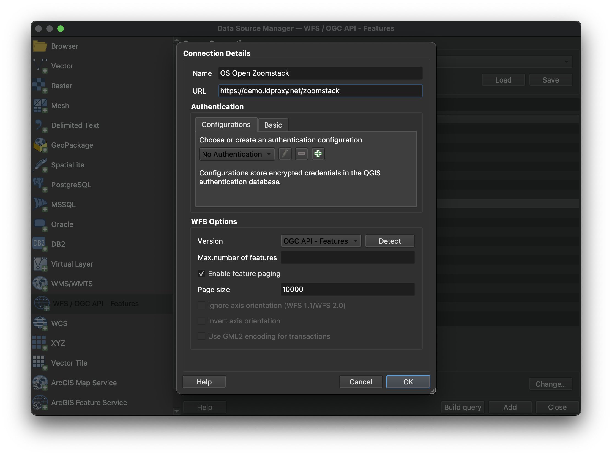
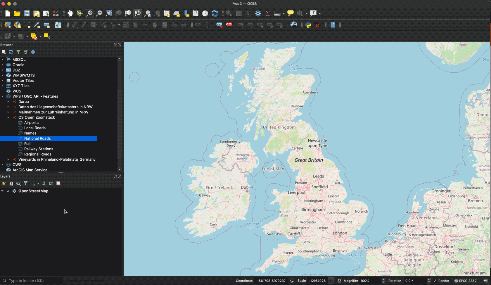

# OGC API - Features

!!! abstract Audience
    Students that are familiar with web services and APIs, and want to have
    an overview of OGC API - Features standard

!!! abstract "Learning Objectives"
    At the completion of the module students will be able to:

    - Explain what the OGC API - Features standard is
    - Describe what can be done with OGC API - Features implementations
    - Understand the main resources offered by OGC API - Features implementations
    - Understand how to retrieve a description of the capabilities of an OGC API - Features implementation
    - Understand how to issue requests to an implementation of OGC API - Features
    - Be able to find an OGC API - Features endpoint and use it through a client

## Introduction

[OGC API - Features](https://ogcapi.ogc.org/features) is a multi-part standard that offers the capability
to create, modify, and query spatial data on the Web and specifies
requirements and recommendations for APIs that want to follow a standard
way of sharing feature data. **OGC API - Features - Part 1: Core** describes the mandatory capabilities that every
implementing service must support and is restricted to read-access to
spatial data. Additional capabilities like support for different CRS, richer queries and creating and modifying data are specified in additional parts.

!!! note
    This tutorial module is not intended to be a replacement to the actual
    **OGC API - Features - Part 1: Core** standard. The tutorial
    intentionally focuses on a subset of capabilities in order to get the
    student started with using the standard. Please refer to the [**OGC API -
    Features - Part 1: Core** standard](https://docs.ogc.org/is/17-069r4/17-069r4.html) for additional detail.


### Background

> History
 
  While in draft form and prior to February 2019, **OGC API -
  Features - Part 1: Core** was referred to as WFS3.0.

> Versions

  **OGC API - Features - Part 1: Core** version 1.0.1 and **OGC API - Features - Part 2: Coordinate Reference Systems by Reference** version 1.0.1 are the current
  latest versions

> Test suite

  Test suites are available for:

  *   [OGC API - Features](https://github.com/opengeospatial/ets-ogcapi-features10)

>  Implementations

  Implementations can be found on the [implementations page](https://github.com/opengeospatial/ogcapi-features/tree/master/implementations).

#### Usage

The standard provides a standard interface for requesting vector
geospatial data consisting of geographic features and their properties.
The benefit of this is that client applications can request source data
from multiple implementations of the API, and then render the data for
display or process the data further as part of a workflow. The standard
enables the data to be accessed consistently with other data. Feature
properties encoded using common data types such as text strings, date
and time can also be accessed consistently.

* **OGC API - Features - Part 1: Core** specifies discovery and query
operations that are implemented using the HTTP GET method. Support for
additional methods (in particular POST, PUT, DELETE, PATCH) will be
specified in additional parts. Government agencies, private
organisations and academic institutes use this standard to publish
vector geospatial datasets in a way that makes it easier for receiving
organisations to compile new maps or conduct analysis on the supplied
data. In Part 1 the default spatial Coordinate Reference System (CRS) is WGS 84 longitude/latitude with or without height.
* **OGC API - Features - Part 2: Coordinate Reference Systems By Reference** extends Part 1 to support presenting geometry-valued properties in a response document in additional CRSs. Each supported CRS must be identified by a URI such as: ```http://www.opengis.net/def/crs/EPSG/0/4326```.

In addition to the approved parts above, The OGC API - Features Standards Working Group (SWG) is working on the following drafts:

* *Draft* **OGC API - Features - Part 3: Filtering** defines query parameters (```filter```, ```filter-lang```, ```filter-crs```) to specify filter criteria in a request to an API and the ```Queryables``` resource that declares the properties of data in a collection that can be used in filter expressions.
* *Draft* **OGC API - Features - Part 4: Create, Replace, Update and Delete** defines the behaviour of an API that allows resource instances to be added, replaced, modified and/or removed for a collection.

!!! note

    The rest of this tutorial will focus on the core part of the standard.

#### Relation to other OGC Standards

-   OGC Web Feature Service Interface Standard (WFS): The WFS standard
    is more appropriate when working with client applications that only
    support classic OGC Web Services. Note as well that WFS adopts the
    Geography Markup Language ([GML](https://www.ogc.org/standards/gml))
    as a default data format. In contrast, OGC API - Features includes
    recommendations to support [HTML](https://html.spec.whatwg.org) and
    [GeoJSON](https://geojson.org) as encodings, where practical.
    Implementations of OGC API - Features may also optionally support
    GML, as well as other vector formats.

### Overview of Resources

**OGC API - Features - Part 1: Core** defines the resources listed in
the following table.

<table>
  <tr>
    <th>Resource</th>
    <th>Method</th>
    <th>Path</th>
    <th>Purpose</th>
  </tr>
  <tr>
    <td>Landing page</td>
    <td>GET</td>
    <td>/</td>
    <td>This is the top-level resource, which serves as an entry point.</td>
  </tr>
  <tr>
    <td>Conformance declaration</td>
    <td>GET</td>
    <td>/conformance</td>
    <td>This resource presents information about the functionality that is implemented by the server.</td>
  </tr>
  <tr>
    <td>API definition</td>
    <td>GET</td>
    <td>/api</td>
    <td>This resource provides metadata about the API itself. Note use of /api on the server is optional and the API definition may be hosted on completely separate server.</td>
  </tr>
  <tr>
    <td>Feature collections</td>
    <td>GET</td>
    <td>/collections</td>
    <td>This resource lists the feature collections that are offered through the API.</td>
  </tr>
  <tr>
    <td>Feature collection</td>
    <td>GET</td>
    <td>/collections/{collectionId}</td>
    <td>This resource describes the feature collection identified in the path.</td>
  </tr>
  <tr>
    <td>Features</td>
    <td>GET</td>
    <td>/collections/{collectionId}/items</td>
    <td>This resource presents the features that are contained in the collection.</td>
  </tr>
  <tr>
    <td>Feature</td>
    <td>GET</td>
    <td>/collections/{collectionId}/items/{featureId}</td>
    <td>This resource presents the feature that is identified in the path</td>
  </tr>
</table>

### Example

This [demonstration
server](https://demo.pygeoapi.io/master)
publishes vector geospatial data through an interface that conforms to
OGC API - Features.

An example request that can be used to retrieve data from the Portuguese Points of Interest feature collection is
<https://demo.pygeoapi.io/master/collections/ogr_gpkg_poi?f=html>

Note that the response to the request is HTML in this case.

Alternatively, the same data can be retrieved in GeoJSON format, through
the request
<https://demo.pygeoapi.io/master/collections/ogr_gpkg_poi?f=json>

A client application can then retrieve the GeoJSON document and display
or process it.

## Resources

This section provides basic information about the types of resources
that OGC API - Features offers.

Each resource provides **links** to related resources. This enables a
client application to navigate the resources, from the landing page
through to the individual features. The server identifies the
relationship between a resource and other linked resources through a
**link relation type**, represented by the attribute ```rel```. The link
relation types used by implementations of the **OGC API - Features -
Part 1: Core** can be found in [Section
5.2](http://docs.opengeospatial.org/is/17-069r3/17-069r3.html#_link_relations)
of the standard.

### Landing page

The landing page is the top-level resource that serves as an entry
point. A client application needs to know the location of the landing
page of the server. From the landing page, the client application can
then retrieve links to the Conformance declaration, Collection and API
definition paths. An example landing page is at
<https://demo.ldproxy.net/daraa?f=json>

The link to the API definition is identified through the
```service-desc``` and ```service-doc``` link relation types.

The link to the Conformance declaration is identified through the
```conformance``` link relation type.

The link to the Collections is identified through the ```data``` link
relation type.

An extract from the landing page of a demo server is shown below.

```json
{
  "title": "Daraa",
  "description": "This is a test dataset used in the Open Portrayal Framework thread in the OGC Testbed-15 as well as the OGC Vector Tiles Pilot Phase 2. The data is based on OpenStreetMap data from the region of Daraa, Syria, converted to the Topographic Data Store schema of NGA.",
  "attribution": "US National Geospatial Intelligence Agency (NGA)",
  "links": [
    {
      "rel": "self",
      "type": "application/json",
      "title": "This document",
      "href": "https://demo.ldproxy.net/daraa?f=json"
    },
    {
      "rel": "service-desc",
      "type": "application/vnd.oai.openapi+json;version=3.0",
      "title": "Definition of the API in OpenAPI 3.0",
      "href": "https://demo.ldproxy.net/daraa/api?f=json"
    },
    {
      "rel": "conformance",
      "title": "OGC API conformance classes implemented by this server",
      "href": "https://demo.ldproxy.net/daraa/conformance"
    },
    {
      "rel": "data",
      "title": "Access the data",
      "href": "https://demo.ldproxy.net/daraa/collections"
    }
  ]
}
```

### Conformance declarations

An implementation of OGC API - Features describes the capabilities that
it supports by declaring which conformance classes it implements. The
Conformance declaration states the conformance classes from standards or
community specifications, identified by a URI, that the API conforms to.
Clients can then use this information, although they are not required
to. Accessing the Conformance declaration using HTTP GET returns the
list of URIs of conformance classes implemented by the server.
Conformance classes describe the behavior a server should implement in
order to meet one or more sets of requirements specified in a standard.

Below is an extract from the response to the request
<https://demo.ldproxy.net/daraa/conformance?f=json>

Notice that the example shows a link relation type called ```alternate```
which identifies a way to retrieve an alternative representation of the
information provided by the resource. In this case the ```alternate```
link relation is referencing an HTML representation of the conformance
declaration.

```json
{
  "links": [
    {
      "rel": "alternate",
      "type": "text/html",
      "title": "This document as HTML",
      "href": "https://demo.ldproxy.net/daraa/conformance?f=html"
    },
    {
      "rel": "self",
      "type": "application/json",
      "title": "This document",
      "href": "https://demo.ldproxy.net/daraa/conformance?f=json"
    }
  ]
"conformsTo" : ["http://www.opengis.net/spec/ogcapi-features-1/1.0/conf/core", "http://www.opengis.net/spec/ogcapi-features-1/1.0/conf/geojson", "http://www.opengis.net/spec/ogcapi-features-1/1.0/conf/html", "http://www.opengis.net/spec/ogcapi-features-1/1.0/conf/oas30", "http://www.opengis.net/spec/ogcapi-features-2/1.0/conf/crs", "http://www.opengis.net/spec/ogcapi-features-3/0.0/conf/features-filter", "http://www.opengis.net/spec/ogcapi-features-3/0.0/conf/filter", "http://www.opengis.net/spec/ogcapi-features-3/0.0/conf/queryables", "http://www.opengis.net/spec/ogcapi-features-3/0.0/conf/queryables-query-parameters"]
}
```

### API Definition

The API definition describes the capabilities of the server. It can be used by developers to understand the API, by software clients to connect to the server, or by development tools to support the implementation of servers and clients. Accessing the API definition using HTTP GET returns a description of the API. 

There are conformance classes to provide the API definition using [Open API](https://ogcapi-workshop.ogc.org/overview-and-main-concepts/#openapi). Some servers also return a human-readable representation of the definition in HTML, using tools such as Redoc or Swagger. 

This is an extract of an [API definition](https://demo.ldproxy.net/daraa/api?f=json), which uses Open API 3:

```json
{
  "openapi" : "3.0.3",
  "info" : {
    "title" : "Daraa",
    "description" : "This is a test dataset used in the Open Portrayal Framework thread in the OGC Testbed-15 as well as the OGC Vector Tiles Pilot Phase 2. The data is based on OpenStreetMap data from the region of Daraa, Syria, converted to the Topographic Data Store schema of NGA.\n\n_Note: This API is based on API building blocks (e.g., operations, query parameters, or headers) specified in OGC API Standards or drafts of those standards. For more information about OGC API Standards, see [https://ogcapi.ogc.org](https://ogcapi.ogc.org/). Some building blocks of this API can be preliminary and may change in this API, because they are not yet based on a stable specification. The maturity is stated for each building block._",
    "contact" : {
      "name" : "interactive instruments GmbH",
      "email" : "mail@interactive-instruments.de"
    },
    "license" : {
      "name" : "The dataset was provided by the US National Geospatial Intelligence Agency (NGA) for development, testing and demonstrations in initiatives of the Open Geospatial Consortium (OGC). For any reuse of the data outside this API, please contact NGA."
    },
    "version" : "1.0.0"
  },
  "servers" : [ {
    "url" : "https://demo.ldproxy.net/daraa"
  } ],
  "tags" : [ ],
  "paths" : {
    "/" : {
      "get" : {
        "tags" : [ "Capabilities" ],
        "summary" : "landing page",
        "description" : "The landing page provides links to the API definition (link relations `service-desc` and `service-doc`), the Conformance declaration (path `/conformance`, link relation `conformance`), and other resources in the API.\n\n_Maturity: `STABLE`_",
        "externalDocs" : {
          "description" : "The specification that describes this operation: OGC API - Features - Part 1: Core",
          "url" : "https://docs.ogc.org/is/17-069r4/17-069r4.html"
        },
        "operationId" : "getLandingPage",
        "parameters" : [ {
          "$ref" : "#/components/parameters/fCommon"
        } ],
        "responses" : {
          "200" : {
            "description" : "The operation was executed successfully.",
            "content" : {
              "application/json" : {
                "schema" : {
                  "$ref" : "#/components/schemas/LandingPage"
                }
              },
              "text/html" : {
                "schema" : {
                  "$ref" : "#/components/schemas/htmlSchema"
                }
              }
            }
          },
          "400" : {
            "description" : "Bad Request"
          },
          "406" : {
            "description" : "Not Acceptable"
          },
          "500" : {
            "description" : "Server Error"
          }
        },
        "x-maturity" : "STABLE_OGC"
      }
    },
```
You can access an HTML representation of the API definition [here](https://demo.ldproxy.net/daraa/api?f=html).

!!! note
    The use of ```/api``` on the server is optional and the API definition may be hosted in a different path or on completely separate server.

### Feature collections

Data offered through an implementation of **OGC API - Features - Part 1:
Core** is organized into one or more feature collections. The
```Collections``` resource provides information about and access to the
list of collections.

For each collection, there is a link to the detailed description of the
collection (represented by the path **/collections/{collectionId}** and
link relation **self**).

For each collection, there is a link to the features in the collection
(represented by the path **/collections/{collectionId}/items** and link
relation **items**) and other information about the collection. The
following information is provided by the server to describe each
collection:

-   A local identifier for the collection that is unique for the dataset
-   A list of coordinate reference systems (CRS) in which geometries may
    be returned by the server
-   An optional title and description for the collection
-   An optional extent that can be used to provide an indication of the
    spatial and temporal extent of the collection
-   An optional indicator about the type of the items in the collection
    (the default value, if the indicator is not provided, is
    ```feature```).

Below is an extract from the response to the request
<https://demo.ldproxy.net/daraa/collections?f=json>

```json
{
  "title": "Daraa",
  "description": "This is a test dataset used in the Open Portrayal Framework thread in the OGC Testbed-15 as well as the OGC Vector Tiles Pilot Phase 2. The data is based on OpenStreetMap data from the region of Daraa, Syria, converted to the Topographic Data Store schema of NGA.",
  "collections": [
    {
      "title": "Aeronautic (Curves)",
      "description": "Aeronautical Facilities: Information about an area specifically designed and constructed for landing, accommodating, and launching military and/or civilian aircraft, rockets, missiles and/or spacecraft.<br/>Aeronautical Aids to Navigation: Information about electronic equipment, housings, and utilities that provide positional information for direction or otherwise assisting in the navigation of airborne aircraft.",
      "id": "AeronauticCrv",
      "extent": {
        "spatial": {
          "bbox": [
            [36.395158, 32.693301, 36.430814, 32.717333]
          ],
          "crs": "http://www.opengis.net/def/crs/OGC/1.3/CRS84"
        },
      "storageCrs": "http://www.opengis.net/def/crs/OGC/1.3/CRS84",
      "links": [
        {
          "rel": "items",
          "type": "application/geo+json",
          "title": "Access the features in the collection 'Aeronautic (Curves)' as GeoJSON",
          "href": "https://demo.ldproxy.net/daraa/collections/AeronauticCrv/items?f=json"
        },
        {
          "rel": "self",
          "title": "The 'Aeronautic (Curves)' feature collection",
          "href": "https://demo.ldproxy.net/daraa/collections/AeronauticCrv"
        }
      ]
     }
    },
    {
      "title": "Other (Points)",
      "id": "o2s_p",
      "extent": {
        "spatial": {
          "bbox": [
            [35.939604, 32.544963, 36.443695, 32.984648]
          ],
          "crs": "http://www.opengis.net/def/crs/OGC/1.3/CRS84"
        }
      },
      "storageCrs": "http://www.opengis.net/def/crs/OGC/1.3/CRS84",
      "links": [
        {
          "rel": "items",
          "type": "application/geo+json",
          "title": "Access the features in the collection 'Other (Points)' as GeoJSON",
          "href": "https://demo.ldproxy.net/daraa/collections/o2s_p/items?f=json"
        },
        {
          "rel": "self",
          "title": "The 'Other (Points)' feature collection",
          "href": "https://demo.ldproxy.net/daraa/collections/o2s_p"
        }
      ],
    }
  ]
```

### Feature collection

The **Collection** resource provides detailed information about the
collection identified in a request.

Below is an extract from the response to the request
<https://demo.ldproxy.net/daraa/collections/AeronauticCrv?f=json>

```json
{
  "title": "Aeronautic (Curves)",
  "description": "Aeronautical Facilities: Information about an area specifically designed and constructed for landing, accommodating, and launching military and/or civilian aircraft, rockets, missiles and/or spacecraft.<br/>Aeronautical Aids to Navigation: Information about electronic equipment, housings, and utilities that provide positional information for direction or otherwise assisting in the navigation of airborne aircraft.",
  "id": "AeronauticCrv",
  "extent": {
    "spatial": {
      "bbox": [
        [36.395158, 32.693301, 36.430814, 32.717333]
      ],
      "crs": "http://www.opengis.net/def/crs/OGC/1.3/CRS84"
    },
    "temporal": {
      "interval": [
        [
          "2011-03-16T14:51:12Z",
          "2015-09-11T19:15:35Z"
        ]
      ],
      "trs": "http://www.opengis.net/def/uom/ISO-8601/0/Gregorian"
    }
  },
  "itemType": "feature",
  "crs": [
    "http://www.opengis.net/def/crs/OGC/1.3/CRS84",
    "http://www.opengis.net/def/crs/EPSG/0/3395",
    "http://www.opengis.net/def/crs/EPSG/0/3857",
    "http://www.opengis.net/def/crs/EPSG/0/4326"
  ],
  "storageCrs": "http://www.opengis.net/def/crs/OGC/1.3/CRS84",
  "links": [
    {
      "rel": "items",
      "type": "application/geo+json",
      "title": "Access the features in the collection 'Aeronautic (Curves)' as GeoJSON",
      "href": "https://demo.ldproxy.net/daraa/collections/AeronauticCrv/items?f=json"
    }
    {
      "rel": "self",
      "type": "application/json",
      "title": "This document",
      "href": "https://demo.ldproxy.net/daraa/collections/AeronauticCrv?f=json"
    }
  ],
}
```


### Features

The Features resource returns a document consisting of features
contained by the collection identified in a request. The features
included in the response are determined by the server based on the query
parameters of the request. To support access to larger collections
without overloading the client, the API supports paged access with links
to the next page, if more features are selected than the page size.

Below is an extract from the response to the request
<https://demo.ldproxy.net/daraa/collections/AeronauticCrv/items?f=json>

```json
{
  "type": "FeatureCollection",
  "numberReturned": 10,
  "numberMatched": 20,
  "timeStamp": "2023-11-29T08:38:10Z",
  "features": [
    {
      "type": "Feature",
      "id": 1,
      "geometry": {
        "type": "MultiLineString",
        "coordinates": [[[36.4270030, 32.7114540],[36.4251990, 32.7137030]]]
      },
      "properties": {
        "F_CODE": "GB075",
        "ZI001_SDV": "2011-03-16T14:51:12Z",
        "UFI": "2d008c34-4458-4226-b335-cf903d261ce9",
        "ZI005_FNA": "No Information",
        "FCSUBTYPE": 100454
      }
    },
    {
      "type": "Feature",
      "id": 2,
      "geometry": {
        "type": "MultiLineString",
        "coordinates": [
          [[ 36.4009090, 32.7000770 ],
            [ 36.4031330, 32.7013330 ],
            [ 36.4208880, 32.7113020 ],
            [ 36.4231110, 32.7125400 ],
            [ 36.4251990, 32.7137030 ],
            [ 36.4252970, 32.7137690 ]
          ]
        ]
      },
      "properties": {
        "F_CODE": "GB075",
        "ZI001_SDV": "2015-09-11T19:15:35Z",
        "UFI": "1257bf27-3f91-461d-8a3b-a95af2ea1f5a",
        "ZI005_FNA": "No Information",
        "FCSUBTYPE": 100454
      }
    }]
}
```

Note that this document is a valid GeoJSON document.

Additional parameters may be used to select only a subset of the
features in the collection.

A **bbox** or **datetime** parameter may be used to select only the
subset of the features in the collection that are within the bounding
box specified by the **bbox** parameter or the time interval specified
by the **datetime** parameter. An example request that uses the **bbox**
parameter is
<https://demo.ldproxy.net/daraa/collections/VegetationSrf/items?f=json&bbox=36.0832432,32.599852,36.1168237,32.6283697>

!!! note
    The effect of the bbox parameter can be easily seen when comparing the
    HTML response from
    [applying](https://demo.ldproxy.net/daraa/collections/VegetationSrf/items?f=html&bbox=36.0832432,32.599852,36.1168237,32.6283697)
    the bbox parameter to the response
    [without](https://demo.ldproxy.net/daraa/collections/VegetationSrf/items?f=html)
    any bbox parameter.

The **limit** parameter may be used to control the page size by
specifying the maximum number of features that should be returned in the
response. An example request that uses the **limit** parameter is
<https://demo.ldproxy.net/daraa/collections/AeronauticCrv/items?f=json&limit=2>

Each page may include information about the number of selected and
returned features (```numberMatched``` and ```numberReturned```) as well as
links to support paging (link relation ```next```).

### Feature

The Feature resource is used for retrieving an individual feature, its
geometric representation and other properties. In the example below, the
feature with an ```id``` of 1 is retrieved. The response is retrieved
through the request
<https://demo.ldproxy.net/daraa/collections/AeronauticCrv/items/1?f=json>

```json
{
  "type": "Feature",
  "id": 1,
  "geometry": {
    "type": "MultiLineString",
    "coordinates": [
      [
        [
          36.4270030,
          32.7114540
        ],
        [
          36.4251990,
          32.7137030
        ]
      ]
    ]
  },
  "properties": {
    "F_CODE": "GB075",
    "ZI001_SDV": "2011-03-16T14:51:12Z",
    "UFI": "2d008c34-4458-4226-b335-cf903d261ce9",
    "ZI005_FNA": "No Information",
    "FCSUBTYPE": 100454
  },
  "links": [
    {
      "href": "https://demo.ldproxy.net/daraa/collections/AeronauticCrv/items/1?f=json",
      "rel": "self",
      "type": "application/geo+json",
      "title": "This document"
    },
    {
      "href": "https://demo.ldproxy.net/daraa/collections/AeronauticCrv/items/1?f=jsonfgc",
      "rel": "alternate",
      "type": "application/vnd.ogc.fg+json;compatibility=geojson",
      "title": "This document as JSON-FG (GeoJSON Compatibility Mode)"
    },
    {
      "href": "https://demo.ldproxy.net/daraa/collections/AeronauticCrv/items/1?f=csv",
      "rel": "alternate",
      "type": "text/csv",
      "title": "This document as CSV"
    },
    {
      "href": "https://demo.ldproxy.net/daraa/collections/AeronauticCrv/items/1?f=fgb",
      "rel": "alternate",
      "type": "application/flatgeobuf",
      "title": "This document as FlatGeobuf"
    },
    {
      "href": "https://demo.ldproxy.net/daraa/collections/AeronauticCrv/items/1?f=html",
      "rel": "alternate",
      "type": "text/html",
      "title": "This document as HTML"
    },
    {
      "href": "https://demo.ldproxy.net/daraa/collections/AeronauticCrv/items/1?f=jsonfg",
      "rel": "alternate",
      "type": "application/vnd.ogc.fg+json",
      "title": "This document as JSON-FG"
    },
    {
      "href": "https://demo.ldproxy.net/daraa/collections/AeronauticCrv?f=json",
      "rel": "collection",
      "type": "application/json",
      "title": "The collection the feature belongs to"
    }
  ]
}
```

### Client usage

In this workshop we'll cover different OGC API - Features client tools two JavaScript libraries ( Leaflet and OpenLayers ), one desktop GIS (QGIS) and a C++ library (GDAL).

#### Leaflet

[Leaflet](https://leafletjs.com) can read GeoJSON out-of-the-box, from a file or an API. As OGC API - Features can expose data as GeoJSON by using `f=json` in the request, the response can be read directly in LeafLet using the following code:

```javascript
fetch('https://demo.ldproxy.net/zoomstack/collections/airports/items?limit=100', {
    headers: {
      'Accept': 'application/geo+json'
    }
  }).then(response => response.json())
  .then(data => {
  L.geoJSON(data).addTo(map);
});
```

Leaflet also has an [external plugin](https://gitlab.com/IvanSanchez/leaflet.featuregroup.ogcapi) which allows OGC API - Features to be used natively:

```javascript
// Import following in <head> tag
//   <script src='https://unpkg.com/leaflet-featuregroup-ogcapi@0.1.0/Leaflet.FeatureGroup.OGCAPI.js'></script>


var overlay = L.featureGroup.ogcApi("https://demo.ldproxy.net/zoomstack/", {
	collection: "airports",
	limit: 500,
	padding: 0.2
}).addTo(map);
```

#### OpenLayers

[OpenLayers](https://openlayers.org/) also understands GeoJSON by default. An OGC API - Features response can be consumed using the following code:

```javascript
fetch('https://demo.ldproxy.net/zoomstack/collections/airports/items?limit=100', {
    headers: {
      'Accept': 'application/geo+json'
    }
  }).then(response => response.json())
  .then(data => {
  map.addLayer(new ol.layer.Vector({
    source: new ol.source.Vector({
      features: new ol.format.GeoJSON().readFeatures(data, { featureProjection: 'EPSG:3857' }),
      attributions: 'Contains OS data &copy; Crown copyright and database right 2021.'
    })
  }));
});
```

#### QGIS

[QGIS](https://qgis.org) supports OGC API - Features and WFS using the same vector layer provider.  Open the Data Source Manager and go to the "WFS / OGC API Features" tab.

{width="100.0%"}

Provide the connection information.  The URL is the URL of the OGC API landing page resource (in this case <https://demo.ldproxy.net/zoomstack>). Make sure "Enable feature paging" is checked.

{width="100.0%"}

Note that, if a collection has millions of features and the map view covers the extent of the collection, QGIS will try to load all features. To avoid this, you can, for example, restrict the scale range in which the layer should be visible.

{width="100.0%"}


#### GDAL

[GDAL](https://gdal.org) supports OGC API - Features as core vector format.  The below example demonstrates usage via `ogrinfo` against an OGC API - Features endpoint:

```bash
ogrinfo OAPIF:https://demo.ldproxy.net/zoomstack 
INFO: Open of `OAPIF:https://demo.ldproxy.net/zoomstack'
      using driver `OAPIF' successful.
1: airports (title: Airports) (Point)
2: boundaries (title: Boundaries) (Line String)
3: contours (title: Contours) (Line String)
4: district_buildings (title: District Buildings) (Polygon)
5: etl (title: ETL) (Line String)
6: foreshore (title: Foreshore) (Polygon)
7: greenspace (title: Greenspace) (Polygon)
8: land (title: Land) (Polygon)
9: local_buildings (title: Local Buildings) (Polygon)
10: names (title: Names) (Point)
11: national_parks (title: National Parks) (Polygon)
12: rail (title: Rail) (Line String)
13: railway_stations (title: RailwayStation) (Point)
14: roads_local (title: Local Roads) (Line String)
15: roads_national (title: National Roads) (Line String)
16: roads_regional (title: Regional Roads) (Line String)
17: sites (title: Sites) (Multi Polygon)
18: surfacewater (title: Surface Water) (Polygon)
19: urban_areas (title: Urban Areas) (Polygon)
20: waterlines (title: Waterlines) (Line String)
21: woodland (title: Woodland) (Polygon)
```

## Summary

OGC API - Features provides functionality for working with vector data on the Web.  This deep dive
provided an overview of the standard and the various Resources and endpoints that are supported, as well as example of how-to access it using different clients.
