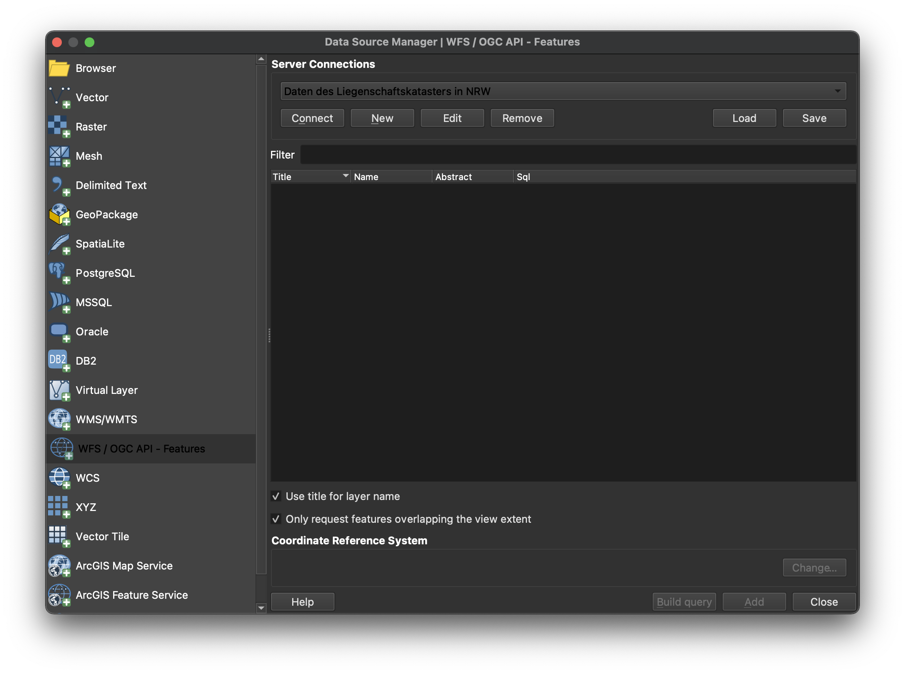
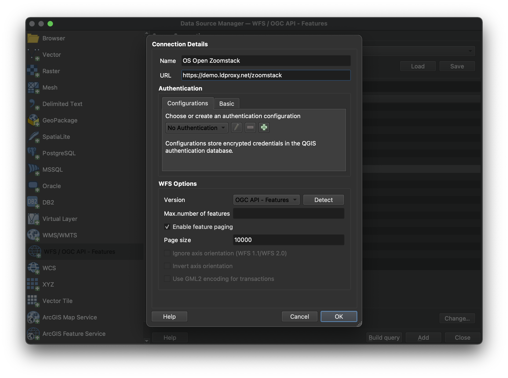
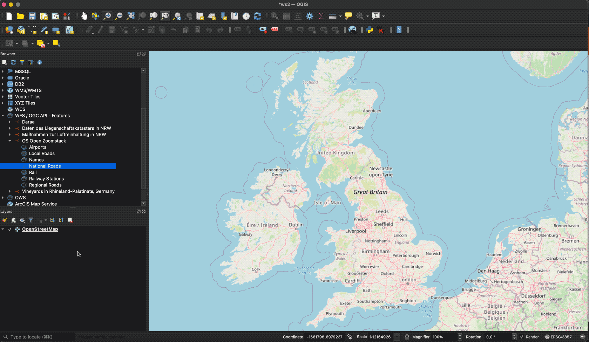

# OGC API - Features

!!! abstract "Público-alvo"
    Estudantes que estejam familiarizados com serviços web e APIs, e queiram ter
    uma visão geral do padrão OGC API - Features

!!! abstract "Objetivos de Aprendizagem"
    Após a conclusão do módulo, os estudantes serão capazes de:

    - Explicar o que é o padrão OGC API - Features
    - Descrever o que pode ser feito com implementações da OGC API - Features
    - Compreender os principais recursos oferecidos por implementações da OGC API - Features
    - Comprender como recuperar uma descrição das capacidades de uma implementação da OGC API - Features
    - Comprender como emitir pedidos a uma implementação da OGC API - Features
    - Conseguir encontrar um endpoint da OGC API - Features e utilizá-lo através de um cliente

## Introdução

A [OGC API - Features](https://features.developer.ogc.org/) é um padrão multi-parte que oferece a capacidade
de criar, modificar e consultar dados espaciais na Web e especifica
requisitos e recomendações para APIs que pretendam seguir uma forma padrão
de partilhar dados de entidades. **A OGC API - Features - Part 1: Core** descreve as capacidades obrigatórias que todo o
serviço que a implementa deve suportar e está limitada a acesso de leitura a
dados espaciais. Capacidades adicionais, como suporte para diferentes SCR, consultas mais ricas e criação e modificação de dados, são especificadas em partes adicionais.

!!! note
    Este módulo de tutorial não tem a intenção de ser um substituto do próprio
    padrão **OGC API - Features - Part 1: Core**. O tutorial
    foca-se intencionalmente num subconjunto de capacidades a fim de começar com
    a utilização do padrão. Consulte o [padrão **OGC API -
    Features - Part 1: Core**](https://docs.ogc.org/is/17-069r4/17-069r4.html) para mais detalhes.


### Antecedentes

> História

  Enquanto esteve em formato de rascunho e antes de fevereiro de 2019, a **OGC API -
  Features - Part 1: Core** era referida como WFS3.0.

> Versões

  A versão 1.0.1 da **OGC API - Features - Part 1: Core**, a versão 1.0.1 da **OGC API - Features - Part 2: Coordinate Reference Systems by Reference** e a versão 1.0.1 da **OGC API - Features - Part 3: Filtering** são as versões
  mais recentes atuais

> Suite de testes

  Suites de testes estão disponíveis para:

  * OGC API - Features - Part 1
  * OGC API - Features - Part 2

  Todas as suites de testes estão disponíveis no [Validador da OGC](https://cite.ogc.org/teamengine/).

> Implementações

  As implementações podem ser encontradas na [página de implementações](https://github.com/opengeospatial/ogcapi-features/tree/master/implementations).

#### Utilização

O padrão fornece uma interface padrão para solicitar dados
geoespaciais vetoriais, consistindo em entidades geográficas e as respetivas propriedades.
O benefício disto é que as aplicações cliente podem solicitar dados de origem
a múltiplas implementações da API e, em seguida, representar os dados para
visualização ou processá-los ulteriormente como parte de um fluxo de trabalho. O padrão
permite que os dados sejam acedidos de forma consistente com outros dados. As propriedades
de entidades codificadas com tipos de dados comuns, como strings de texto, data
e hora, também podem ser acedidas de forma consistente.

* A **OGC API - Features - Part 1: Core** especifica operações de descoberta e consulta
  que são implementadas usando o método HTTP GET. O suporte para
  métodos adicionais (em particular POST, PUT, DELETE, PATCH) será
  especificado em partes adicionais. As agências governamentais,
  organizações privadas e institutos académicos usam este padrão para publicar
  conjuntos de dados geoespaciais vetoriais de uma forma que facilite as
  organizações receptoras compilarem novos mapas ou conduzirem análises aos
  dados fornecidos. Na Parte 1, o Sistema de Referência de Coordenadas (SCR) padrão é o WGS 84 longitude/latitude, com ou sem altitude.
* A **OGC API - Features - Part 2: Coordinate Reference Systems By Reference** estende a Parte 1 para suportar a apresentação de propriedades com valor geométrico num documento de resposta em SCR adicionais. Cada SCR suportado deve ser identificado por um URI, tal como: ```http://www.opengis.net/def/crs/EPSG/0/4326```.

* A **OGC API - Features - Part 3: Filtering** define parâmetros de consulta (```filter```, ```filter-lang```, ```filter-crs```) para especificar critérios de filtragem num pedido a uma API e o recurso ```Queryables``` que declara as propriedades dos dados numa coleção que podem ser usadas em expressões de filtro.

Para além das partes aprovadas acima, o Standards Working Group (SWG) da OGC API - Features está a trabalhar nos seguintes rascunhos:

* *Rascunho* **OGC API - Features - Part 4: Create, Replace, Update and Delete** define o comportamento de uma API que permite que instâncias de recursos sejam adicionadas, substituídas, modificadas e/ou removidas para uma coleção.

* *Rascunho* **OGC API - Features - Part 5/OGC API - Common - Part 3: Schemas** especifica como as entidades podem ser descritas por um esquema lógico e como esses esquemas são publicados numa implementação de API Web da OGC.

* *Rascunho* **OGC API - Features - Part 6: Property Selection** especifica como a representação de um recurso pode ser reduzida a propriedades selecionadas do recurso usando um parâmetro de consulta.

* *Rascunho* **OGC API - Features - Part 7: Geometry Simplification** especifica como a representação de geometria pode ser simplificada usando um parâmetro de consulta.

* *Rascunho* **OGC API - Features - Part 8: Sorting** define parâmetros de consulta (sortby) para especificar critérios de ordenação num pedido a uma API e o recurso Sortables que declara as propriedades dos dados numa coleção que podem ser usadas em expressões de ordenação.

* *Rascunho* **OGC API - Features - Part 9: Text Search** adiciona um parâmetro de consulta à suíte de padrões da OGC API Features para suportar pesquisas de texto ou palavras-chave em campos de texto.

* *Rascunho* **OGC API - Features - Part 10: Search/Queries** adiciona suporte para obter dinamicamente entidades de múltiplas coleções de uma vez.

!!! note

    O resto deste tutorial focar-se-á na parte central do padrão.

#### Relação com outros padrões da OGC

- O Padrão de Interface Web Feature Service da OGC (WFS): O padrão WFS
  é mais adequado quando se trabalha com aplicações cliente que apenas
  suportam Serviços Web clássicos da OGC. Note também que o WFS adota a
  Linguagem de Marcação Geográfica ([GML](https://www.ogc.org/standards/gml))
  como formato de dados padrão. Em contraste, a OGC API - Features inclui
  recomendações para suportar [HTML](https://html.spec.whatwg.org) e
  [GeoJSON](https://geojson.org) como codificações, quando prático.
  Implementações da OGC API - Features podem também opcionalmente suportar
  GML, bem como outros formatos vetoriais.

### Visão geral dos Recursos

**A OGC API - Features - Part 1: Core** define os recursos listados na
tabela seguinte.

<table>
  <tr>
    <th>Recurso</th>
    <th>Método</th>
    <th>Caminho</th>
    <th>Finalidade</th>
  </tr>
  <tr>
    <td>Página de aterragem</td>
    <td>GET</td>
    <td>/</td>
    <td>Este é o recurso de nível superior, que serve como ponto de entrada.</td>
  </tr>
  <tr>
    <td>Declaração de conformidade</td>
    <td>GET</td>
    <td>/conformance</td>
    <td>Este recurso apresenta informação sobre a funcionalidade que está implementada pelo servidor.</td>
  </tr>
  <tr>
    <td>Definição da API</td>
    <td>GET</td>
    <td>/api</td>
    <td>Este recurso fornece metadados sobre a própria API. Note que o uso de /api no servidor é opcional e a definição da API pode estar alojada num servidor completamente separado.</td>
  </tr>
  <tr>
    <td>Coleções de entidades</td>
    <td>GET</td>
    <td>/collections</td>
    <td>Este recurso lista as coleções de entidades que são oferecidas através da API.</td>
  </tr>
  <tr>
    <td>Coleção de entidades</td>
    <td>GET</td>
    <td>/collections/{collectionId}</td>
    <td>Este recurso descreve a coleção de entidades identificada no caminho.</td>
  </tr>
  <tr>
    <td>Entidades</td>
    <td>GET</td>
    <td>/collections/{collectionId}/items</td>
    <td>Este recurso apresenta as entidades que estão contidas na coleção.</td>
  </tr>
  <tr>
    <td>Entidade</td>
    <td>GET</td>
    <td>/collections/{collectionId}/items/{featureId}</td>
    <td>Este recurso apresenta a entidade que está identificada no caminho</td>
  </tr>
</table>

### Exemplo

Este [servidor de
demonstração](https://demo.pygeoapi.io/master)
publica dados geoespaciais vetoriais através de uma interface que está em conformidade com a
OGC API - Features.

Um exemplo de pedido que pode ser usado para recuperar dados da coleção de Pontos de Interesse de Portugal é
<https://demo.pygeoapi.io/master/collections/ogr_gpkg_poi/items?f=html>

Note que a resposta ao pedido é HTML neste caso.

Alternativamente, os mesmos dados podem ser recuperados em formato GeoJSON, através
do pedido
<https://demo.pygeoapi.io/master/collections/ogr_gpkg_poi/items?f=json>

Uma aplicação cliente pode, em seguida, recuperar o documento GeoJSON e exibí-lo
ou processá-lo.

## Recursos

Esta secção fornece informação básica sobre os tipos de recursos
que a OGC API - Features oferece.

Cada recurso fornece **ligações** para recursos relacionados. Isto permite a
uma aplicação cliente navegar pelos recursos, desde a página de aterragem
até às entidades individuais. O servidor identifica a
relação entre um recurso e outros recursos ligados através de um
**tipo de relação de ligação**, representado pelo atributo ```rel```. Os tipos
de relação de ligação usados por implementações da **OGC API - Features -
Part 1: Core** podem ser encontrados na [Secção
5.2](http://docs.opengeospatial.org/is/17-069r3/17-069r3.html#_link_relations)
do padrão.

### Página de aterragem

A página de aterragem é o recurso de nível superior que serve como ponto de
entrada. Uma aplicação cliente precisa de conhecer a localização da página de
aterragem do servidor. A partir da página de aterragem, a aplicação cliente
pode então recuperar ligações para a declaração de Conformidade, para os caminhos
de Coleção e para a definição da API. Um exemplo de página de aterragem está em
<https://demo.ldproxy.net/daraa?f=json>

A ligação à definição da API é identificada através dos tipos
de relação de ligação ```service-desc``` e ```service-doc```.

A ligação à declaração de Conformidade é identificada através do tipo
de relação de ligação ```conformance```.

A ligação às Coleções é identificada através do tipo de relação de
ligação ```data```.

Um excerto da página de aterragem de um servidor de demonstração é apresentado abaixo.

```json
{
  "title": "Daraa",
  "description": "This is a test dataset used in the Open Portrayal Framework thread in the OGC Testbed-15 as well as the OGC Vector Tiles Pilot Phase 2. The data is based on OpenStreetMap data from the region of Daraa, Syria, converted to the Topographic Data Store schema of NGA.",
  "attribution": "US National Geospatial Intelligence Agency (NGA)",
  "links": [
    {
      "rel": "self",
      "type": "application/json",
      "title": "This document",
      "href": "https://demo.ldproxy.net/daraa?f=json"
    },
    {
      "rel": "service-desc",
      "type": "application/vnd.oai.openapi+json;version=3.0",
      "title": "Definition of the API in OpenAPI 3.0",
      "href": "https://demo.ldproxy.net/daraa/api?f=json"
    },
    {
      "rel": "conformance",
      "title": "OGC API conformance classes implemented by this server",
      "href": "https://demo.ldproxy.net/daraa/conformance"
    },
    {
      "rel": "data",
      "title": "Access the data",
      "href": "https://demo.ldproxy.net/daraa/collections"
    }
  ]
}
```

### Declarações de conformidade

Uma implementação da OGC API - Features descreve as capacidades que
suporta declarando que classes de conformidade implementa. A
declaração de Conformidade afirma as classes de conformidade de padrões ou
especificações comunitárias, identificadas por um URI, às quais a API está em conformidade.
Os clientes podem então utilizar esta informação, embora não sejam obrigados
a fazê-lo. Ao aceder à declaração de Conformidade usando HTTP GET, devolve a
lista de URIs das classes de conformidade implementadas pelo servidor.
As classes de conformidade descrevem o comportamento que um servidor deve implementar para
cumprirem um ou mais conjuntos de requisitos especificados num padrão.

Abaixo está um excerto da resposta ao pedido
<https://demo.ldproxy.net/daraa/conformance?f=json>

Note que o exemplo mostra um tipo de relação de ligação chamado ```alternate```
que identifica uma forma de recuperar uma representação alternativa da
informação fornecida pelo recurso. Neste caso, a relação de ligação
```alternate``` está a referenciar uma representação HTML da declaração de conformidade.

```json
{
  "links": [
    {
      "rel": "alternate",
      "type": "text/html",
      "title": "This document as HTML",
      "href": "https://demo.ldproxy.net/daraa/conformance?f=html"
    },
    {
      "rel": "self",
      "type": "application/json",
      "title": "This document",
      "href": "https://demo.ldproxy.net/daraa/conformance?f=json"
    }
  ]
"conformsTo" : ["http://www.opengis.net/spec/ogcapi-features-1/1.0/conf/core", "http://www.opengis.net/spec/ogcapi-features-1/1.0/conf/geojson", "http://www.opengis.net/spec/ogcapi-features-1/1.0/conf/html", "http://www.opengis.net/spec/ogcapi-features-1/1.0/conf/oas30", "http://www.opengis.net/spec/ogcapi-features-2/1.0/conf/crs", "http://www.opengis.net/spec/ogcapi-features-3/0.0/conf/features-filter", "http://www.opengis.net/spec/ogcapi-features-3/0.0/conf/filter", "http://www.opengis.net/spec/ogcapi-features-3/0.0/conf/queryables", "http://www.opengis.net/spec/ogcapi-features-3/0.0/conf/queryables-query-parameters"]
}
```

### Definição da API

A definição da API descreve as capacidades do servidor. Pode ser usada por programadores para compreender a API, por clientes de software para se ligarem ao servidor, ou por ferramentas de desenvolvimento para apoiar a implementação de servidores e clientes. Ao aceder à definição da API usando HTTP GET, devolve uma descrição da API.

Existem classes de conformidade para fornecer a definição da API usando [Open API](https://ogcapi-workshop.ogc.org/overview-and-main-concepts/#openapi). Alguns servidores também devolvem uma representação legível por humanos da definição em HTML, usando ferramentas como Redoc ou Swagger.

Isto é um excerto de uma [definição de API](https://demo.ldproxy.net/daraa/api?f=json), que usa Open API 3:

```json
{
  "openapi" : "3.0.3",
  "info" : {
    "title" : "Daraa",
    "description" : "This is a test dataset used in the Open Portrayal Framework thread in the OGC Testbed-15 as well as the OGC Vector Tiles Pilot Phase 2. The data is based on OpenStreetMap data from the region of Daraa, Syria, converted to the Topographic Data Store schema of NGA.\n\n_Note: This API is based on API building blocks (e.g., operations, query parameters, or headers) specified in OGC API Standards or drafts of those standards. For more information about OGC API Standards, see [https://ogcapi.ogc.org](https://ogcapi.ogc.org/). Some building blocks of this API can be preliminary and may change in this API, because they are not yet based on a stable specification. The maturity is stated for each building block._",
    "contact" : {
      "name" : "interactive instruments GmbH",
      "email" : "mail@interactive-instruments.de"
    },
    "license" : {
      "name" : "The dataset was provided by the US National Geospatial Intelligence Agency (NGA) for development, testing and demonstrations in initiatives of the Open Geospatial Consortium (OGC). For any reuse of the data outside this API, please contact NGA."
    },
    "version" : "1.0.0"
  },
  "servers" : [ {
    "url" : "https://demo.ldproxy.net/daraa"
  } ],
  "tags" : [ ],
  "paths" : {
    "/" : {
      "get" : {
        "tags" : [ "Capabilities" ],
        "summary" : "landing page",
        "description" : "The landing page provides links to the API definition (link relations `service-desc` and `service-doc`), the Conformance declaration (path `/conformance`, link relation `conformance`), and other resources in the API.\n\n_Maturity: `STABLE`_",
        "externalDocs" : {
          "description" : "The specification that describes this operation: OGC API - Features - Part 1: Core",
          "url" : "https://docs.ogc.org/is/17-069r4/17-069r4.html"
        },
        "operationId" : "getLandingPage",
        "parameters" : [ {
          "$ref" : "#/components/parameters/fCommon"
        } ],
        "responses" : {
          "200" : {
            "description" : "The operation was executed successfully.",
            "content" : {
              "application/json" : {
                "schema" : {
                  "$ref" : "#/components/schemas/LandingPage"
                }
              },
              "text/html" : {
                "schema" : {
                  "$ref" : "#/components/schemas/htmlSchema"
                }
              }
            }
          },
          "400" : {
            "description" : "Bad Request"
          },
          "406" : {
            "description" : "Not Acceptable"
          },
          "500" : {
            "description" : "Server Error"
          }
        },
        "x-maturity" : "STABLE_OGC"
      }
    },
```
Pode aceder a uma representação HTML da definição da API [aqui](https://demo.ldproxy.net/daraa/api?f=html).

!!! note
    O uso de ```/api``` no servidor é opcional e a definição da API pode estar alojada num caminho diferente ou num servidor completamente separado.

### Coleções de entidades

Os dados oferecidos através de uma implementação da **OGC API - Features - Part 1:
Core** estão organizados numa ou mais coleções de entidades. O
recurso ```Collections``` fornece informação sobre e acesso à
lista de coleções.

Para cada coleção, existe uma ligação à descrição detalhada da
coleção (representada pelo caminho **/collections/{collectionId}** e
relação de ligação **self**).

Para cada coleção, existe uma ligação às entidades na coleção
(representada pelo caminho **/collections/{collectionId}/items** e
relação de ligação **items**) e outra informação sobre a coleção. A
seguinte informação é fornecida pelo servidor para descrever cada
coleção:

- Um identificador local para a coleção que é único para o conjunto de dados
- Uma lista de sistemas de referência de coordenadas (SCR) em que as geometrias podem
  ser devolvidas pelo servidor
- Um título e descrição opcionais para a coleção
- Uma extensão opcional que pode ser usada para fornecer uma indicação da
  extensão espacial e temporal da coleção
- Um indicador opcional sobre o tipo dos itens na coleção
  (o valor padrão, se o indicador não for fornecido, é
  ```feature```).

Abaixo está um excerto da resposta ao pedido
<https://demo.ldproxy.net/daraa/collections?f=json>

```json
{
  "title": "Daraa",
  "description": "This is a test dataset used in the Open Portrayal Framework thread in the OGC Testbed-15 as well as the OGC Vector Tiles Pilot Phase 2. The data is based on OpenStreetMap data from the region of Daraa, Syria, converted to the Topographic Data Store schema of NGA.",
  "collections": [
    {
      "title": "Aeronautic (Curves)",
      "description": "Aeronautical Facilities: Information about an area specifically designed and constructed for landing, accommodating, and launching military and/or civilian aircraft, rockets, missiles and/or spacecraft.<br/>Aeronautical Aids to Navigation: Information about electronic equipment, housings, and utilities that provide positional information for direction or otherwise assisting in the navigation of airborne aircraft.",
      "id": "AeronauticCrv",
      "extent": {
        "spatial": {
          "bbox": [
            [36.395158, 32.693301, 36.430814, 32.717333]
          ],
          "crs": "http://www.opengis.net/def/crs/OGC/1.3/CRS84"
        },
      "storageCrs": "http://www.opengis.net/def/crs/OGC/1.3/CRS84",
      "links": [
        {
          "rel": "items",
          "type": "application/geo+json",
          "title": "Access the features in the collection 'Aeronautic (Curves)' as GeoJSON",
          "href": "https://demo.ldproxy.net/daraa/collections/AeronauticCrv/items?f=json"
        },
        {
          "rel": "self",
          "title": "The 'Aeronautic (Curves)' feature collection",
          "href": "https://demo.ldproxy.net/daraa/collections/AeronauticCrv"
        }
      ]
     }
    },
    {
      "title": "Other (Points)",
      "id": "o2s_p",
      "extent": {
        "spatial": {
          "bbox": [
            [35.939604, 32.544963, 36.443695, 32.984648]
          ],
          "crs": "http://www.opengis.net/def/crs/OGC/1.3/CRS84"
        }
      },
      "storageCrs": "http://www.opengis.net/def/crs/OGC/1.3/CRS84",
      "links": [
        {
          "rel": "items",
          "type": "application/geo+json",
          "title": "Access the features in the collection 'Other (Points)' as GeoJSON",
          "href": "https://demo.ldproxy.net/daraa/collections/o2s_p/items?f=json"
        },
        {
          "rel": "self",
          "title": "The 'Other (Points)' feature collection",
          "href": "https://demo.ldproxy.net/daraa/collections/o2s_p"
        }
      ],
    }
  ]
```

### Coleção de entidades

O recurso **Collection** fornece informação detalhada sobre a
coleção identificada num pedido.

Abaixo está um excerto da resposta ao pedido
<https://demo.ldproxy.net/daraa/collections/AeronauticCrv?f=json>

```json
{
  "title": "Aeronautic (Curves)",
  "description": "Aeronautical Facilities: Information about an area specifically designed and constructed for landing, accommodating, and launching military and/or civilian aircraft, rockets, missiles and/or spacecraft.<br/>Aeronautical Aids to Navigation: Information about electronic equipment, housings, and utilities that provide positional information for direction or otherwise assisting in the navigation of airborne aircraft.",
  "id": "AeronauticCrv",
  "extent": {
    "spatial": {
      "bbox": [
        [36.395158, 32.693301, 36.430814, 32.717333]
      ],
      "crs": "http://www.opengis.net/def/crs/OGC/1.3/CRS84"
    },
    "temporal": {
      "interval": [
        [
          "2011-03-16T14:51:12Z",
          "2015-09-11T19:15:35Z"
        ]
      ],
      "trs": "http://www.opengis.net/def/uom/ISO-8601/0/Gregorian"
    }
  },
  "itemType": "feature",
  "crs": [
    "http://www.opengis.net/def/crs/OGC/1.3/CRS84",
    "http://www.opengis.net/def/crs/EPSG/0/3395",
    "http://www.opengis.net/def/crs/EPSG/0/3857",
    "http://www.opengis.net/def/crs/EPSG/0/4326"
  ],
  "storageCrs": "http://www.opengis.net/def/crs/OGC/1.3/CRS84",
  "links": [
    {
      "rel": "items",
      "type": "application/geo+json",
      "title": "Access the features in the collection 'Aeronautic (Curves)' as GeoJSON",
      "href": "https://demo.ldproxy.net/daraa/collections/AeronauticCrv/items?f=json"
    }
    {
      "rel": "self",
      "type": "application/json",
      "title": "This document",
      "href": "https://demo.ldproxy.net/daraa/collections/AeronauticCrv?f=json"
    }
  ],
}
```


### Entidades

O recurso de Entidades devolve um documento que consiste em entidades
contidas pela coleção identificada num pedido. As entidades
incluídas na resposta são determinadas pelo servidor com base nos parâmetros de consulta
do pedido. Para suportar o acesso a coleções maiores sem sobrecarregar o cliente, a API suporta acesso por página com ligações
para a página seguinte, se mais entidades forem selecionadas do que o tamanho da página.

Abaixo está um excerto da resposta ao pedido
<https://demo.ldproxy.net/daraa/collections/AeronauticCrv/items?f=json>

```json
{
  "type": "FeatureCollection",
  "numberReturned": 10,
  "numberMatched": 20,
  "timeStamp": "2023-11-29T08:38:10Z",
  "features": [
    {
      "type": "Feature",
      "id": 1,
      "geometry": {
        "type": "MultiLineString",
        "coordinates": [[[36.4270030, 32.7114540],[36.4251990, 32.7137030]]]
      },
      "properties": {
        "F_CODE": "GB075",
        "ZI001_SDV": "2011-03-16T14:51:12Z",
        "UFI": "2d008c34-4458-4226-b335-cf903d261ce9",
        "ZI005_FNA": "No Information",
        "FCSUBTYPE": 100454
      }
    },
    {
      "type": "Feature",
      "id": 2,
      "geometry": {
        "type": "MultiLineString",
        "coordinates": [
          [[ 36.4009090, 32.7000770 ],
            [ 36.4031330, 32.7013330 ],
            [ 36.4208880, 32.7113020 ],
            [ 36.4231110, 32.7125400 ],
            [ 36.4251990, 32.7137030 ],
            [ 36.4252970, 32.7137690 ]
          ]
        ]
      },
      "properties": {
        "F_CODE": "GB075",
        "ZI001_SDV": "2015-09-11T19:15:35Z",
        "UFI": "1257bf27-3f91-461d-8a3b-a95af2ea1f5a",
        "ZI005_FNA": "No Information",
        "FCSUBTYPE": 100454
      }
    }]
}
```

Note que este documento é um documento GeoJSON válido.

Podem ser usados parâmetros adicionais para selecionar apenas um subconjunto das
entidades na coleção.

Um parâmetro **bbox** ou **datetime** pode ser usado para selecionar apenas o
subconjunto das entidades na coleção que se encontram dentro da caixa delimitadora especificada
pelo parâmetro **bbox** ou do intervalo de tempo especificado
pelo parâmetro **datetime**. Um exemplo de pedido que usa o parâmetro **bbox**
é
<https://demo.ldproxy.net/daraa/collections/VegetationSrf/items?f=json&bbox=36.0832432,32.599852,36.1168237,32.6283697>

!!! note
    O efeito do parâmetro bbox pode ser facilmente observado ao comparar a
    resposta HTML de
    [aplicar](https://demo.ldproxy.net/daraa/collections/VegetationSrf/items?f=html&bbox=36.0832432,32.599852,36.1168237,32.6283697)
    o parâmetro bbox com a resposta
    [sem](https://demo.ldproxy.net/daraa/collections/VegetationSrf/items?f=html)
    qualquer parâmetro bbox.

O parâmetro **limit** pode ser usado para controlar o tamanho da página
especificando o número máximo de entidades que devem ser devolvidas na
resposta. Um exemplo de pedido que usa o parâmetro **limit** é
<https://demo.ldproxy.net/daraa/collections/AeronauticCrv/items?f=json&limit=2>

Cada página pode incluir informação sobre o número de entidades selecionadas e
devolvidas (```numberMatched``` e ```numberReturned```) bem como
ligações para suportar paginação (relação de ligação ```next```).

### Entidade

O recurso de Entidade é usado para recuperar uma entidade individual, a sua
representação geométrica e outras propriedades. No exemplo abaixo, a
entidade com um ```id``` de 1 é recuperada. A resposta é obtida
através do pedido
<https://demo.ldproxy.net/daraa/collections/AeronauticCrv/items/1?f=json>

```json
{
  "type": "Feature",
  "id": 1,
  "geometry": {
    "type": "MultiLineString",
    "coordinates": [
      [
        [
          36.4270030,
          32.7114540
        ],
        [
          36.4251990,
          32.7137030
        ]
      ]
    ]
  },
  "properties": {
    "F_CODE": "GB075",
    "ZI001_SDV": "2011-03-16T14:51:12Z",
    "UFI": "2d008c34-4458-4226-b335-cf903d261ce9",
    "ZI005_FNA": "No Information",
    "FCSUBTYPE": 100454
  },
  "links": [
    {
      "href": "https://demo.ldproxy.net/daraa/collections/AeronauticCrv/items/1?f=json",
      "rel": "self",
      "type": "application/geo+json",
      "title": "This document"
    },
    {
      "href": "https://demo.ldproxy.net/daraa/collections/AeronauticCrv/items/1?f=jsonfgc",
      "rel": "alternate",
      "type": "application/vnd.ogc.fg+json;compatibility=geojson",
      "title": "This document as JSON-FG (GeoJSON Compatibility Mode)"
    },
    {
      "href": "https://demo.ldproxy.net/daraa/collections/AeronauticCrv/items/1?f=csv",
      "rel": "alternate",
      "type": "text/csv",
      "title": "This document as CSV"
    },
    {
      "href": "https://demo.ldproxy.net/daraa/collections/AeronauticCrv/items/1?f=fgb",
      "rel": "alternate",
      "type": "application/flatgeobuf",
      "title": "This document as FlatGeobuf"
    },
    {
      "href": "https://demo.ldproxy.net/daraa/collections/AeronauticCrv/items/1?f=html",
      "rel": "alternate",
      "type": "text/html",
      "title": "This document as HTML"
    },
    {
      "href": "https://demo.ldproxy.net/daraa/collections/AeronauticCrv/items/1?f=jsonfg",
      "rel": "alternate",
      "type": "application/vnd.ogc.fg+json",
      "title": "This document as JSON-FG"
    },
    {
      "href": "https://demo.ldproxy.net/daraa/collections/AeronauticCrv?f=json",
      "rel": "collection",
      "type": "application/json",
      "title": "The collection the feature belongs to"
    }
  ]
}
```

### Utilização com clientes

Nesta workshop, abordaremos diferentes ferramentas cliente para a OGC API - Features: duas bibliotecas JavaScript (Leaflet e OpenLayers), um SIG de escritorio (QGIS) e uma biblioteca C++ (GDAL).

#### Leaflet

A [Leaflet](https://leafletjs.com) pode ler GeoJSON nativamente, a partir de um ficheiro ou de uma API. Como a OGC API - Features pode expor dados em formato GeoJSON usando `f=json` no pedido, a resposta pode ser lida diretamente na LeafLet usando o seguinte código:

```javascript
fetch('https://demo.ldproxy.net/zoomstack/collections/airports/items?limit=100', {
    headers: {
      'Accept': 'application/geo+json'
    }
  }).then(response => response.json())
  .then(data => {
  L.geoJSON(data).addTo(map);
});
```

A Leaflet também tem um [plugin externo](https://gitlab.com/IvanSanchez/leaflet.featuregroup.ogcapi) que permite que a OGC API - Features seja usada nativamente:

```javascript
// Import following in <head> tag
//   <script src='https://unpkg.com/leaflet-featuregroup-ogcapi@0.1.0/Leaflet.FeatureGroup.OGCAPI.js'></script>


var overlay = L.featureGroup.ogcApi("https://demo.ldproxy.net/zoomstack/", {
	collection: "airports",
	limit: 500,
	padding: 0.2
}).addTo(map);
```

#### OpenLayers

A [OpenLayers](https://openlayers.org/) também compreende GeoJSON por predefinição. Uma resposta da OGC API - Features pode ser consumida usando o seguinte código:

```javascript
fetch('https://demo.ldproxy.net/zoomstack/collections/airports/items?limit=100', {
    headers: {
      'Accept': 'application/geo+json'
    }
  }).then(response => response.json())
  .then(data => {
  map.addLayer(new ol.layer.Vector({
    source: new ol.source.Vector({
      features: new ol.format.GeoJSON().readFeatures(data, { featureProjection: 'EPSG:3857' }),
      attributions: 'Contains OS data &copy; Crown copyright and database right 2021.'
    })
  }));
});
```

#### QGIS

O [QGIS](https://qgis.org) suporta a OGC API - Features e WFS usando o mesmo fornecedor de camadas vetorial. Abra o Gestor de Origens de Dados e vá para a aba "WFS / OGC API Features".

{width="100.0%"}

Forneça as informações de ligação. A URL é a URL do recurso de página de aterragem da OGC API (neste caso <https://demo.ldproxy.net/zoomstack>). Certifique-se de que "Ativar paginação de entidades" está marcado.

{width="100.0%"}

Note que, se uma coleção tiver milhões de entidades e a vista do mapa cobrir a extensão da coleção, o QGIS vai tentar carregar todas as entidades. Para evitar isso, pode, por exemplo, restringir o intervalo de zoom em que a camada deve ser visível.

{width="100.0%"}


#### GDAL

O [GDAL](https://gdal.org) suporta a OGC API - Features como formato vetorial central. O exemplo abaixo demonstra a utilização via `ogrinfo` contra um endpoint da OGC API - Features:

```bash
ogrinfo OAPIF:https://demo.ldproxy.net/zoomstack 
INFO: Open of `OAPIF:https://demo.ldproxy.net/zoomstack'
      using driver `OAPIF' successful.
1: airports (title: Airports) (Point)
2: boundaries (title: Boundaries) (Line String)
3: contours (title: Contours) (Line String)
4: district_buildings (title: District Buildings) (Polygon)
5: etl (title: ETL) (Line String)
6: foreshore (title: Foreshore) (Polygon)
7: greenspace (title: Greenspace) (Polygon)
8: land (title: Land) (Polygon)
9: local_buildings (title: Local Buildings) (Polygon)
10: names (title: Names) (Point)
11: national_parks (title: National Parks) (Polygon)
12: rail (title: Rail) (Line String)
13: railway_stations (title: RailwayStation) (Point)
14: roads_local (title: Local Roads) (Line String)
15: roads_national (title: National Roads) (Line String)
16: roads_regional (title: Regional Roads) (Line String)
17: sites (title: Sites) (Multi Polygon)
18: surfacewater (title: Surface Water) (Polygon)
19: urban_areas (title: Urban Areas) (Polygon)
20: waterlines (title: Waterlines) (Line String)
21: woodland (title: Woodland) (Polygon)
```

### GeoJSON

A Classe de Requisitos GeoJSON da OGC API - Features especifica uma codificação baseada em GeoJSON com base na RFC7946. Dada a onipresença do GeoJSON, existem inúmeras ferramentas para validar, processar e decodificar/codificar GeoJSON, tornando a OGC API - Features GeoJSON fácil de incluir em pipelines de processamento de dados. A OGC API - Features inclui o [JSON Schema](https://github.com/opengeospatial/ogcapi-features/blob/master/core/openapi/schemas/featureGeoJSON.yaml) para a representação GeoJSON e, portanto, pode ser usado para validação em tempo de execução ou offline de cargas de dados. Aplicações baseadas na OGC API - Features GeoJSON podem estender e restringir o esquema de acordo com fluxos de trabalho específicos de domínio.

## Resumo

A OGC API - Features fornece funcionalidade para trabalhar com dados vetoriais na Web. Este aprofundamento
proporcionou uma visão geral do padrão e dos vários Recursos e endpoints que são suportados, bem como exemplos de como aceder usando diferentes clientes.
