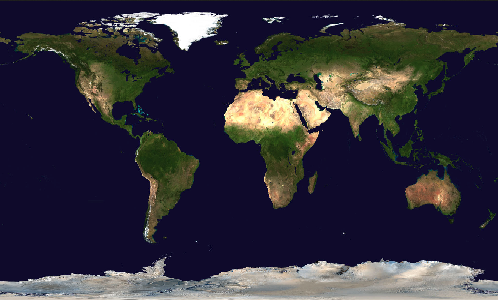
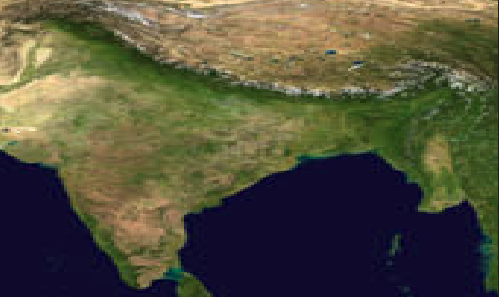
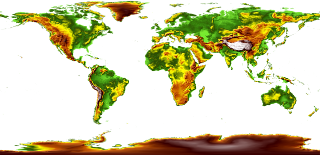
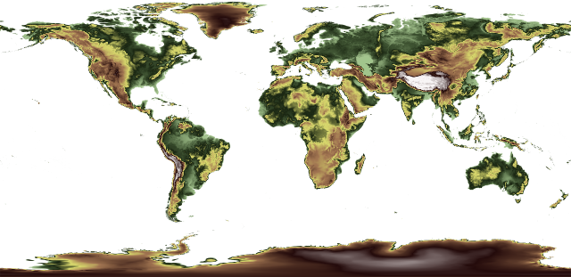

# OGC API - Maps

!!! abstract "Público-alvo"
    Estudantes que estejam familiarizados com serviços web e APIs, e queiram ter
    uma visão geral da norma OGC API - Maps

!!! abstract "Objetivos de Aprendizagem"
    Após a conclusão do módulo, os estudantes serão capazes de:

    - Explicar o que é a norma OGC API - Maps
    - Descrever o que pode ser feito com implementações da OGC API - Maps
    - Compreender os principais recursos oferecidos por implementações da OGC API - Maps
    - Compreender como recuperar uma descrição das capacidades de uma implementação da OGC API - Maps
    - Compreender como fazer pedidos a uma implementação da OGC API - Maps
    - Conseguir encontrar um endpoint da OGC API - Maps e utilizá-lo através de um cliente

## Introdução

A [OGC API - Maps](https://ogcapi.ogc.org/maps) é uma norma que descreve uma API que apresenta dados como mapas aplicando um
estilo. A norma permite que uma aplicação cliente solicite mapas como imagens, ou altere
parâmetros como tamanho e sistemas de referência de coordenadas no momento do pedido, tornando-a
amigável para programadores e facilmente compreensível por programadores sem experiência geoespacial.

!!! note
    Este módulo de tutorial não tem a intenção de substituir a própria norma **OGC API - Maps - Part 1: Core**. O tutorial foca-se intencionalmente
    num subconjunto de capacidades com o propósito de ser uma iniciação à utilização da norma. Consulte a [norma **OGC API - Maps - Parte 1:
    Core**](https://docs.ogc.org/is/20-058/20-058.html) para mais detalhes.

### Antecedentes

> História

    O trabalho da norma OGC API - Maps começou em 2019. Foi desenvolvido em relação à OGC API - Tiles para
    suportar tanto mapas dinâmicos como tiles de mapas.

> Versões

    A versão 1.0.0 da **OGC API - Maps - Part 1: Core** é a versão atual mais recente

> Suite de testes

  Atualmente não existem suites de testes implementadas; uma vez implementadas elas estarão disponíveis no [OGC Validator](https://cite.ogc.org/teamengine/).

> Implementações

    As implementações podem ser encontradas na [página de implementações](https://github.com/opengeospatial/ogcapi-maps/blob/master/implementations.adoc).

#### Utilização

#### Relação com outras normas

A Norma de Interface Web Map Service da OGC (WMS): A norma WMS é de longa data e é, sem dúvida, a norma da OGC mais conhecida
e utilizada.

### Visão geral dos Recursos

**A OGC API - Maps - Parte 1: Core** define os recursos listados na tabela seguinte.

!!! note
    Este aprofundamento foca-se na Classe de Requisitos "Collection Maps" da OGC API - Maps. "Dataset Maps" não está incluído de momento.

<table>
  <tr>
    <th>Recurso</th>
    <th>Método</th>
    <th>Caminho</th>
    <th>Finalidade</th>
  </tr>
  <tr>
    <td>Página de aterragem</td>
    <td>GET</td>
    <td>/</td>
    <td>Este é o recurso de nível superior, que serve como ponto de entrada.</td>
  </tr>
  <tr>
    <td>Declaração de conformidade</td>
    <td>GET</td>
    <td>/conformance</td>
    <td>Este recurso apresenta informação sobre a funcionalidade que está implementada pelo servidor.</td>
  </tr>
  <tr>
    <td>Definição da API</td>
    <td>GET</td>
    <td>/api</td>
    <td>Este recurso fornece metadados sobre a própria API. Note que o uso de /api no servidor é opcional e a definição da API pode estar alojada num servidor completamente separado.</td>
  </tr>
  <tr>
    <td>Coleções</td>
    <td>GET</td>
    <td>/collections</td>
    <td>Este recurso lista as coleções que são oferecidas através da API.</td>
  </tr>
  <tr>
    <td>Coleção</td>
    <td>GET</td>
    <td>/collections/{collectionId}</td>
    <td>Este recurso descreve a coleção identificada no caminho.</td>
  </tr>
  <tr>
    <td>Mapas de coleção no estilo predefinido</td>
    <td>GET</td>
    <td>/collections/{collectionId}/map</td>
    <td>Este recurso apresenta o mapa associado à coleção usando o estilo predefinido.</td>
  </tr>
  <tr>
    <td>Mapas de coleção</td>
    <td>GET</td>
    <td>/collections/{collectionId}/styles/{styleId}/map</td>
    <td>Este recurso apresenta o mapa associado à coleção usando um estilo aplicável.</td>
  </tr>
</table>

### Exemplo

Este [servidor de demonstração](https://demo.pygeoapi.io/master) publica dados geoespaciais através de uma interface que está em conformidade com a OGC API - Maps.

Um exemplo de pedido que pode ser usado para recuperar dados da coleção MapServer WMS demo é <https://demo.pygeoapi.io/master/collections/mapserver_world_map/map?f=png>

Note que, dado o âmbito e propósito da OGC API - Maps, a resposta ao pedido é uma imagem PNG bruta e não dados crus.


## Recursos

### Página de Aterragem

Como a OGC API - Maps usa a OGC API - Common como bloco de construção, consulte o aprofundamento da [OGC API - Features](features.md#landing-page)
para uma explicação detalhada de um exemplo de implementação.

### Declarações de Conformidade

Como a OGC API - Maps usa a OGC API - Common como bloco de construção, consulte o aprofundamento da [OGC API - Features](features.md#conformance-declarations)
para uma explicação detalhada de um exemplo de implementação.

### Definição da API

Como a OGC API - Maps usa a OGC API - Common como bloco de construção, consulte o aprofundamento da [OGC API - Features](features.md#api-definition)
para uma explicação detalhada de um exemplo de implementação.

### Coleções

Como a OGC API - Maps usa a OGC API - Common como bloco de construção, consulte o aprofundamento da [OGC API - Features](features.md#feature-collections)
para uma explicação detalhada de um exemplo de implementação.

As descrições de coleção da OGC API - Maps fornecem uma série de propriedades opcionais, incluindo:

- tipo de dados: uma descrição dos dados subjacentes fornecidos pelo mapa (vetorial, cobertura, mapa)
- denominador de escala mínimo e máximo: denominador de escala mínimo e máximo para utilização da coleção como mapa

Abaixo está um excerto da resposta ao pedido <https://demo.pygeoapi.io/master/collections?f=json>.

```json
{
  "id": "mapserver_world_map",
  "title": "MapServer demo WMS world map",
  "description": "MapServer demo WMS world map",
  "keywords": [
    "MapServer",
    "world map"
  ],
  "links": [
    {
      "type": "text/html",
      "rel": "canonical",
      "title": "information",
      "href": "https://demo.mapserver.org",
      "hreflang": "en-US"
    },
    {
      "type": "application/json",
      "rel": "root",
      "title": "The landing page of this server as JSON",
      "href": "https://demo.pygeoapi.io/master?f=json"
    },
    {
      "type": "text/html",
      "rel": "root",
      "title": "The landing page of this server as HTML",
      "href": "https://demo.pygeoapi.io/master?f=html"
    },
    {
      "type": "application/json",
      "rel": "self",
      "title": "This document as JSON",
      "href": "https://demo.pygeoapi.io/master/collections/mapserver_world_map?f=json"
    },
    {
      "type": "application/ld+json",
      "rel": "alternate",
      "title": "This document as RDF (JSON-LD)",
      "href": "https://demo.pygeoapi.io/master/collections/mapserver_world_map?f=jsonld"
    },
    {
      "type": "text/html",
      "rel": "alternate",
      "title": "This document as HTML",
      "href": "https://demo.pygeoapi.io/master/collections/mapserver_world_map?f=html"
    },
    {
      "type": "image/png",
      "rel": "http://www.opengis.net/def/rel/ogc/1.0/map",
      "title": "Map as png",
      "href": "https://demo.pygeoapi.io/master/collections/mapserver_world_map/map?f=png"
    }
  ],
  "extent": {
    "spatial": {
      "bbox": [
        [
          -180,
          -90,
          180,
          90
        ]
      ],
      "crs": "http://www.opengis.net/def/crs/OGC/1.3/CRS84"
    }
  }
}
```

!!! note
    Uma representação HTML pode ser vista se alterar para `f=html` ou não especificar o parâmetro `f` ao trabalhar através de um navegador web.

Na matriz `links`, note a ligação com a relação de ligação (`rel`) `http://www.opengis.net/def/rel/ogc/1.0/map`. Esta ligação
informa o cliente de que a ligação é uma interface da OGC API - Maps que fornece um mapa predefinido (`href`) ou um mapa
com vários parâmetros de consulta aplicados.

### Coleção

Como a OGC API - Maps usa a OGC API - Common como bloco de construção, consulte o aprofundamento da [OGC API - Features](features.md#feature-collection)
para uma explicação detalhada de um exemplo de implementação, bem como a descrição das [Coleções](#collections).

Para inspecionar a coleção específica, execute o pedido <https://demo.pygeoapi.io/master/collections/mapserver_world_map?f=json>.

### Mapas de coleção no estilo predefinido

Vamos gerar um mapa a partir da coleção usando a ligação no excerto [acima](#collections):

<https://demo.pygeoapi.io/master/collections/mapserver_world_map/map>

{width="80.0%"}

O pedido acima pede ao servidor OGC API - Maps para gerar um mapa predefinido, conforme determinado pelo servidor. Neste caso,
o predefinido é um mapa do mundo com uma largura de 500 pixels e altura de 300 pixels.

Podem ser adicionados parâmetros adicionais à URL do mapa com largura, altura e área de interesse específicos.

Para recortar o mapa para uma área de interesse desejada (por exemplo, a Índia), utilize o parâmetro **bbox**:

<https://demo.pygeoapi.io/master/collections/mapserver_world_map/map?f=png&bbox=69,7,99,37>

Para ajustar as dimensões do mapa, utilize os parâmetros **width** e **height**:

<https://demo.pygeoapi.io/master/collections/mapserver_world_map/map?f=png&bbox=69,7,99,37&width=800&height=600>

{width="80.0%"}

### Mapas de coleção

Para demonstrar uma implementação da OGC API - Maps, [este servidor de demonstração](https://test.cubewerx.com/cubewerx/cubeserv/demo/ogcapi/Foundation) fornece uma lista
de estilos para um dado conjunto de dados em <https://test.cubewerx.com/cubewerx/cubeserv/demo/ogcapi/Foundation/collections/gtopo30/styles?f=json>.

Cada estilo dentro da coleção pode, em seguida, ser solicitado como mapa, da seguinte forma (usando os estilos `colorShaded` e `desaturated`):

<https://test.cubewerx.com/cubewerx/cubeserv/demo/ogcapi/Foundation/collections/gtopo30/styles/colorShaded/map>

{width="80.0%"}

<https://test.cubewerx.com/cubewerx/cubeserv/demo/ogcapi/Foundation/collections/gtopo30/styles/desaturated/map>

{width="80.0%"}

## Resumo

A norma OGC API - Maps descreve uma API que apresenta dados como mapas aplicando um estilo. Este aprofundamento
proporcionou uma visão geral da norma e dos vários Recursos e endpoints que são suportados.
