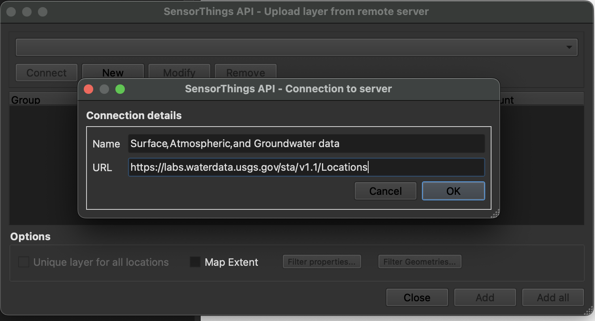
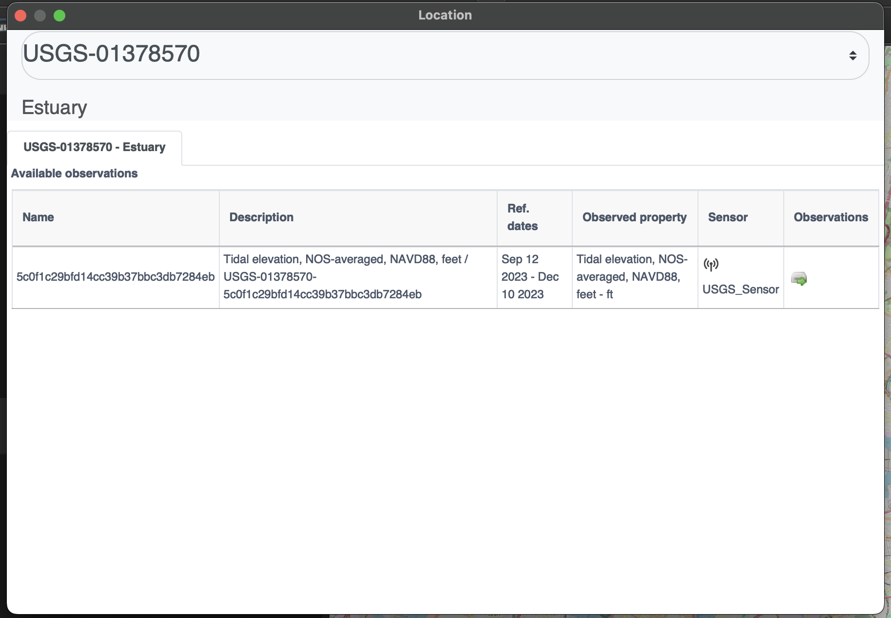
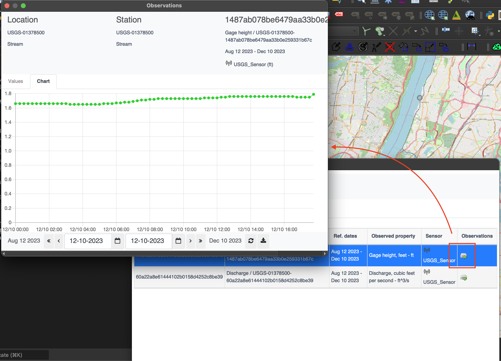

# OGC SensorThings API

!!! abstract Audience
    Students that are familiar with web services and want to have an
    overview of the SensorThings Application Programming Interface (API) standard

!!! abstract "Learning Objectives"
    At completion of the module students will be able to:

    - Explain what the SensorThings API is
    - Describe what can be done with the SensorThings API
    - Understand how to retrieve data through the SensorThings API
    - Understand how to publish sensor-collected data through the SensorThings API
    - Be able to find a SensorThings API endpoint and use it through a client

## Introduction

The Internet of Things (IoT) is a global information infrastructure that
enables advanced services by interconnecting both physical and virtual
"things" based on existing and evolving interoperable information and
communication technologies [ITU-T\]. To facilitate geospatial
interoperability between devices in the IoT, the OGC has published the
OGC SensorThings API.

The OGC SensorThings API is a multi-part standard for an open and
geospatial-enabled approach for interconnecting devices, data, and
applications of the Internet of Things (IoT). The first part of the
standard describes the interface for Sensing. The second part describes
the interface for Tasking. The Sensing part standardizes the management
and retrieval of observations and metadata from heterogeneous IoT sensor
systems. The Tasking part provides a standard way for parameterizing - also called
tasking - of IoT devices that can be instructed to carry out
observations or perform other functions. SensorThings also includes an extension, STAplus, specifically developed to address the requirements from the Citizen Science community.

!!! note
    This tutorial module is not intended to be a replacement to the actual
    **OGC SensorThings API Part 1: Sensing** standard. The tutorial
    intentionally focuses on a subset of capabilities in order to get the
    student started with using the standard. Please refer to the [**OGC SensorThings API Part 1: Sensing** standard](https://docs.ogc.org/is/18-088/18-088.html) for additional detail.

{width="100.0%"}

### Background

> History

The OGC SensorThings API is based on the existing [OGC Sensor Web Enablement (SWE) standards](https://www.ogc.org/about-ogc/domains/swe/). It was developed to address the specific needs of the IoT community. SensorThings API Part 1: Sensing version 1.0 was approved by the OGC Technical Committee in February 2016.

> Versions

**OGC SensorThings API Part 1: Sensing** Version 1.1 and **OGC SensorThings API Part 2 – Tasking Core** Version 1.0.0 are the current latest versions. The current latest version of the **STAplus extension** is 1.0.0.

> Test suite

A test suite is available for:

* [SensorThings API - Part 1](https://github.com/opengeospatial/ets-sta10)

> Public Endpoints

  A list of public endpoints can be found here: <https://github.com/opengeospatial/sensorthings/blob/master/PublicEndPoints.md>

#### Usage

The SensorThings API allows for the access and dissemination of
sensor-collected data about any object of the physical world (physical
things) or the information world (virtual things) that is capable of
being identified and integrated into communication networks. The data is
accessed through a resource-centric interface that is based on
Representational state transfer (REST) principles. The data returned by
the API is serialized in JavaScript Object Notation (JSON).

The benefit of adopting REST and JSON for the SensorThings API is that
they offer greater efficiency in devices of constrained Size, Weight and
Power (SWaP) such as microcomputers, smart home controllers,
nano-Unmanned Aerial Vehicles (UAVs), smartphones, smart watches and
tablets. The use of REST also makes it easier for web developers and the
applications they implement to access data through resource-centric
Uniform Resource Locator (URL) patterns.

* **OGC SensorThings API Part 1: Sensing** - provides a standard way to manage and retrieve observations and metadata from heterogeneous IoT sensor systems.
* **OGC SensorThings API Part 2: Tasking Core** - provides a standard way for parameterizing - also called tasking - of taskable IoT devices, such as individual sensors and actuators, composite consumer / commercial / industrial / smart cities in-situ platforms, mobile and wearable devices, or even unmanned systems platforms such as drones, satellites, connected and autonomous vehicles, etc. 
* **OGC SensorThings API Extension: STAplus** - is designed to support a model in which observations are owned by different users. This results in requirements for the ownership concept. In addition to the ownership, users may express a license for ensuring proper re-use of their observations. The STAplus extension also supports expressing explicit relations between observations as well as between observations and external resources. Relations can enrich observations to enable future extensions supporting Linked Data, RDF and SPARQL. Observation group(s) allow the grouping of observations that belong together.

!!! note

    The rest of this tutorial will focus on Version 1.0 of the Part 1 of the standard (e.g.: Sensing). Version 1.1 of SensorThings API Part 1 is an [update to version 1.0 that is (mostly) backwards compatible with version 1.0](https://docs.ogc.org/is/18-088/18-088.html#changes_v_11). 

#### Relation to other OGC Standards

-   Sensor Observation Service Interface Standard (SOS): The
    SensorThings API is designed specifically to enable the
    dissemination of observations from resource-constrained IoT devices
    and the Web developer community. In contrast to SOS, the
    SensorThings API uses approaches that are considered more efficient
    for example, REST, JSON and the Message Queuing Telemetry Transport
    (MQTT).
-   Web Feature Service Interface Standard (WFS) : The WFS standard is
    designed to allow for serving feature types of any kind. Other than
    requiring the data to be serializable in Geography Markup Language
    (GML), WFS does not place any other significant constraints. In
    contrast, SensorThings API formalized how specific entities and
    concepts should be represented and serialized.

### Overview of Resources

SensorThings API provides a serious of entities as resources.
The following is a list entities supported by the API:

> Thing

    The OGC SensorThings API follows the ITU-T definition, i.e., with
    regard to the Internet of Things, a thing is an object of the
    physical world (physical things) or the information world (virtual
    things) that is capable of being identified and integrated into
    communication networks ITU-T.

>  Location

    The Location entity locates the Thing or the Things it associated
    with. A Thing's Location entity is defined as the last known
    location of the Thing.

>  HistoricalLocation

    A Thing's HistoricalLocation entity set provides the times of the
    current (i.e., last known) and previous locations of the Thing.

>  Datastream

    A Datastream groups a collection of Observations measuring the same
    ObservedProperty and produced by the same Sensor.

> Sensor

    A Sensor is an instrument that observes a property or phenomenon
    with the goal of producing an estimate of the value of the property.

> ObservedProperty

    An ObservedProperty specifies the phenomenon of an Observation.

> Observation

    An Observation is the act of measuring or otherwise determining the
    value of a property.

> FeatureOfInterest

    The phenomenon against which an observation is made is a property of
    the feature of interest.

The figure below shows the relations between sensing entities.

{width="100.0%"}

### Example

This [SensorThings API
server](http://toronto-bike-snapshot.sensorup.com/v1.0/) publishes sample
data about available bikes and docks from a Toronto bike share station.

An example request to retrieve sensors through the API is shown below.

<http://toronto-bike-snapshot.sensorup.com/v1.0/Sensors>

The response, which is presented below, reports that there are two
sensors: one for tracking how many docks are available in a bike station
and another sensor for tracking how many bikes are available in a bike
station.

``` javascript
{"@iot.count":2,
    "value":[
        {"@iot.id":4,"@iot.selfLink": "http://toronto-bike-snapshot.sensorup.com/v1.0/Sensors(4)","description": "A sensor for tracking how many docks are available in a bike station","name": "available_docks","encodingType": "text/plan","metadata": "https://member.bikesharetoronto.com/stations","Datastreams@iot.navigationLink": "http://toronto-bike-snapshot.sensorup.com/v1.0/Sensors(4)/Datastreams"
              },
        {"@iot.id":3,"@iot.selfLink": "http://toronto-bike-snapshot.sensorup.com/v1.0/Sensors(3)","description": "A sensor for tracking how many bikes are available in a bike station","name": "available_bikes","encodingType": "text/plan","metadata": "https://member.bikesharetoronto.com/stations","Datastreams@iot.navigationLink": "http://toronto-bike-snapshot.sensorup.com/v1.0/Sensors(3)/Datastreams"
              }
           ]
}
```

The data returned by the service can be rendered by a desktop Geographic
Information System (GIS) or a web application. Alternatively, it can be
forwarded to an OGC API - Processes service for further processing.

### Client usage

A client needs to know the location of the SensorThings API service to
be able to interact with the server. The location is usually called the
```endpoint``` of the service and is represented by the service root URI.
Resources available through the service can be accessed by appending a
resource path and, optionally query options.

For example, the first line of the following URL is the service root
URI. The second line is the resource path. The third line is the query
option.

``` properties
http://toronto-bike-snapshot.sensorup.com/v1.0
/Datastreams(206051)/Observations(1593917)
?$select=result
```

The link to the request
is: <http://toronto-bike-snapshot.sensorup.com/v1.0/Datastreams(206051)/Observations(1593917)?$select=result>

Checkout various available public endpoints [here](https://github.com/opengeospatial/sensorthings/blob/master/PublicEndPoints.md)


## Operations

The entities offered by a SensorThings API service can be accessed by
appending a resource path to the service root URI. An example of a URL
that retrieves observations is shown below.

<http://toronto-bike-snapshot.sensorup.com/v1.0/Observations>

An extract of the response is presented below. Notice how the instances
of the requested entity are presented in a JSON array.

``` javascript
{"@iot.count":1594349,
    "@iot.nextLink": "http://toronto-bike-snapshot.sensorup.com/v1.0/Observations?$top=100&$skip=100","value":
        [
            {"@iot.id":1595550,"@iot.selfLink": "http://toronto-bike-snapshot.sensorup.com/v1.0/Observations(1595550)","phenomenonTime": "2017-02-16T21:55:12.841Z","result": "7","resultTime":null,"Datastream@iot.navigationLink": "http://toronto-bike-snapshot.sensorup.com/v1.0/Observations(1595550)/Datastream","FeatureOfInterest@iot.navigationLink": "http://toronto-bike-snapshot.sensorup.com/v1.0/Observations(1595550)/FeatureOfInterest"
                },
            {"@iot.id":1595551,"@iot.selfLink": "http://toronto-bike-snapshot.sensorup.com/v1.0/Observations(1595551)","phenomenonTime": "2017-02-16T21:55:12.841Z","result": "4","resultTime":null,"Datastream@iot.navigationLink": "http://toronto-bike-snapshot.sensorup.com/v1.0/Observations(1595551)/Datastream","FeatureOfInterest@iot.navigationLink": "http://toronto-bike-snapshot.sensorup.com/v1.0/Observations(1595551)/FeatureOfInterest"
                },
                ...
        ]
}
```

Other entities can also be retrieved through resource paths of a similar
pattern. The following table lists the resource paths of each entity
type.

<table>
  <caption>Entity Sets Offered</caption>
  <tr>
    <th>Entity Set</th>
    <th>Method</th>
    <th>Resource Path</th>
  </tr>
  <tr>
    <td>Things</td>
    <td>GET</td>
    <td>/Things</td>
  </tr>
  <tr>
    <td>Locations</td>
    <td>GET</td>
    <td>/Locations</td>
  </tr>
  <tr>
    <td>Historical locations</td>
    <td>GET</td>
    <td>/HistoricalLocations</td>
  </tr>
  <tr>
    <td>Datastreams</td>
    <td>GET</td>
    <td>/Datastreams</td>
  </tr>
  <tr>
    <td>Sensors</td>
    <td>GET</td>
    <td>/Sensors</td>
  </tr>
  <tr>
    <td>Observed properties</td>
    <td>GET</td>
    <td>/ObservedProperties</td>
  </tr>
  <tr>
    <td>Observations</td>
    <td>GET</td>
    <td>/Observations</td>
  </tr>
  <tr>
    <td>Features of interest</td>
    <td>GET</td>
    <td>/FeaturesOfInterest</td>
  </tr>
</table>

In addition to accessing an entity, the property of an entity can also
be accessed in a similar way by appending the name of the property to
the resource path. The following is an example of a request that
retrieves a property named ```result``` from a specific observation.

<http://toronto-bike-snapshot.sensorup.com/v1.0/Observations(1595550)/result>

Examples of resource paths of properties are shown in the following
table.

<table>
  <caption>Property Resource Path Examples</caption>
  <tr>
    <th>Property</th>
    <th>Method</th>
    <th>Resource Path</th>
  </tr>
  <tr>
    <td>Result of an observation with an ID of 1595550</td>
    <td>GET</td>
    <td>/Observations(1595550)/result</td>
  </tr>
  <tr>
    <td>The name of a feature of interest</td>
    <td>GET</td>
    <td>/Sensor(4)/metadata</td>
  </tr>
  <tr>
    <td>Coordinates of the feature observed by observation 1595550</td>
    <td>GET</td>
    <td>/Observations(1595550)/FeatureOfInterest/feature</td>
  </tr>
</table>

### Retrieval Options

#### $filter

The ```$filter``` system option allows clients to filter a collection of
entities that are addressed by a request URL.

For example, the following request returns all Observations whose result
is less than 15.00.

<http://toronto-bike-snapshot.sensorup.com/v1.0/Observations?$filter=result%20lt%2015.00>

#### $count

The ```$count``` query option specifies whether the total count of items
within a collection matching the request should be returned along with
the result.

For example, the following request returns the total number of
Observations in the collection, as well as the results. Changing the
value of the ```$count``` option to false causes the count to be omitted from
the response.

<http://toronto-bike-snapshot.sensorup.com/v1.0/Observations?$count=true>

#### $orderby

The ```$orderby``` query option specifies the order in which items are
returned from the service.

For example, the following request all Observations arranged in
ascending order of the result property

<http://toronto-bike-snapshot.sensorup.com/v1.0/Observations?$orderby=result>

#### $skip

The ```$skip``` query option specifies the number for the items of the
queried collection that should be excluded from the result.

For example, the following request all Observations starting with the
twenty-first Observation entity.

<http://toronto-bike-snapshot.sensorup.com/v1.0/Observations?$skip=20>

#### $top

The ```$top``` query option specifies the limit on the number of items
returned from a collection of entities.

For example, the following request returns only the first six entities
in the Observations collection.

<http://toronto-bike-snapshot.sensorup.com/v1.0/Observations?$top=6>

#### $expand

The ```$expand``` query option enables the client to specify the set of
properties to be included in a response by indicating that the related
entities are to be represented inline.

For example, the following request returns the complete entity set of
Things and their associated Datastreams.

<http://toronto-bike-snapshot.sensorup.com/v1.0/Things?$expand=Datastreams>

#### $select

The ```$select``` query option enables the client to specify the set of
properties to be included in a response by instructing the service to
return only the properties explicitly requested.

For example, the following request returns each Observation entity with
only the result and phenomenonTime properties listed.

<http://toronto-bike-snapshot.sensorup.com/v1.0/Observations?$select=result,phenomenonTime>

## Demo

On this section, we explore different ways to access a [SensorThings API server](http://developers.sensorup.com/docs/) on: 

<http://toronto-bike-snapshot.sensorup.com/v1.0/>

### Web Client

We start exploring the different endpoints available in the server using a web browser. In alternative you could also use [postman](https://www.postman.com/) or [curl](https://curl.se/).

#### Return Base Resource Path

<http://toronto-bike-snapshot.sensorup.com/v1.0/>

``` properties
{  
  "value":[  
      {  
          "name": "Things",
          "url": "http://pm25-march.singapore2017.sensorup.com/v1.0/Things"
      },
      {  
          "name": "Locations",
          "url": "http://pm25-march.singapore2017.sensorup.com/v1.0/Locations"
      },
      {  
          "name": "HistoricalLocations",
          "url": "http://pm25-march.singapore2017.sensorup.com/v1.0/HistoricalLocations"
      },
      {  
          "name": "Datastreams",
          "url": "http://pm25-march.singapore2017.sensorup.com/v1.0/Datastreams"
      },
      {  
          "name": "Sensors",
          "url": "http://pm25-march.singapore2017.sensorup.com/v1.0/Sensors"
      },
      {  
          "name": "Observations",
          "url": "http://pm25-march.singapore2017.sensorup.com/v1.0/Observations"
      },
      {  
          "name": "ObservedProperties",
          "url": "http://pm25-march.singapore2017.sensorup.com/v1.0/ObservedProperties"
      },
      {  
          "name": "FeaturesOfInterest",
          "url": "http://pm25-march.singapore2017.sensorup.com/v1.0/FeaturesOfInterest"
      }
      ]
      }
```

#### Which *Things* are available in the server?

<http://toronto-bike-snapshot.sensorup.com/v1.0/Things>

> ``` properties
> {  
> "@iot.count":199,
> "@iot.nextLink": "http://toronto-bike-snapshot.sensorup.com/v1.0/
>       Things?$top=100&$skip=100",
> "value":[  
>  {  
>    "@iot.id":206047,
>    "@iot.selfLink": "http://toronto-bike-snapshot.sensorup.com/v1.0/Things(206047)",
>    "description": "Bloor St / Brunswick Ave Toronto bike share station with data
>              of available bikes and available docks",
>    "name": "7061:Bloor St / Brunswick Ave",
>    "properties":{  
>
>    },
>    ...
> ```

#### Getting a *Datastream* for a thing

<http://toronto-bike-snapshot.sensorup.com/v1.0/Things(206047)/Datastreams>

``` properties
{  
 "@iot.count":2,
 "value":[  
 {  
   "@iot.id":206051,
   "@iot.selfLink":
       "http://toronto-bike-snapshot.sensorup.com/v1.0/Datastreams(206051)",
   "description":
       "... available docks count for the Toronto bike share station Bloor St ",
   "name": "7061:Bloor St / Brunswick Ave:available_docks",
   "observationType":
       "http://www.opengis.net/def/observationType/OGC-OM/2.0/OM_CountObservation",
   "unitOfMeasurement":{  
     "symbol": "{TOT}",
     "name": "dock count",
     "definition": "http://unitsofmeasure.org/ucum.html#para-50"
   },
   ....
```

!!! note
    Datastreams define the unit of measurement

    > ``` properties
    > "observationType":
    >     "http://www.opengis.net/def/observationType/OGC-OM/2.0/OM_CountObservation",
    > "unitOfMeasurement":{  
    >   "symbol": "{TOT}",
    >   "name": "dock count",
    >   "definition": "http://unitsofmeasure.org/ucum.html#para-50"
    > },
    > ```

#### Getting the *Observations* related to a stream

<http://toronto-bike-snapshot.sensorup.com/v1.0/Datastreams(206051)/Observations>

``` properties
{  
"@iot.count":3511,
"@iot.nextLink":
      "http://toronto-bike-snapshot.sensorup.com/...",
"value":[  
 {  
   "@iot.id":1595467,
   "@iot.selfLink":
      "http://toronto-bike-snapshot.sensorup.com/v1.0/Observations(1595467)",
   "phenomenonTime": "2017-02-16T21:55:12.233Z",
   "result": "23",
   "resultTime":null,
   "Datastream@iot.navigationLink":
      "http://toronto-bike-snapshot.sensorup.com/v1.0/Observations(1595467)/Datastream",
   "FeatureOfInterest@iot.navigationLink":
      "http://toronto-bike-snapshot.sensorup.com/v1.0/Observations(1595467)/FeatureOfInterest"
 },
```

#### Complex Query

-   Expands Datastreams and observations in one query
-   Feature of Interest = 7000:Ft. York / Capreol Crt.
-   Start time = 2017-01-01T11:30:00.000Z
-   End time = 2017-03-01T11:30:00.000Z

[Link](http://toronto-bike-snapshot.sensorup.com/v1.0/Things?$expand=Datastreams/Observations/FeatureOfInterest&$filter=Datastreams/Observations/FeatureOfInterest/name%20eq%20'7000:Ft.%20York%20/%20Capreol%20Crt.'%20and%20Datastreams/Observations/phenomenonTime%20ge%202017-01-01T11:30:00.000Z%20and%20Datastreams/Observations/phenomenonTime%20le%202017-03-01T11:30:00.000Z)

> ``` properties
> http://toronto-bike-snapshot.sensorup.com/v1.0/Things?
> $expand=Datastreams/Observations/FeatureOfInterest&
> $filter=Datastreams/Observations/FeatureOfInterest/
> name eq '7000:Ft. York / Capreol Crt.' and
> Datastreams/Observations/phenomenonTime ge 2017-01-01T11:30:00.000Z 
> and
> Datastreams/Observations/phenomenonTime le 2017-03-01T11:30:00.000Z
> ```

#### Complex Query Response

> ``` properties
> {  
> "@iot.count":1,
> "value":[  
>  {  
>    "@iot.id":5,
>    "@iot.selfLink": "http://toronto-bike-snapshot.sensorup.com/v1.0/Things(5)",
>    "description":
>          "Ft. York / Capreol Crt. Toronto bike share station available bikes and docks",
>    "name": "7000:Ft. York / Capreol Crt.",
>    "properties":{  
>
>    },
>    "Datastreams":[  
>      {  
>        "@iot.id":9,
>        "@iot.selfLink": "http://toronto-bike-snapshot.sensorup.com/v1.0/Datastreams(9)",
>        "description":
>             "...available docks count for the Toronto bike share station Ft. York / Capreol Crt.",
>        "name": "7000:Ft. York / Capreol Crt.:available_docks",
>        "observationType":
>             "http://www.opengis.net/def/observationType/OGC-OM/2.0/OM_CountObservation",
>        "unitOfMeasurement":{  
>          "symbol": "{TOT}",
>          "name": "dock count",
>          "definition": "http://unitsofmeasure.org/ucum.html#para-50"
>        },
> "Observations@iot.nextLink":
>          ".../v1.0/Datastreams(9)/Observations?$top=100&$skip=100",
>  "Observations":[  
>    {  
>      "@iot.id":1595545,
>      "@iot.selfLink": "http://toronto-bike-snapshot.sensorup.com/v1.0/Observations(1595545)",
>      "phenomenonTime": "2017-02-16T21:55:12.797Z",
>      "result": "10",
>      "resultTime":null,
>      "Datastream@iot.navigationLink":
>             ".... /v1.0/Observations(1595545)/Datastream",
>      "FeatureOfInterest":{  
>        "@iot.id":10,
>        "@iot.selfLink": "http://toronto-bike-snapshot.sensorup.com/v1.0/FeaturesOfInterest(10)",
>        "description": "  ...
> ```

<!-- ### Python Client

The [Sensorthings API Python Client](https://pypi.org/project/frost-sta-client/) is a python package for developing applications with SensorThings API. -->

### QGIS Plugin

The [SensorThings API plugin](https://plugins.qgis.org/plugins/SensorThingsAPI/) enables QGIS software to access dynamic data from sensors, using SensorThings API protocol.

In order to install this plugin from the QGIS repository, you will need to enable experimental plugins, in the plugins settings.

{width="100.0%"}

Open the plugin and enter SensorThings API with `/Locations`

In our case we'll connect to 
```bash

Name - Surface, Atmospheric, and Groundwater data
URL - https://labs.waterdata.usgs.gov/sta/v1.1/Locations
```

Now you can either add each sensors as new layer or combine all in one layer
{width="100.0%"}

Now we can check more information about each Location by activate `Show Location Information` and then clicking on sensor

{width="100.0%"}

Each sensor also has observation panel which allows us to see complete spatio-temporal data for each sensor in table and graph format
{width="100.0%"}


## References

[ITU-T, Overview of the Internet of
things](http://www.itu.int/ITU-T/recommendations/rec.aspx?rec=y.2060)

[SensorUp SensorThings API](https://www.sensorup.com/)

## Summary

The OGC SensorThings API provides an open and unified way to interconnect IoT devices, data, and applications over the Web. It builds on Web protocols and the OGC Sensor Web Enablement standards, and applies an easy-to-use REST-like style. This deep dive provided an overview of the entities and main operations made available by this standard.
