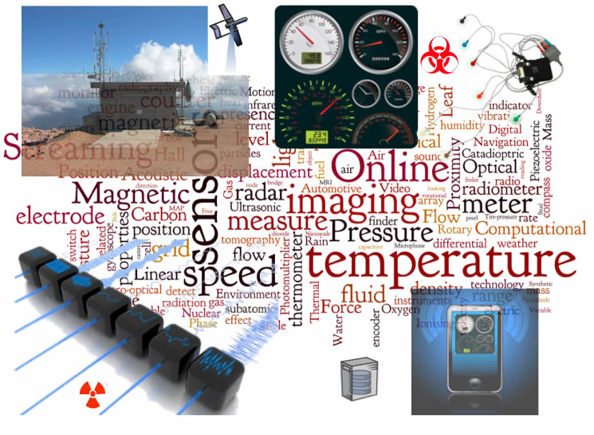
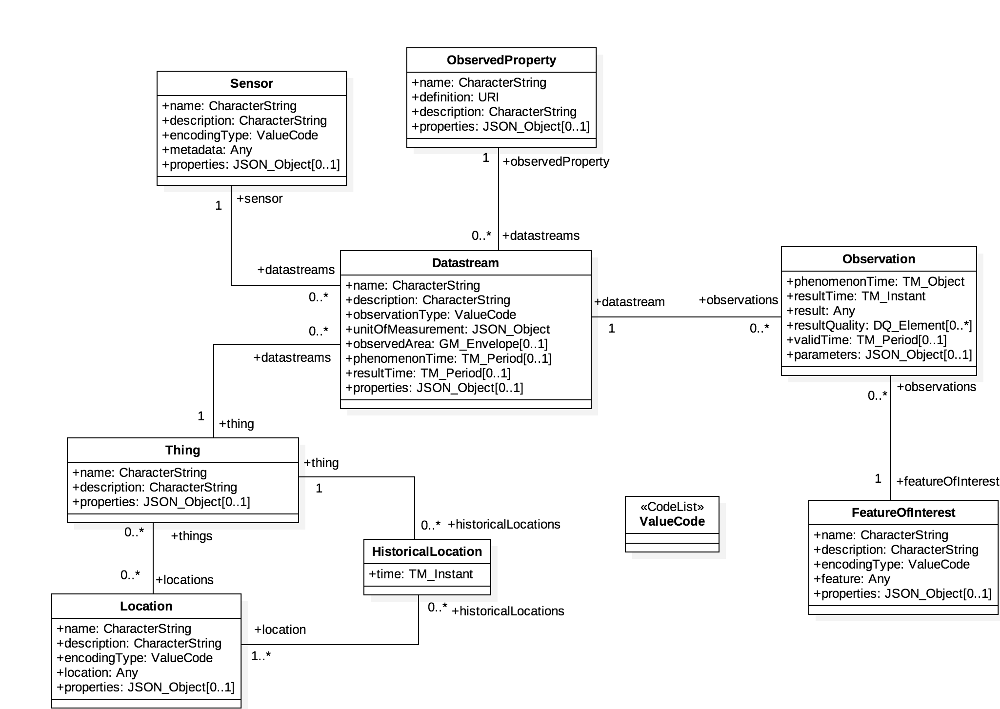
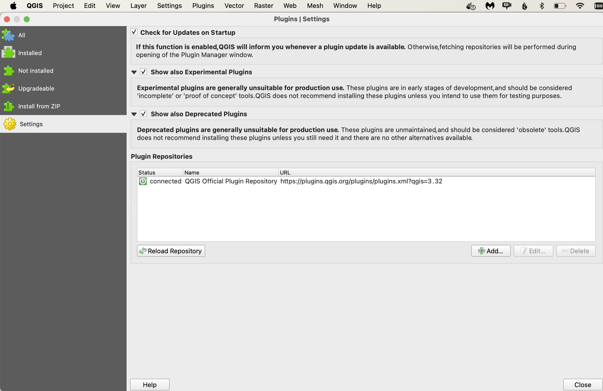
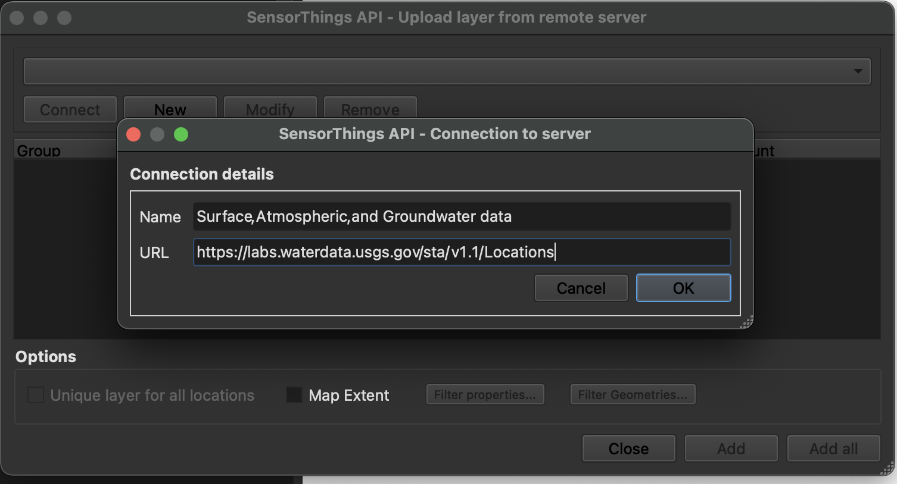
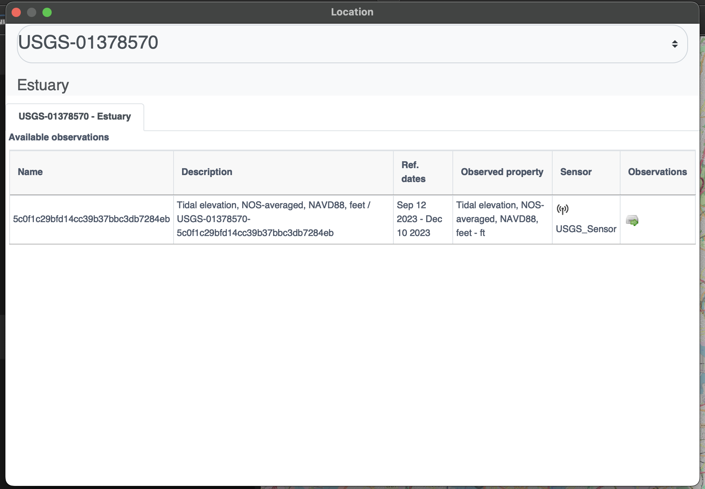
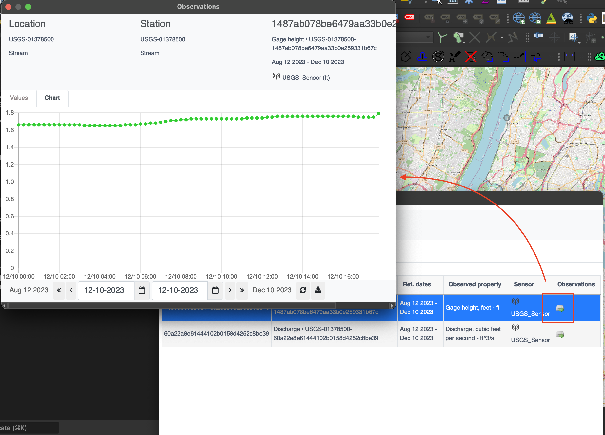

# OGC SensorThings API

!!! abstract "Público-alvo"
    Estudantes que estejam familiarizados com serviços web e queiram ter
    uma visão geral da norma da Interface de Programação de Aplicação (API) SensorThings

!!! abstract "Objetivos de Aprendizagem"
    Após a conclusão do módulo, os estudantes serão capazes de:

    - Explicar o que é a SensorThings API
    - Descrever o que pode ser feito com a SensorThings API
    - Compreender como obter dados através da SensorThings API
    - Compreender como publicar dados coletados por sensores através da SensorThings API
    - Conseguir encontrar um endpoint de uma SensorThings API e utilizá-lo através de um cliente

## Introdução

A Internet das Coisas (IoT, das siglas em inglês) é uma infraestrutura global de informação que
permite serviços avançados interligando "coisas" tanto físicas como virtuais
com base em tecnologias de informação e comunicação interoperáveis existentes e em evolução [ITU-T\]. Para facilitar a
interoperabilidade geoespacial entre dispositivos na IoT, a OGC publicou a
OGC SensorThings API.

A OGC SensorThings API é uma norma multiparte para uma abordagem aberta e
com capacidades geoespaciais para interligar dispositivos, dados e
aplicações da Internet das Coisas (IoT). A primeira parte da
norma descreve a interface para a Sensibilização (Sensing). A segunda parte descreve
a interface para a Atribuição de Tarefas (Tasking). A parte de Sensibilização padroniza a gestão
e recuperação de observações e metadados de sistemas de sensores IoT heterogéneos. A parte de Atribuição de Tarefas fornece uma forma padrão para parametrizar - também chamada
de atribuição de tarefas - dispositivos IoT que podem ser instruídos a realizar
observações ou executar outras funções. A SensorThings também inclui uma extensão, a STAplus, desenvolvida especificamente para abordar os requisitos da comunidade de Ciência Cidadã.

!!! note
    Este módulo de tutorial não tem a intenção de substituir a própria norma
    **OGC SensorThings API Parte 1: Sensibilização (Sensing)**. O tutorial
    foca-se intencionalmente num subconjunto de capacidades com o propósito de dar aos
    estudantes um ponto de partida para utilizar a norma. Consulte a [norma **OGC SensorThings API Parte 1: Sensibilização (Sensing)**](https://docs.ogc.org/is/18-088/18-088.html) para mais detalhes.

{width="100.0%"}

### Antecedentes

> História

A OGC SensorThings API baseia-se nas [normas existentes de Habilitação da Web de Sensores (SWE) da OGC](https://www.ogc.org/about-ogc/domains/swe/). Foi desenvolvida para abordar as necessidades específicas da comunidade IoT. A SensorThings API Parte 1: Sensibilização (Sensing) versão 1.0 foi aprovada pelo Comitê Técnico da OGC em fevereiro de 2016.

> Versões

As versões **OGC SensorThings API Parte 1: Sensibilização (Sensing)** Versão 1.1 e **OGC SensorThings API Parte 2 – Atribuição de Tarefas (Tasking Core)** Versão 1.0 são as versões mais recentes. A versão mais recente da **extensão STAplus** é a 1.0.

> Suite de testes

Uma suite de testes está disponível para:

* [SensorThings API - Parte 1](https://github.com/opengeospatial/ets-sta10)

> Endpoints Públicos

  Uma lista de endpoints públicos pode ser encontrada aqui: <https://github.com/opengeospatial/sensorthings/blob/master/PublicEndPoints.md>

#### Utilização

A SensorThings API permite o acesso e disseminação de
dados coletados por sensores sobre qualquer objeto do mundo físico (coisas
físicas) ou do mundo da informação (coisas virtuais) que seja capaz de
ser identificado e integrado em redes de comunicação. Os dados são
acedidos através de uma interface centrada em recursos que se baseia nos
princípios de Transferência de Estado Representacional (REST). Os dados devolvidos pela
API são serializados em Notação de Objetos JavaScript (JSON).

A vantagem de adotar REST e JSON para a SensorThings API é que
estes oferecem maior eficiência em dispositivos de Tamanho, Peso e
Potência (SWaP) restritos, como microcomputadores, controladores de casa inteligente,
nanoveículos Aéreos não Tripulados (UAV), smartphones, relógios inteligentes e
tablets. O uso de REST também torna mais fácil para os desenvolvedores web e as
aplicações que implementam aceder a dados através de
padrões de URL Uniformes centrados em recursos.

* **OGC SensorThings API Parte 1: Sensibilização (Sensing)** - fornece uma forma padrão de gerir e recuperar observações e metadados a partir de sistemas de sensores IoT heterogéneos.
* **OGC SensorThings API Parte 2: Atribuição de Tarefas (Tasking Core)** - fornece uma forma padrão para parametrizar - também chamada de atribuição de tarefas - dispositivos IoT com tarefas, como sensores e atuadores individuais, plataformas in situ de consumidores / comerciais / industriais / cidades inteligentes compostas, dispositivos móveis e vestíveis, ou mesmo plataformas de sistemas não tripulados como drones, satélites, veículos conectados e autónomos, etc.
* **OGC SensorThings API Extensão: STAplus** - foi projetada para suportar um modelo em que as observações pertencem a utilizadores diferentes. Isto resulta em requisitos para o conceito de propriedade. Além da propriedade, os utilizadores podem expressar uma licença para garantir a reutilização adequada das suas observações. A extensão STAplus também suporta a expressão de relações explícitas entre observações, bem como entre observações e recursos externos. As relações podem enriquecer observações para permitir extensões futuras que suportem Dados Ligados, RDF e SPARQL. Grupo(s) de Observação permitem agrupar observações que pertencem juntas.

!!! note

    O resto deste tutorial irá focar-se na Versão 1.0 da Parte 1 da norma (por exemplo: Sensibilização). A Versão 1.1 da SensorThings API Parte 1 é uma [atualização para a versão 1.0 que é (maioritariamente) compatível com a versão 1.0](https://docs.ogc.org/is/18-088/18-088.html#changes_v_11).

#### Relação com outras normas da OGC

-   Norma da Interface do Serviço de Observação de Sensores (SOS): A
    SensorThings API foi projetada especificamente para permitir a
    disseminação de observações a partir de dispositivos IoT com recursos limitados
    e a comunidade de desenvolvedores web. Em contraste com o SOS, a
    SensorThings API utiliza abordagens consideradas mais eficientes,
    por exemplo, REST, JSON e o Transporte de Telemetria e Enfileiramento de Mensagens
    (MQTT).
-   Norma da Interface do Serviço de Características Web (WFS): A norma WFS é
    projetada para permitir o fornecimento de tipos de características de qualquer tipo. Para além de
    exigir que os dados sejam serializáveis em Linguagem de Marcação Geográfica
    (GML), o WFS não impõe outras restrições significativas. Em
    contraste, a SensorThings API formalizou como entidades específicas e
    conceitos devem ser representados e serializados.

### Visão Geral dos Recursos

A SensorThings API fornece uma série de entidades como recursos.
A seguinte é uma lista de entidades suportadas pela API:

> Thing

    A OGC SensorThings API segue a definição da ITU-T, isto é, no
    que diz respeito à Internet das Coisas, uma coisa é um objeto do
    mundo físico (coisas físicas) ou do mundo da informação (coisas
    virtuais) que seja capaz de ser identificado e integrado em
    redes de comunicação ITU-T.

>  Location

    A entidade Location localiza a Thing ou as Things com as quais está
    associada. A entidade Location de uma Thing é definida como a última localização
    conhecida da Thing.

>  HistoricalLocation

    O conjunto de entidades HistoricalLocation de uma Thing fornece os tempos das
    localizações atuais (isto é, última localização conhecida) e anteriores da Thing.

>  Datastream

    Um Datastream agrupa uma coleção de Observações que medem o mesmo
    ObservedProperty e produzidas pelo mesmo Sensor.

> Sensor

    Um Sensor é um instrumento que observa uma propriedade ou fenômeno
    com o objetivo de produzir uma estimativa do valor da propriedade.

> ObservedProperty

    Um ObservedProperty especifica o fenômeno de uma Observação.

> Observation

    Uma Observation é o ato de medir ou de outro modo determinar o
    valor de uma propriedade.

> FeatureOfInterest

    O fenômeno contra o qual uma observação é feita é uma propriedade da
    característica de interesse.

A figura abaixo mostra as relações entre as entidades de sensibilização.

{width="100.0%"}

### Exemplo

Este [servidor de SensorThings API](http://toronto-bike-snapshot.sensorup.com/v1.0/) publica dados de exemplo
sobre bicicletas e docas disponíveis de uma estação de partilha de bicicletas de Toronto.

Um exemplo de pedido para recuperar sensores através da API é mostrado abaixo.

<http://toronto-bike-snapshot.sensorup.com/v1.0/Sensors>

A resposta, que é apresentada abaixo, reporta que existem dois
sensores: um para acompanhar quantas docas estão disponíveis numa estação de bicicletas
e outro sensor para acompanhar quantas bicicletas estão disponíveis numa estação de bicicletas.

``` javascript
{"@iot.count":2,
    "value":[
        {"@iot.id":4,"@iot.selfLink": "http://toronto-bike-snapshot.sensorup.com/v1.0/Sensors(4)","description": "Um sensor para acompanhar quantas docas estão disponíveis numa estação de bicicletas","name": "available_docks","encodingType": "text/plan","metadata": "https://member.bikesharetoronto.com/stations","Datastreams@iot.navigationLink": "http://toronto-bike-snapshot.sensorup.com/v1.0/Sensors(4)/Datastreams"
              },
        {"@iot.id":3,"@iot.selfLink": "http://toronto-bike-snapshot.sensorup.com/v1.0/Sensors(3)","description": "Um sensor para acompanhar quantas bicicletas estão disponíveis numa estação de bicicletas","name": "available_bikes","encodingType": "text/plan","metadata": "https://member.bikesharetoronto.com/stations","Datastreams@iot.navigationLink": "http://toronto-bike-snapshot.sensorup.com/v1.0/Sensors(3)/Datastreams"
              }
           ]
}
```

Os dados devolvidos pelo serviço podem ser renderizados por um Sistema de
Informação Geográfica (SIG) de desktop ou uma aplicação web. Alternativamente, podem ser
enviados para um serviço OGC API - Processes para processamento adicional.

### Utilização de Cliente

Um cliente precisa de conhecer a localização do serviço de SensorThings API para
poder interagir com o servidor. A localização é geralmente chamada de
```endpoint``` do serviço e é representada pelo URI raiz do serviço.
Os recursos disponíveis através do serviço podem ser acedidos anexando um
caminho do recurso e, opcionalmente, opções de consulta.

Por exemplo, a primeira linha do seguinte URL é o URI raiz
do serviço. A segunda linha é o caminho do recurso. A terceira linha é a opção
de consulta.

``` properties
http://toronto-bike-snapshot.sensorup.com/v1.0
/Datastreams(206051)/Observations(1593917)
?$select=result
```

O link para o pedido
é: <http://toronto-bike-snapshot.sensorup.com/v1.0/Datastreams(206051)/Observations(1593917)?$select=result>

Consulte vários endpoints públicos disponíveis [aqui](https://github.com/opengeospatial/sensorthings/blob/master/PublicEndPoints.md)


## Operações

As entidades oferecidas por um serviço de SensorThings API podem ser acedidas
anexando o caminho do recurso ao URI raiz do serviço. Um exemplo de um URL
que recupera observações é mostrado abaixo.

<http://toronto-bike-snapshot.sensorup.com/v1.0/Observations>

Um extrato da resposta é apresentado abaixo. Note como as instâncias
da entidade solicitada são apresentadas numa matriz JSON.

``` javascript
{"@iot.count":1594349,
    "@iot.nextLink": "http://toronto-bike-snapshot.sensorup.com/v1.0/Observations?$top=100&$skip=100","value":
        [
            {"@iot.id":1595550,"@iot.selfLink": "http://toronto-bike-snapshot.sensorup.com/v1.0/Observations(1595550)","phenomenonTime": "2017-02-16T21:55:12.841Z","result": "7","resultTime":null,"Datastream@iot.navigationLink": "http://toronto-bike-snapshot.sensorup.com/v1.0/Observations(1595550)/Datastream","FeatureOfInterest@iot.navigationLink": "http://toronto-bike-snapshot.sensorup.com/v1.0/Observations(1595550)/FeatureOfInterest"
                },
            {"@iot.id":1595551,"@iot.selfLink": "http://toronto-bike-snapshot.sensorup.com/v1.0/Observations(1595551)","phenomenonTime": "2017-02-16T21:55:12.841Z","result": "4","resultTime":null,"Datastream@iot.navigationLink": "http://toronto-bike-snapshot.sensorup.com/v1.0/Observations(1595551)/Datastream","FeatureOfInterest@iot.navigationLink": "http://toronto-bike-snapshot.sensorup.com/v1.0/Observations(1595551)/FeatureOfInterest"
                },
                ...
        ]
}
```

Outras entidades também podem ser recuperadas através de caminhos de recursos com um padrão
semelhante. A seguinte tabela lista os caminhos de recursos de cada tipo
de entidade.

<table>
  <caption>Conjuntos de Entidades Oferecidos</caption>
  <tr>
    <th>Conjunto de Entidades</th>
    <th>Método</th>
    <th>Caminho do Recurso</th>
  </tr>
  <tr>
    <td>Things</td>
    <td>GET</td>
    <td>/Things</td>
  </tr>
  <tr>
    <td>Locations</td>
    <td>GET</td>
    <td>/Locations</td>
  </tr>
  <tr>
    <td>Localizações Históricas</td>
    <td>GET</td>
    <td>/HistoricalLocations</td>
  </tr>
  <tr>
    <td>Datastreams</td>
    <td>GET</td>
    <td>/Datastreams</td>
  </tr>
  <tr>
    <td>Sensores</td>
    <td>GET</td>
    <td>/Sensors</td>
  </tr>
  <tr>
    <td>Propriedades Observadas</td>
    <td>GET</td>
    <td>/ObservedProperties</td>
  </tr>
  <tr>
    <td>Observações</td>
    <td>GET</td>
    <td>/Observations</td>
  </tr>
  <tr>
    <td>Características de Interesse</td>
    <td>GET</td>
    <td>/FeaturesOfInterest</td>
  </tr>
</table>

Além de aceder a uma entidade, a propriedade de uma entidade também
pode ser acedida de forma semelhante, anexando o nome da propriedade ao
caminho do recurso. O seguinte é um exemplo de um pedido que
recupera uma propriedade chamada ```result``` de uma observação específica.

<http://toronto-bike-snapshot.sensorup.com/v1.0/Observations(1595550)/result>

Exemplos de caminhos de recursos de propriedades são mostrados na seguinte
tabela.

<table>
  <caption>Exemplos de Caminho do Recurso de Propriedades</caption>
  <tr>
    <th>Propriedade</th>
    <th>Método</th>
    <th>Caminho do Recurso</th>
  </tr>
  <tr>
    <td>Resultado de uma observação com um ID de 1595550</td>
    <td>GET</td>
    <td>/Observations(1595550)/result</td>
  </tr>
  <tr>
    <td>O nome de uma característica de interesse</td>
    <td>GET</td>
    <td>/Sensor(4)/metadata</td>
  </tr>
  <tr>
    <td>Coordenadas da característica observada pela observação 1595550</td>
    <td>GET</td>
    <td>/Observations(1595550)/FeatureOfInterest/feature</td>
  </tr>
</table>

### Opções de Recuperação

#### $filter

A opção de sistema ```$filter``` permite aos clientes filtrar uma coleção de
entidades que são endereçadas por um URL de pedido.

Por exemplo, o seguinte pedido devolve todas as Observações cujo resultado
é menor que 15.00.

<http://toronto-bike-snapshot.sensorup.com/v1.0/Observations?$filter=result%20lt%2015.00>

#### $count

A opção de consulta ```$count``` especifica se a contagem total de itens
dentro de uma coleção que correspondem ao pedido deve ser devolvida junto com
o resultado.

Por exemplo, o seguinte pedido devolve o número total de
Observações na coleção, bem como os resultados. Alterando o
valor da opção ```$count``` para false faz com que a contagem seja omitida da
resposta.

<http://toronto-bike-snapshot.sensorup.com/v1.0/Observations?$count=true>

#### $orderby

A opção de consulta ```$orderby``` especifica a ordem em que os itens são
devolvidos a partir do serviço.

Por exemplo, o seguinte pedido devolve todas as Observações organizadas em
ordem ascendente da propriedade de resultado

<http://toronto-bike-snapshot.sensorup.com/v1.0/Observations?$orderby=result>

#### $skip

A opção de consulta ```$skip``` especifica o número de itens da
coleção consultada que devem ser excluídos do resultado.

Por exemplo, o seguinte pedido devolve todas as Observações a partir da
vinte e primeira entidade de Observação.

<http://toronto-bike-snapshot.sensorup.com/v1.0/Observations?$skip=20>

#### $top

A opção de consulta ```$top``` especifica o limite no número de itens
devolvidos a partir de uma coleção de entidades.

Por exemplo, o seguinte pedido devolve apenas as primeiras seis entidades
na coleção de Observações.

<http://toronto-bike-snapshot.sensorup.com/v1.0/Observations?$top=6>

#### $expand

A opção de consulta ```$expand``` permite ao cliente especificar o conjunto de
propriedades a serem incluídas numa resposta, indicando que as entidades
relacionadas devem ser representadas em linha.

Por exemplo, o seguinte pedido devolve o conjunto completo de entidades
de Things e os seus Datastreams associados.

<http://toronto-bike-snapshot.sensorup.com/v1.0/Things?$expand=Datastreams>

#### $select

A opção de consulta ```$select``` permite ao cliente especificar o conjunto de
propriedades a serem incluídas numa resposta, instruindo o serviço a
devolver apenas as propriedades explicitamente solicitadas.

Por exemplo, o seguinte pedido devolve cada entidade de Observation com
apenas as propriedades result e phenomenonTime listadas.

<http://toronto-bike-snapshot.sensorup.com/v1.0/Observations?$select=result,phenomenonTime>

## Demonstração

Nesta secção, exploramos diferentes formas de aceder a um [servidor de SensorThings API](http://developers.sensorup.com/docs/) em:

<http://toronto-bike-snapshot.sensorup.com/v1.0/>

### Cliente Web

Começamos a explorar os diferentes endpoints disponíveis no servidor utilizando um navegador web. Em alternativa, também poderia utilizar o [postman](https://www.postman.com/) ou o [curl](https://curl.se/).

#### Devolver Caminho do Recurso Base

<http://toronto-bike-snapshot.sensorup.com/v1.0/>

``` properties
{  
  "value":[  
      {  
          "name": "Things",
          "url": "http://pm25-march.singapore2017.sensorup.com/v1.0/Things"
      },
      {  
          "name": "Locations",
          "url": "http://pm25-march.singapore2017.sensorup.com/v1.0/Locations"
      },
      {  
          "name": "HistoricalLocations",
          "url": "http://pm25-march.singapore2017.sensorup.com/v1.0/HistoricalLocations"
      },
      {  
          "name": "Datastreams",
          "url": "http://pm25-march.singapore2017.sensorup.com/v1.0/Datastreams"
      },
      {  
          "name": "Sensors",
          "url": "http://pm25-march.singapore2017.sensorup.com/v1.0/Sensors"
      },
      {  
          "name": "Observations",
          "url": "http://pm25-march.singapore2017.sensorup.com/v1.0/Observations"
      },
      {  
          "name": "ObservedProperties",
          "url": "http://pm25-march.singapore2017.sensorup.com/v1.0/ObservedProperties"
      },
      {  
          "name": "FeaturesOfInterest",
          "url": "http://pm25-march.singapore2017.sensorup.com/v1.0/FeaturesOfInterest"
      }
      ]
      }
```

#### Que *Things* estão disponíveis no servidor?

<http://toronto-bike-snapshot.sensorup.com/v1.0/Things>

> ``` properties
> {  
> "@iot.count":199,
> "@iot.nextLink": "http://toronto-bike-snapshot.sensorup.com/v1.0/
>       Things?$top=100&$skip=100",
> "value":[  
>  {  
>    "@iot.id":206047,
>    "@iot.selfLink": "http://toronto-bike-snapshot.sensorup.com/v1.0/Things(206047)",
>    "description": "Estação de partilha de bicicletas de Toronto Bloor St / Brunswick Ave com dados
>              de bicicletas disponíveis e docas disponíveis",
>    "name": "7061:Bloor St / Brunswick Ave",
>    "properties":{  
>
>    },
>    ...
> ```

#### Obter um *Datastream* para uma Coisa

<http://toronto-bike-snapshot.sensorup.com/v1.0/Things(206047)/Datastreams>

``` properties
{  
 "@iot.count":2,
 "value":[  
 {  
   "@iot.id":206051,
   "@iot.selfLink":
       "http://toronto-bike-snapshot.sensorup.com/v1.0/Datastreams(206051)",
   "description":
       "... contagem de docas disponíveis para a estação de partilha de bicicletas de Toronto Bloor St ",
   "name": "7061:Bloor St / Brunswick Ave:available_docks",
   "observationType":
       "http://www.opengis.net/def/observationType/OGC-OM/2.0/OM_CountObservation",
   "unitOfMeasurement":{  
     "symbol": "{TOT}",
     "name": "dock count",
     "definition": "http://unitsofmeasure.org/ucum.html#para-50"
   },
   ....
```

!!! note
    Os Datastreams definem a unidade de medida

    > ``` properties
    > "observationType":
    >     "http://www.opengis.net/def/observationType/OGC-OM/2.0/OM_CountObservation",
    > "unitOfMeasurement":{  
    >   "symbol": "{TOT}",
    >   "name": "dock count",
    >   "definition": "http://unitsofmeasure.org/ucum.html#para-50"
    > },
    > ```

#### Obter as *Observações* relacionadas com um fluxo

<http://toronto-bike-snapshot.sensorup.com/v1.0/Datastreams(206051)/Observations>

``` properties
{  
"@iot.count":3511,
"@iot.nextLink":
      "http://toronto-bike-snapshot.sensorup.com/...",
"value":[  
 {  
   "@iot.id":1595467,
   "@iot.selfLink":
      "http://toronto-bike-snapshot.sensorup.com/v1.0/Observations(1595467)",
   "phenomenonTime": "2017-02-16T21:55:12.233Z",
   "result": "23",
   "resultTime":null,
   "Datastream@iot.navigationLink":
      "http://toronto-bike-snapshot.sensorup.com/v1.0/Observations(1595467)/Datastream",
   "FeatureOfInterest@iot.navigationLink":
      "http://toronto-bike-snapshot.sensorup.com/v1.0/Observations(1595467)/FeatureOfInterest"
 },
```

#### Consulta Complexa

-   Expande Datastreams e observações numa única consulta
-   Característica de Interesse = 7000:Ft. York / Capreol Crt.
-   Hora de início = 2017-01-01T11:30:00.000Z
-   Hora de fim = 2017-03-01T11:30:00.000Z

[Link](http://toronto-bike-snapshot.sensorup.com/v1.0/Things?$expand=Datastreams/Observations/FeatureOfInterest&$filter=Datastreams/Observations/FeatureOfInterest/name%20eq%20'7000:Ft.%20York%20/%20Capreol%20Crt.'%20and%20Datastreams/Observations/phenomenonTime%20ge%202017-01-01T11:30:00.000Z%20and%20Datastreams/Observations/phenomenonTime%20le%202017-03-01T11:30:00.000Z)

> ``` properties
> http://toronto-bike-snapshot.sensorup.com/v1.0/Things?
> $expand=Datastreams/Observations/FeatureOfInterest&
> $filter=Datastreams/Observations/FeatureOfInterest/
> name eq '7000:Ft. York / Capreol Crt.' and
> Datastreams/Observations/phenomenonTime ge 2017-01-01T11:30:00.000Z 
> and
> Datastreams/Observations/phenomenonTime le 2017-03-01T11:30:00.000Z
> ```

#### Resposta de Consulta Complexa

> ``` properties
> {  
> "@iot.count":1,
> "value":[  
>  {  
>    "@iot.id":5,
>    "@iot.selfLink": "http://toronto-bike-snapshot.sensorup.com/v1.0/Things(5)",
>    "description":
>          "Estação de partilha de bicicletas de Toronto Ft. York / Capreol Crt. com bicicletas e docas disponíveis",
>    "name": "7000:Ft. York / Capreol Crt.",
>    "properties":{  
>
>    },
>    "Datastreams":[  
>      {  
>        "@iot.id":9,
>        "@iot.selfLink": "http://toronto-bike-snapshot.sensorup.com/v1.0/Datastreams(9)",
>        "description":
>             "...contagem de docas disponíveis para a estação de partilha de bicicletas de Toronto Ft. York / Capreol Crt.",
>        "name": "7000:Ft. York / Capreol Crt.:available_docks",
>        "observationType":
>             "http://www.opengis.net/def/observationType/OGC-OM/2.0/OM_CountObservation",
>        "unitOfMeasurement":{  
>          "symbol": "{TOT}",
>          "name": "dock count",
>          "definition": "http://unitsofmeasure.org/ucum.html#para-50"
>        },
> "Observations@iot.nextLink":
>          ".../v1.0/Datastreams(9)/Observations?$top=100&$skip=100",
>  "Observations":[  
>    {  
>      "@iot.id":1595545,
>      "@iot.selfLink": "http://toronto-bike-snapshot.sensorup.com/v1.0/Observations(1595545)",
>      "phenomenonTime": "2017-02-16T21:55:12.797Z",
>      "result": "10",
>      "resultTime":null,
>      "Datastream@iot.navigationLink":
>             ".... /v1.0/Observations(1595545)/Datastream",
>      "FeatureOfInterest":{  
>        "@iot.id":10,
>        "@iot.selfLink": "http://toronto-bike-snapshot.sensorup.com/v1.0/FeaturesOfInterest(10)",
>        "description": "  ...
> ```

<!-- ### Cliente Python

O [Cliente Python da SensorThings API](https://pypi.org/project/frost-sta-client/) é um pacote python para desenvolver aplicações com a SensorThings API. -->

### Plugin QGIS

O [plugin da SensorThings API](https://plugins.qgis.org/plugins/SensorThingsAPI/) permite ao software QGIS aceder dados dinâmicos de sensores, usando a norma SensorThings API.

Para instalar este plugin a partir do repositório do QGIS, será necessário ativar os plugins experimentais, nas definições de plugins.

{width="100.0%"}

Abra o plugin e insira a SensorThings API com `/Locations`

No nosso caso, vamos conectar-nos a
```bash

Nome - Dados de superfície, atmosféricos e de águas subterrâneas
URL - https://labs.waterdata.usgs.gov/sta/v1.1/Locations
```

Agora pode adicionar cada sensor como uma nova camada ou combinar tudo numa única camada
{width="100.0%"}

Agora podemos verificar mais informações sobre cada Localização ativando `Mostrar Informação da Localização` e, em seguida, clicando no sensor

{width="100.0%"}

Cada sensor também possui um painel de observação que nos permite ver os dados espaço-temporais completos de cada sensor em formato de tabela e gráfico
{width="100.0%"}


## Referências

[ITU-T, Visão geral da Internet das Coisas
(Internet of Things)](http://www.itu.int/ITU-T/recommendations/rec.aspx?rec=y.2060)

[SensorUp SensorThings API](https://www.sensorup.com/)

## Resumo

A OGC SensorThings API fornece uma forma aberta e unificada de interligar dispositivos IoT, dados e aplicações através da Web. Baseia-se nos protocolos Web e nas normas de Habilitação da Web de Sensores (SWE) da OGC e aplica um estilo semelhante ao REST de fácil utilização. Esta análise aprofundada forneceu uma visão geral das entidades e das principais operações disponibilizadas por esta norma.
