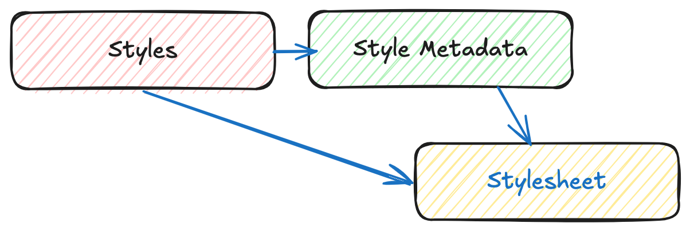

# OGC API - Styles

!!! abstract "Audience"
    Students that are familiar with web services and APIs, and want to have an overview of OGC API - Styles standard

!!! abstract "Learning Objectives"
    At the completion of the module students will be able to:

    - Explain what the OGC API - Styles standard is
    - Describe what can be done with OGC API - Styles implementations
    - Understand the main resources offered by OGC API - Styles implementations
    - Understand how to retrieve a description of the capabilities of an OGC API - Styles implementation
    - Understand how to issue requests to an implementation of OGC API - Styles
    - Be able to find an OGC API - Styles endpoint and use it through a client

## Introduction

[OGC API - Styles](https://ogcapi.ogc.org/styles) is a standard that describes an API that enables map servers, clients as well as visual style editors, to manage and fetch styles. The styles consist of symbolizing instructions that can be applied by a rendering engine on features and/or coverages. The API implements the conceptual model for style encodings and style metadata.

!!! note
    This tutorial module is not intended to be a replacement to the actual
    **OGC API - Styles - Part 1: Core** standard. The tutorial intentionally
    focuses on a subset of capabilities in order to get the student started
    with using the standard. Please refer to the [**OGC API - Styles - Part 1:
    Core** standard](https://docs.ogc.org/DRAFTS/20-009.html) for additional detail.

### Background

> History

The need for users and software to be able to control the visual portrayal of geospatial data was already present in the first generation of OGC Web Services. 

In 2002, [Web Map Service (WMS)](https://www.ogc.org/standard/wms/) 1.1.0 introduced enhanced support for styles using the [Styled Layer Descriptor (SLD)](https://www.ogc.org/standard/sld/) [Implementation Specification](https://portal.ogc.org/files/?artifact_id=1188). This specification extended WMS to allow user-defined symbolization of feature data. In 2007, SLD became a profile of WMS.

The evolution of the new web APIs also brought new capabilities in terms of changing, sharing and rendering styles, which were explored in OGC Testbed-15 Open Portrayal Framework (OPF), in 2019. This work was documented in the [OGC Testbed-15: Styles API Engineering Report](https://docs.ogc.org/per/19-010r2.html). The following year, in 2020, the charter for the OGC API - Styles Standards Working Group was drafted.

> Versions

  **OGC API - Styles - Part 1: Core** is currently in draft.

> Test suite

  There are no test suites currently implemented; they will be made available once the specification is
  approved, and an executable test suite (ETS) is made availabe as per of OGC CITE.

> Implementations

  Implementations can be found on the [implementations page](https://github.com/opengeospatial/ogcapi-styles/blob/master/implementations.md).

#### Usage

The Styles API supports three main types of consumers:

* Visual style editors that create, update and delete styles for datasets shared by other OGC APIs that publish feature or coverage data. Feature data is either accessed directly or organized into spatial partitions (e.g.: vector tiles).
* OGC API - Maps implementations, that fetch styles and render spatial data (features or coverages) on the server.
* Map clients that fetch styles and render spatial data (features or coverages) on the client.

The draft Standard also defines a conceptual model for styles, style encodings and style metadata. The model defines three main concepts, which are mapped to resources and documents.

* **Style**: the main resource.
* **Stylesheets**: the representation of a style in an encoding like OGC SLD 1.0 or Mapbox Style. Each style is available in one or more stylesheets. Clients will use the stylesheet of a style that fits best based on the capabilities of available tools and their preferences. 
* **Style metadata**: general descriptive information about the style, structural information (e.g., layers and attributes), and so forth to allow users to discover and select existing styles for their data. For each style there is style metadata available.

!!! note

    *Draft* **OGC API - Styles - Part 1**: Core offers conformance classes for fetching styles and style metadata, managing and validating styles.

#### Relation to other standards

OGC API - Styles is designed to be combined with other OGC API Standards, in order to produce styled geospatial data.
Feature or coverage data published through OGC APIs, can be styled on client side with styles produced by OGC API - Styles editors. This is the case of OGC API - Features, OGC API - Coverages or OGC API - Tiles (vector tiles).
OGC API - Maps has support for fetching styles and rendering geospatial data (features or coverages) on server side. 

The styles themselves can be represented using different encodings. As usual in OGC API, no encodings are prescribed, although the draft Standard offers conformance classes for [OGC SLD 1.0](http://portal.opengeospatial.org/files/?artifact_id=1188)/[1.1](http://portal.opengeospatial.org/files/?artifact_id=22364) and [Mapbox Styles](https://docs.mapbox.com/style-spec/guides/).

### Overview of Resources

**OGC API - Styles - Part 1: Core** defines the resources listed in
the following table.

<table>
  <tr>
    <th>Resource</th>
    <th>Method</th>
    <th>Path</th>
    <th>Purpose</th>
  </tr>
  <tr>
    <td>Landing page</td>
    <td>GET</td>
    <td>/</td>
    <td>This is the top-level resource, which serves as an entry point.</td>
  </tr>
  <tr>
    <td>Conformance declaration</td>
    <td>GET</td>
    <td>/conformance</td>
    <td>This resource presents information about the functionality that is implemented by the server.</td>
  </tr>
  <tr>
    <td>Fetch Styles</td>
    <td>GET</td>
    <td>/styles</td>
    <td>This resource lists the styles that are offered through the API.</td>
  </tr>
  <tr>
    <td>Create or validate Styles</td>
    <td>POST</td>
    <td>/styles</td>
    <td>This resource enables the creation of a new Style or the validation of an existing one.</td>
  </tr>
  <tr>
    <td>Fetch Style</td>
    <td>GET</td>
    <td>/styles/{styleId}</td>
    <td>This resource retrieves the style identified in the path.</td>
  </tr>
  <tr>
    <td>Create or validate Style</td>
    <td>PUT</td>
    <td>/styles/{styleId}</td>
    <td>This resource can be used to update, create or validate the style identified in the path.</td>
  </tr>
  <tr>
    <td>Delete Style</td>
    <td>DELETE</td>
    <td>/styles/{styleId}</td>
    <td>This resource can be used to delete the style identified in the path.</td>
  </tr>
  <tr>
    <td>Fetch Style metadata</td>
    <td>GET</td>
    <td>/styles/{styleId}/metadata</td>
    <td>This resource retrieves the metadata of the style identified in the path.</td>
  </tr>
  <tr>
    <td>Replace Style metadata</td>
    <td>PUT</td>
    <td>/styles/{styleId}</td>
    <td>This resource replaces the metadata of the style identified in the path.</td>
  </tr>
  <tr>
    <td>Patch Style metadata</td>
    <td>PATCH</td>
    <td>/styles/{styleId}</td>
    <td>This resource updates parts of the metadata of the style identified in the path.</td>
  </tr>
  <tr>
    <td>Fetch resources</td>
    <td>GET</td>
    <td>/resources</td>
    <td>This operation fetches the set of resources (e.g.: symbols and sprites) that have been created and that may be used by reference in stylesheets.</td>
  </tr>
  <tr>
    <td>Fetch symbol resource by id</td>
    <td>GET</td>
    <td>/resources/{resourceId}</td>
    <td>This operation fetches the resource with identifier resourceId. The set of available resources can be retrieved at /resources.</td>
  </tr>
  <tr>
    <td>Replace symbol resource or add new one</td>
    <td>PUT</td>
    <td>/resources/{resourceId}</td>
    <td>This operation replaces an existing resource with the id resourceId. If no such resource exists, a new resource with that id is added. This operation is only available to registered style authors.</td>
  </tr>
  <tr>
    <td>Delete symbol resource</td>
    <td>DELETE</td>
    <td>/resources/{resourceId}</td>
    <td>This operation deletes an existing resource with the id resourceId. If no such resource exists, an error is returned. This operation is only available to registered style authors.</td>
  </tr>
</table>

!!! note

    A *sprite* used in a Mapbox Style stylesheet consists of three resources: 

    * PNG bitmap image (resourceId ends in '.png').
    * JSON index file (resourceId of the same name, but ends in '.json' instead of '.png')
    * PNG bitmap image for high-resolution displays (the file ends in '.@2x.png').
    
    Each of the resources needs to be created (and eventually deleted) separately. 

### Example

This [demonstration
server](https://demo.ldproxy.net/)
publishes styles through an interface that conforms to
OGC API - Features.

An example request that can be used to list the styles from the Daara collection is
<https://demo.ldproxy.net/daraa/styles?f=html>

Note that the response to the request is HTML in this case.

Alternatively, the same data can be retrieved in GeoJSON format, through
the request
<https://demo.ldproxy.net/daraa/styles?f=json>

These styles can be rendered by a client application, or applied directly by other OGC APIs that support styles. The example below shows the *Night* style, being applied by OGC API - Maps.
<https://demo.ldproxy.net/daraa/styles/night?f=html#12.24/32.6264/36.1033>

<iframe
  src="https://demo.ldproxy.net/daraa/styles/night?f=html#12.24/32.6264/36.1033s"
  style="width:100%; height:800px;"
></iframe>

## Resources

Styles are the main resources of this API. 

* For each style there is style metadata available, with general descriptive information about the style, structural information (e.g., layers and attributes), and so forth to allow users to discover and select existing styles for their data.

* Each style is available as one or more stylesheets - the representation of a style in an encoding like OGC SLD 1.0 or Mapbox Style. Clients will use the stylesheet of a style that fits best based on the capabilities of available tools and their preferences.

A basic request workflow could look like the diagram below, where a client requests the list of styles, and then asks for more information about a particular style, before fetching the stylesheet. In alternative, a client can request the stylesheet directly after the styles request. 

{width="80.0%"}

!!! note

    This section will focus on the resources related to requirements class "Core": fetching styles, style and style metadata.  


### Landing page

Given OGC API - Styles uses OGC API - Common as a building block, please see the [OGC API - Features](features.md#landing-page) deep dive
for a detailed explanation of an example implementation.

### Conformance declarations

Given OGC API - Styles uses OGC API - Common as a building block, please see the [OGC API - Features](features.md#conformance-declarations) deep dive
for a detailed explanation of an example implementation.

### API Definition

Given OGC API - Styles uses OGC API - Common as a building block, please see the [OGC API - Features](features.md#api-definition) deep dive
for a detailed explanation of an example implementation.

### Style list

This endpoint, lists the styles available on the server, and for each describes basic information like its id, title and description, as well as the available stylesheets.

Below is an extract from the response to the request <https://demo.ldproxy.net/daraa/styles?f=json>.

```json
{
  "styles": [
    {
      "title": "night",
      "id": "night",
      "links": [
        {
          "rel": "describedby",
          "title": "Style metadata",
          "href": "https://demo.ldproxy.net/daraa/styles/night/metadata"
        },
        {
          "rel": "stylesheet",
          "type": "text/html",
          "title": "Web map using the style",
          "href": "https://demo.ldproxy.net/daraa/styles/night?f=html"
        },
        {
          "rel": "stylesheet",
          "type": "application/vnd.mapbox.style+json",
          "title": "Style in format 'Mapbox'",
          "href": "https://demo.ldproxy.net/daraa/styles/night?f=mbs"
        }
      ]
    },
```

In this response, we can see that the links to retrieve more information about the style (e.g.: style metadata) and to retrieve it as a stylesheet.

### Style metadata

Requests the metadata for a particular style, so that a client has more information about a potential style of interest. The response format (typically HTML or JSON, but extensions can easily supply others) is determined using HTTP content negotiation.

In the sample below, we request information about the *topographic* style. The full response can be retrieved using this request:
<https://demo.ldproxy.net/daraa/styles/topographic/metadata?f=json>

```json
{
  "title": "topographic",
  "links": [
    {
      "rel": "self",
      "type": "application/json",
      "title": "This document",
      "href": "https://demo.ldproxy.net/daraa/styles/topographic/metadata?f=json"
    },
    {
      "rel": "alternate",
      "type": "text/html",
      "title": "This document as HTML",
      "href": "https://demo.ldproxy.net/daraa/styles/topographic/metadata?f=html"
    }
  ],
  "id": "topographic",
  "scope": "style",
  "stylesheets": [
    {
      "title": "Mapbox",
      "version": "8",
      "specification": "https://docs.mapbox.com/mapbox-gl-js/style-spec/",
      "native": true,
      "link": {
        "rel": "stylesheet",
        "type": "application/vnd.mapbox.style+json",
        "title": "Style in format 'Mapbox'",
        "href": "https://demo.ldproxy.net/daraa/styles/topographic?f=mbs"
      }
    }
  ],
```

### Fetch Style

This request returns a stylesheet. If multiple encodings are available, the style encoding is determined using HTTP content negotiation. For instance, a client looking for a Mapbox stylesheet, could request the `application/vnd.mapbox.style+json` type.

In the example below, the *topographic* style is retrieved as a Mapbox stylesheet. 

<https://demo.ldproxy.net/daraa/styles/topographic?f=mbs>

This sample shows an extract of the Mapbox spec 8.0, response.

```json
    "daraa": {
      "type": "vector",
      "tiles": [
        "https://demo.ldproxy.net/daraa/tiles/WebMercatorQuad/{z}/{y}/{x}?f=mvt"
      ],
      "bounds": [
        35.755073,
        32.357351,
        37.205276,
        33.26714
      ],
      "scheme": "xyz",
      "maxzoom": 16
    }
  },
  "sprite": "https://demo.ldproxy.net/daraa/resources/sprites",
  "glyphs": "https://go-spatial.github.io/carto-assets/fonts/{fontstack}/{range}.pbf",
  "layers": [
    {
      "id": "Grey Background",
      "type": "background",
      "layout": {
        "visibility": "visible"
      },
      "paint": {
        "background-color": "#d3d3d3"
      }
    },
    {
      "id": "OSM",
      "type": "raster",
      "source": "osm",
      "layout": {
        "visibility": "none"
      }
    },
    {
      "id": "agriculturesrf",
      "type": "fill",
      "source": "daraa",
      "source-layer": "AgricultureSrf",
      "paint": {
        "fill-color": "#7ac5a5"
      }
    },
    {
      "id": "vegetationsrf",
      "type": "fill",
      "source": "daraa",
      "source-layer": "VegetationSrf",
      "paint": {
        "fill-color": "#C2E4B9"
      }
    },
    {
      "id": "settlementsrf.1",
      "type": "line",
      "source": "daraa",
      "source-layer": "SettlementSrf",
      "paint": {
        "line-color": "#000000",
        "line-width": 2
      }
    },
    {
      "id": "settlementsrf.2",
      "type": "fill",
      "source": "daraa",
      "source-layer": "SettlementSrf",
      "paint": {
        "fill-color": "#E8C3B2"
      }
    },
    {
      "id": "militarysrf",
      "type": "fill",
      "source": "daraa",
      "source-layer": "MilitarySrf",
      "paint": {
        "fill-color": "#f3602f",
        "fill-opacity": 0.5
      }
    },
    {
      "id": "culturesrf",
      "type": "fill",
      "source": "daraa",
      "source-layer": "CultureSrf",
      "paint": {
        "fill-color": "#ab92d2",
        "fill-opacity": 0.5
      }
    },
    {
      "id": "hydrographycrv",
      "type": "line",
      "source": "daraa",
      "source-layer": "HydrographyCrv",
      "filter": [
        "==",
        "BH140",
        [
          "get",
          "F_CODE"
        ]
      ],
      "paint": {
        "line-color": "#00A0C6",
        "line-width": [
          "step",
          [
            "zoom"
          ],
          1,
          8,
          2,
          13,
          4
        ]
      }
    },
```

## Summary

The OGC API - Styles candidate Standard describes an API for accessing and managing styles for rendering geospatial data on the web. It provides building blocks for interacting with styles in multiple style encodings and with metadata for the styles. This deep dive provided an overview of the candidate Standard and the various resources and endpoints that are supported.