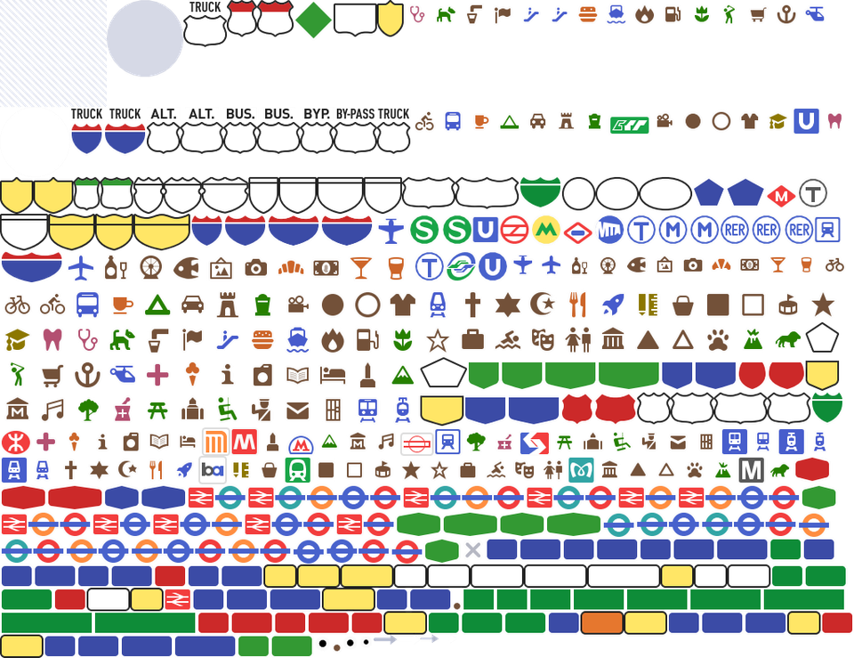
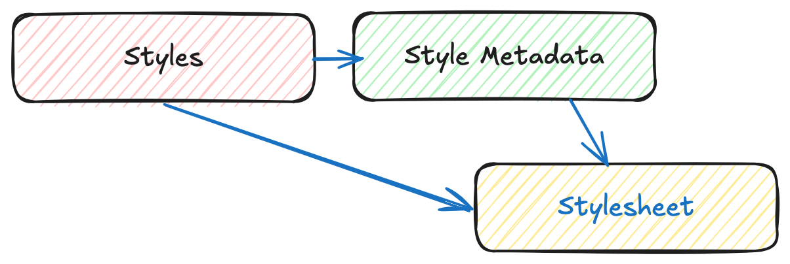

# OGC API - Styles

!!! abstract "Público-alvo"
    Estudantes familiarizados com serviços web e APIs, que desejam ter uma visão geral da norma OGC API - Styles

!!! abstract "Objetivos de Aprendizagem"
    Ao concluir o módulo, os estudantes serão capazes de:

    - Explicar o que é a norma OGC API - Styles
    - Descrever o que pode ser feito com implementações da OGC API - Styles
    - Compreender os principais recursos oferecidos por implementações da OGC API - Styles
    - Compreender como obter uma descrição das capacidades de uma implementação da OGC API - Styles
    - Compreender como fazer pedidos a uma implementação da OGC API - Styles
    - Conseguir encontrar um endpoint da OGC API - Styles e utilizá-lo através de um cliente

## Introdução

A [OGC API - Styles](https://ogcapi.ogc.org/styles) é uma norma que descreve uma API que permite a servidores de mapa, clientes, bem como editores de estilo visual, gerir e obter estilos. Os estilos consistem em instruções de simbolização que podem ser aplicadas por um motor de renderização em entidades e/ou coverages. A API implementa o modelo conceptual para codificações de estilo e metadados de estilo.

!!! note
    Este módulo tutorial não tem a intenção de substituir a própria norma 
    **OGC API - Processes - Parte 1: Core**. O tutorial
    concentra-se intencionalmente num subconjunto de capacidades com o propósito de ser uma iniciação à utilização da norma. Consulte a norma da **OGC API -
    Processes - Parte 1: Core** para mais detalhes

!!! note
    Este módulo tutorial não tem a intenção de substituir a norma candidata **OGC API - Styles - Parte 1: Core**. O tutorial concentra-se
    intencionalmente num subconjunto de capacidades com o propósito de ser uma iniciação à utilização da norma candidata. Consulte a [norma candidata **OGC API - Styles - Parte 1:
    Core**](https://docs.ogc.org/DRAFTS/20-009.html) para mais detalhes.

### Antecedentes

> Histórico

A necessidade de utilizadores e software poderem controlar a representação visual de dados geoespaciais já estava presente na primeira geração de serviços web da OGC.

Em 2001, o [Web Map Service (WMS)](https://www.ogc.org/standard/wms/) 1.1.0 introduziu suporte aprimorado para estilos utilizando a [Especificação de Implementação do Styled Layer Descriptor (SLD)](https://www.ogc.org/standard/sld/). Esta especificação estendeu o WMS para permitir a simbolização definida pelo utilizador de dados de entidades. Em 2007, o SLD tornou-se num perfil do WMS.

A evolução das novas APIs web também trouxe novas capacidades em termos de alteração, partilha e renderização de estilos, que foram exploradas no OGC Testbed-15 Open Portrayal Framework (OPF), em 2019. Este trabalho foi documentado no [Relatório de Engenharia do OGC Testbed-15: Styles API](https://docs.ogc.org/per/19-010r2.html). No ano seguinte, em 2020, foi redigida a carta de formação do Grupo de Trabalho da OGC API - Styles.

> Versões

  A **OGC API - Styles - Parte 1: Core** está atualmente em rascunho.

> Suite de testes

  Atualmente não existem suites de testes implementadas; estas serão disponibilizadas assim que a especificação for
  aprovada e uma suite de testes executável (ETS) estiver disponível conforme a OGC CITE.

> Implementações

  As implementações podem ser encontradas na [página de implementações](https://github.com/opengeospatial/ogcapi-styles/blob/master/implementations.md).

#### Utilização

A API de Estilos suporta três tipos principais de consumidores:

* Editores de estilo visual que criam, atualizam e eliminam estilos para conjuntos de dados partilhados por outras APIs da OGC que publiquem dados de entidades ou coverages. Os dados de entidades são acessados diretamente ou organizados em partições espaciais (por exemplo: tiles vetoriais).
* Implementações do OGC API - Maps, que obtêm estilos e renderizam dados espaciais (entidades ou coverages) no servidor.
* Clientes de mapa que obtêm estilos e renderizam dados espaciais (entidades ou coverages) no cliente.

A norma candidata também define um modelo conceptual para estilos, codificações de estilo e metadados de estilo. O modelo define três conceitos principais, que são mapeados para recursos e documentos.

* **Estilo**: o recurso principal.
* **Folhas de estilo**: a representação de um estilo numa codificação como OGC SLD 1.0 ou Mapbox Style. Cada estilo está disponível numa ou mais folhas de estilo. Os clientes utilizarão a folha de estilo de um estilo que melhor se ajuste com base nas capacidades das ferramentas disponíveis e nas respetivas preferências.
* **Metadados de estilo**: informação descritiva geral sobre o estilo, informação estrutural (por exemplo, camadas e atributos), e assim por diante, para permitir aos utilizadores descobrir e selecionar estilos existentes para os seus dados. Para cada estilo, existem metadados de estilo disponíveis.

!!! note

    A **OGC API - Styles - Parte 1** (rascunho): Core oferece classes de conformidade para obter estilos e metadados de estilo, bem como para gerir e validar estilos.

#### Relação com outras normas

A OGC API - Styles foi concebida para ser combinada com outras normas da OGC API, de modo a produzir dados geoespaciais estilizados.
Dados de entidades ou coverages publicados através de APIs da OGC podem ser estilizados no lado do cliente com estilos produzidos por editores da OGC API - Styles. Este é o caso da OGC API - Features, OGC API - Coverages ou OGC API - Tiles (tiles vetoriais).
A OGC API - Maps suporta a obtenção de estilos e a renderização de dados geoespaciais (entidades ou coverages) no lado do servidor.

Os estilos em si podem ser representados utilizando diferentes codificações. Como habitual nas APIs da OGC, não há codificações prescritas, embora a norma de rascunho ofereça classes de conformidade para [OGC SLD 1.0](http://portal.opengeospatial.org/files/?artifact_id=1188)/[1.1](http://portal.opengeospatial.org/files/?artifact_id=22364) e [Mapbox Styles](https://docs.mapbox.com/style-spec/guides/).

### Visão geral dos recursos

A **OGC API - Styles - Parte 1: Core** define os recursos listados na
tabela seguinte.

<table>
  <tr>
    <th>Recurso</th>
    <th>Método</th>
    <th>Caminho</th>
    <th>Propósito</th>
  </tr>
  <tr>
    <td>Página de aterragem</td>
    <td>GET</td>
    <td>/</td>
    <td>Este é o recurso de nível superior, que serve como ponto de entrada.</td>
  </tr>
  <tr>
    <td>Declaração de conformidade</td>
    <td>GET</td>
    <td>/conformance</td>
    <td>Este recurso apresenta informação sobre a funcionalidade que é implementada pelo servidor.</td>
  </tr>
  <tr>
    <td>Obter Estilos</td>
    <td>GET</td>
    <td>/styles</td>
    <td>Este recurso lista os estilos oferecidos através da API.</td>
  </tr>
  <tr>
    <td>Criar ou validar Estilos</td>
    <td>POST</td>
    <td>/styles</td>
    <td>Este recurso permite a criação de um novo Estilo ou a validação de um existente.</td>
  </tr>
  <tr>
    <td>Obter Estilo</td>
    <td>GET</td>
    <td>/styles/{styleId}</td>
    <td>Este recurso recupera o estilo identificado no caminho.</td>
  </tr>
  <tr>
    <td>Criar ou validar Estilo</td>
    <td>PUT</td>
    <td>/styles/{styleId}</td>
    <td>Este recurso pode ser utilizado para atualizar, criar ou validar o estilo identificado no caminho.</td>
  </tr>
  <tr>
    <td>Eliminar Estilo</td>
    <td>DELETE</td>
    <td>/styles/{styleId}</td>
    <td>Este recurso pode ser utilizado para eliminar o estilo identificado no caminho.</td>
  </tr>
  <tr>
    <td>Obter metadados do Estilo</td>
    <td>GET</td>
    <td>/styles/{styleId}/metadata</td>
    <td>Este recurso recupera os metadados do estilo identificado no caminho.</td>
  </tr>
  <tr>
    <td>Substituir metadados do Estilo</td>
    <td>PUT</td>
    <td>/styles/{styleId}</td>
    <td>Este recurso substitui os metadados do estilo identificado no caminho.</td>
  </tr>
  <tr>
    <td>Atualizar parcialmente metadados do Estilo</td>
    <td>PATCH</td>
    <td>/styles/{styleId}</td>
    <td>Este recurso atualiza parcialmente os metadados do estilo identificado no caminho.</td>
  </tr>
  <tr>
    <td>Obter recursos</td>
    <td>GET</td>
    <td>/resources</td>
    <td>Esta operação obtém o conjunto de recursos (por exemplo: símbolos e sprites) que foram criados e que podem ser utilizados por referência nas folhas de estilo.</td>
  </tr>
  <tr>
    <td>Obter recurso de símbolo por id</td>
    <td>GET</td>
    <td>/resources/{resourceId}</td>
    <td>Esta operação obtém o recurso com o identificador resourceId. O conjunto de recursos disponíveis pode ser recuperado em /resources.</td>
  </tr>
  <tr>
    <td>Substituir recurso de símbolo ou adicionar novo</td>
    <td>PUT</td>
    <td>/resources/{resourceId}</td>
    <td>Esta operação substitui um recurso existente com o id resourceId. Se tal recurso não existir, um novo recurso com esse id é adicionado. Esta operação está apenas disponível para autores de estilos registados.</td>
  </tr>
  <tr>
    <td>Eliminar recurso de símbolo</td>
    <td>DELETE</td>
    <td>/resources/{resourceId}</td>
    <td>Esta operação elimina um recurso existente com o id resourceId. Se tal recurso não existir, é devolvido um erro. Esta operação está apenas disponível para autores de estilos registados.</td>
  </tr>
</table>

!!! note

    Um *sprite* utilizado numa folha de estilo Mapbox consiste em três recursos:

    * Imagem bitmap PNG (resourceId termina em '.png').
    * Ficheiro de índice JSON (resourceId do mesmo nome, mas termina em '.json' em vez de '.png')
    * Imagem bitmap PNG para ecrãs de alta resolução (o ficheiro termina em '.@2x.png').

    Cada um dos recursos precisa de ser criado (e eventualmente eliminado) separadamente.


    {width="60.0%"}

### Exemplo

O [servidor de demonstração](https://demo.ldproxy.net/)
publica estilos através de uma interface que está em conformidade com
a OGC API - Features.

Um exemplo de pedido que pode ser utilizado para listar os estilos da coleção Daraa é
<https://demo.ldproxy.net/daraa/styles?f=html>

Note que a resposta ao pedido é HTML neste caso.

Em alternativa, os mesmos dados podem ser recuperados no formato GeoJSON, através
do pedido
<https://demo.ldproxy.net/daraa/styles?f=json>

Estes estilos podem ser renderizados por uma aplicação cliente, ou aplicados diretamente por outras APIs da OGC que suportem estilos. O exemplo abaixo mostra o estilo *Night*, a ser aplicado pelo OGC API - Maps.
<https://demo.ldproxy.net/daraa/styles/night?f=html#12.24/32.6264/36.1033>

<iframe
  src="https://demo.ldproxy.net/daraa/styles/night?f=html#12.24/32.6264/36.1033s"
  style="width:100%; height:800px;"
></iframe>

## Recursos

Os estilos são os principais recursos desta API.

* Para cada estilo, existem metadados de estilo disponíveis, com informação descritiva geral sobre o estilo, informação estrutural (por exemplo, camadas e atributos), e assim por diante, para permitir aos utilizadores descobrir e selecionar estilos existentes para os seus dados.

* Cada estilo está disponível numa ou mais folhas de estilo — a representação de um estilo numa codificação como OGC SLD 1.0 ou Mapbox Style. Os clientes utilizarão a folha de estilo de um estilo que melhor se ajuste com base nas capacidades das ferramentas disponíveis e nas respetivas preferências.

Um fluxo de trabalho básico de pedido poderá parecer com o diagrama abaixo, onde um cliente solicita a lista de estilos e, em seguida, pede mais informação sobre um estilo particular, antes de obter a folha de estilo. Alternativamente, um cliente pode solicitar a folha de estilo diretamente após o pedido de estilos.

{width="80.0%"}

!!! note

    Esta secção vai focar-se nos recursos relacionados com a classe de requisitos «Core»: obtenção de estilos, de estilo e de metadados de estilo.


### Página de aterragem

Dado que a OGC API - Styles utiliza a OGC API - Common como bloco de construção, consulte a [OGC API - Features](features.md#landing-page) para
uma explicação detalhada de uma implementação de exemplo.

### Declarações de conformidade

Dado que a OGC API - Styles utiliza a OGC API - Common como bloco de construção, consulte a [OGC API - Features](features.md#conformance-declarations) para
uma explicação detalhada de uma implementação de exemplo.

### Definição da API

Dado que a OGC API - Styles utiliza a OGC API - Common como bloco de construção, consulte a [OGC API - Features](features.md#api-definition) para
uma explicação detalhada de uma implementação de exemplo.

### Lista de estilos

Este endpoint lista os estilos disponíveis no servidor e, para cada um, descreve informação básica como o seu id, título e descrição, bem como as folhas de estilo disponíveis.

Abaixo segue um excerto da resposta ao pedido <https://demo.ldproxy.net/daraa/styles?f=json>.

```json
{
  "styles": [
    {
      "title": "night",
      "id": "night",
      "links": [
        {
          "rel": "describedby",
          "title": "Style metadata",
          "href": "https://demo.ldproxy.net/daraa/styles/night/metadata"
        },
        {
          "rel": "stylesheet",
          "type": "text/html",
          "title": "Web map using the style",
          "href": "https://demo.ldproxy.net/daraa/styles/night?f=html"
        },
        {
          "rel": "stylesheet",
          "type": "application/vnd.mapbox.style+json",
          "title": "Style in format 'Mapbox'",
          "href": "https://demo.ldproxy.net/daraa/styles/night?f=mbs"
        }
      ]
    },
```

Nesta resposta, podemos ver que as ligações para obter mais informação sobre o estilo (por exemplo: metadados de estilo) e para o obter como folha de estilo.

### Metadados de estilo

Solicita os metadados de um estilo particular, para que o cliente tenha mais informação sobre um estilo potencial de interesse. O formato de resposta (típicamente HTML ou JSON, mas as extensões podem facilmente fornecer outros) é determinado utilizando negociação de conteúdos por HTTP.

No exemplo abaixo, solicitamos informação sobre o estilo *topographic*. A resposta completa pode ser obtida através deste pedido:
<https://demo.ldproxy.net/daraa/styles/topographic/metadata?f=json>

```json
{
  "title": "topographic",
  "links": [
    {
      "rel": "self",
      "type": "application/json",
      "title": "This document",
      "href": "https://demo.ldproxy.net/daraa/styles/topographic/metadata?f=json"
    },
    {
      "rel": "alternate",
      "type": "text/html",
      "title": "This document as HTML",
      "href": "https://demo.ldproxy.net/daraa/styles/topographic/metadata?f=html"
    }
  ],
  "id": "topographic",
  "scope": "style",
  "stylesheets": [
    {
      "title": "Mapbox",
      "version": "8",
      "specification": "https://docs.mapbox.com/mapbox-gl-js/style-spec/",
      "native": true,
      "link": {
        "rel": "stylesheet",
        "type": "application/vnd.mapbox.style+json",
        "title": "Style in format 'Mapbox'",
        "href": "https://demo.ldproxy.net/daraa/styles/topographic?f=mbs"
      }
    }
  ],
```

### Obter Estilo

Este pedido retorna uma folha de estilo. Se estiverem disponíveis múltiplas codificações, a codificação de estilo é determinada utilizando negociação de conteúdos por HTTP. Por exemplo, um cliente à procura de uma folha de estilo Mapbox, poderia solicitar o tipo `application/vnd.mapbox.style+json`.

No exemplo abaixo, o estilo *topographic* é obtido como uma folha de estilo Mapbox.

<https://demo.ldproxy.net/daraa/styles/topographic?f=mbs>

Esta amostra mostra um excerto da resposta do Mapbox spec 8.0.

```json
    "daraa": {
      "type": "vector",
      "tiles": [
        "https://demo.ldproxy.net/daraa/tiles/WebMercatorQuad/{z}/{y}/{x}?f=mvt"
      ],
      "bounds": [
        35.755073,
        32.357351,
        37.205276,
        33.26714
      ],
      "scheme": "xyz",
      "maxzoom": 16
    }
  },
  "sprite": "https://demo.ldproxy.net/daraa/resources/sprites",
  "glyphs": "https://go-spatial.github.io/carto-assets/fonts/{fontstack}/{range}.pbf",
  "layers": [
    {
      "id": "Grey Background",
      "type": "background",
      "layout": {
        "visibility": "visible"
      },
      "paint": {
        "background-color": "#d3d3d3"
      }
    },
    {
      "id": "OSM",
      "type": "raster",
      "source": "osm",
      "layout": {
        "visibility": "none"
      }
    },
    {
      "id": "agriculturesrf",
      "type": "fill",
      "source": "daraa",
      "source-layer": "AgricultureSrf",
      "paint": {
        "fill-color": "#7ac5a5"
      }
    },
    {
      "id": "vegetationsrf",
      "type": "fill",
      "source": "daraa",
      "source-layer": "VegetationSrf",
      "paint": {
        "fill-color": "#C2E4B9"
      }
    },
    {
      "id": "settlementsrf.1",
      "type": "line",
      "source": "daraa",
      "source-layer": "SettlementSrf",
      "paint": {
        "line-color": "#000000",
        "line-width": 2
      }
    },
    {
      "id": "settlementsrf.2",
      "type": "fill",
      "source": "daraa",
      "source-layer": "SettlementSrf",
      "paint": {
        "fill-color": "#E8C3B2"
      }
    },
    {
      "id": "militarysrf",
      "type": "fill",
      "source": "daraa",
      "source-layer": "MilitarySrf",
      "paint": {
        "fill-color": "#f3602f",
        "fill-opacity": 0.5
      }
    },
    {
      "id": "culturesrf",
      "type": "fill",
      "source": "daraa",
      "source-layer": "CultureSrf",
      "paint": {
        "fill-color": "#ab92d2",
        "fill-opacity": 0.5
      }
    },
    {
      "id": "hydrographycrv",
      "type": "line",
      "source": "daraa",
      "source-layer": "HydrographyCrv",
      "filter": [
        "==",
        "BH140",
        [
          "get",
          "F_CODE"
        ]
      ],
      "paint": {
        "line-color": "#00A0C6",
        "line-width": [
          "step",
          [
            "zoom"
          ],
          1,
          8,
          2,
          13,
          4
        ]
      }
    },
```

## Resumo

A norma candidata OGC API - Styles descreve uma API para aceder e gerir estilos para renderização de dados geoespaciais na web. Fornece blocos de construção para interagir com estilos em múltiplas codificações de estilo e com metadados para os estilos. Este aprofundamento proporcionou uma visão geral da norma candidata e dos vários recursos e endpoints suportados.
