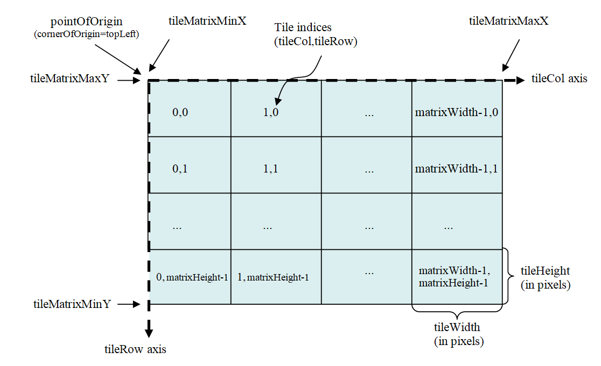
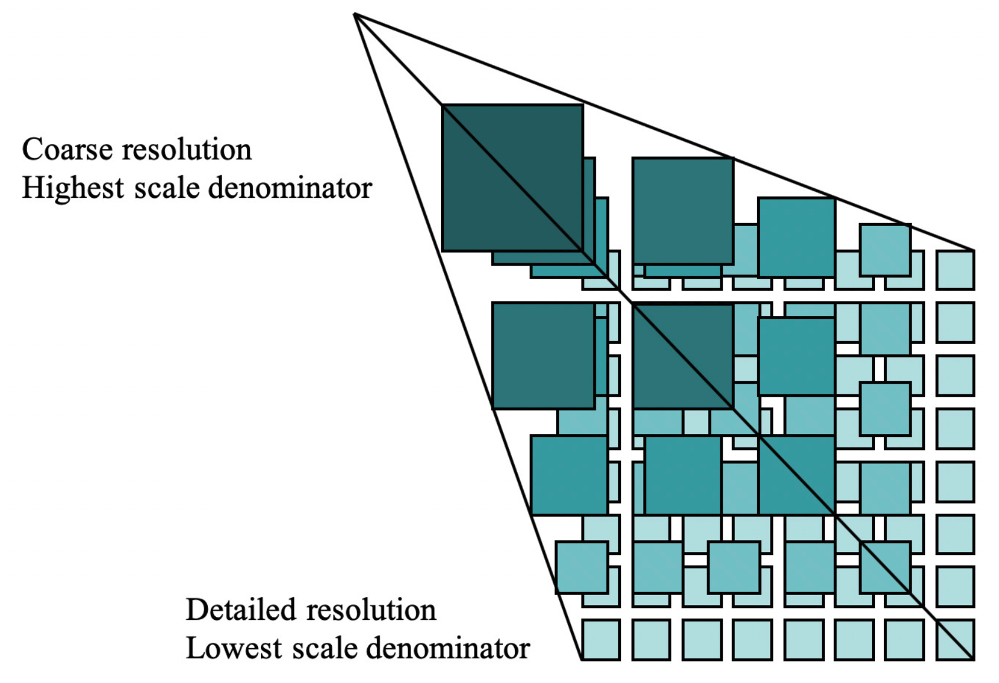
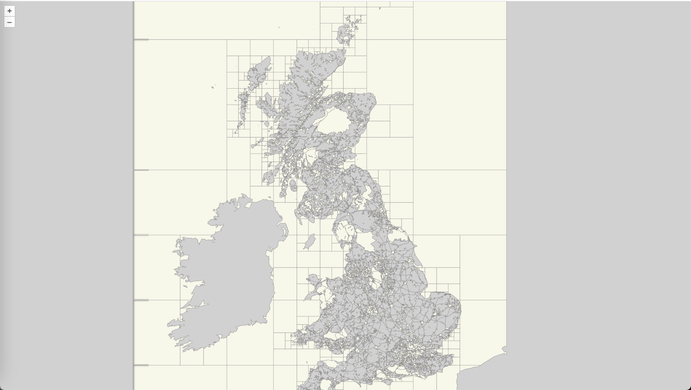
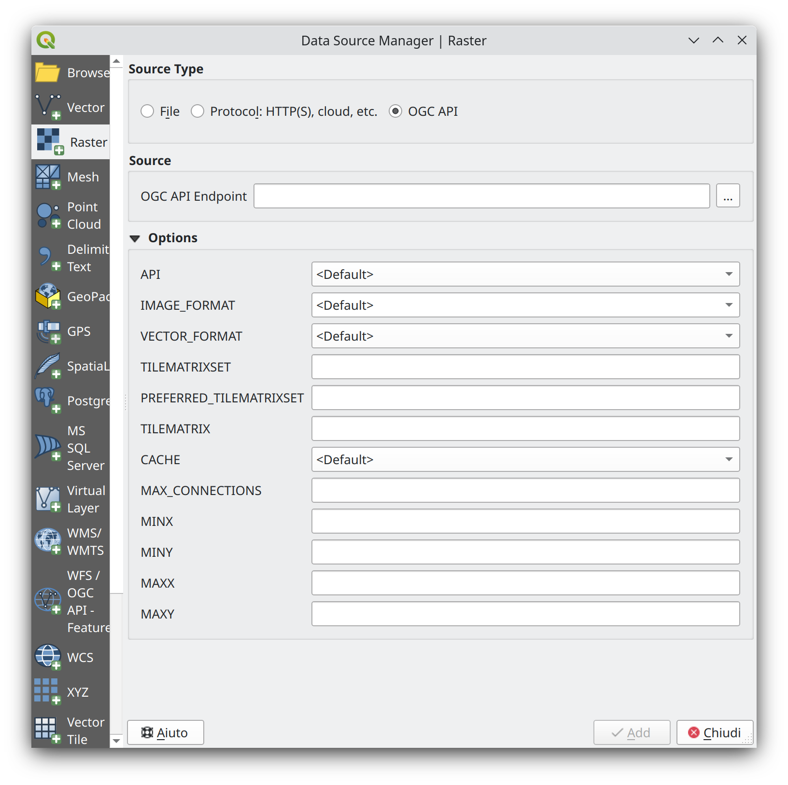

# OGC API - Tiles

!!! abstract Audience
    Students that are familiar with web services and APIs, and want to have
    an overview of OGC API - Tiles standard

!!! abstract "Learning Objectives"
    At the completion of the module students will be able to:

    -   Explain what the OGC API - Tiles standard is
    -   Describe what can be done with OGC API - Tiles implementations
    -   Understand the main resources offered by OGC API - Tiles implementations
    -   Understand how to retrieve a description of the capabilities of an OGC API - Tiles implementation
    -   Understand how to issue requests to an implementation of OGC API - Features
    -   Be able to find an OGC API - Tiles endpoint and use it through a client

## Introduction

The OGC API - Tiles standard defines building blocks for creating Web
APIs that support the retrieval of geospatial information as tiles.
Different forms of geospatial information are supported, such as tiles
of vector features ("vector tiles"), coverages, maps (or imagery) and
other types of geospatial information. Although it can be used
independently, the OGC API - Tiles building blocks can be combined
with other OGC API Standards and draft specifications for additional
capabilities or increasing interoperability for specific types of data.
The OGC API - Tiles standard references the [OGC Two Dimensional Tile
Matrix Set (TMS) and Tileset Metadata standard](https://docs.ogc.org/is/17-083r4/17-083r4.html), which defines logical
models and encodings for specifying tile matrix sets and describing tile
sets. 

!!! note
    This tutorial module is not intended to be a replacement to the actual
    **OGC API - Tiles - Part 1: Core** standard. The tutorial intentionally
    focuses on a subset of capabilities in order to get the student started
    with using the standard. Please refer to the [**OGC API - Tiles - Part 1:
    Core** standard](https://docs.ogc.org/is/20-057/20-057.html) for additional detail.

These concepts are at the core of this standard:

- **Tiling Scheme:** schema used to partitioning the space into individual tiles, potentially featuring multiple levels of detail. A tiling scheme is usually defined on top of a CRS, althought it can use other spatial reference systems.
- **Tile Matrix:** tiling grid in a given 2D coordinate reference system, associated to a specific scale and partitioning space (e.g.: tiling scheme).
  {width="80.0%"}
- **Tile Matrix Set:** tiling scheme consisting of a set of tile matrices defined at different scales covering approximately the same area and having a common coordinate reference system. A Tile Matrix has a unique alphanumeric identifier in the Tile Matrix Set. Some tile-based implementations prefer to use the zoom level number. 
  {width="80.0%"}
- **Tile Set:** set of tiles resulting from tiling data according to a particular tiling scheme.

!!! note

    - A tile matrix can be implemented as a set of image files (e.g., PNG or JPEG) in a file folder, each file representing a single tile.
    - In some standards the Tile Matrix Set concept is called an *image pyramid*. 
    
<iframe
  src="https://emotional.byteroad.net/collections/hex350_grid_cardio_1920/tiles"
  style="width:100%; height:800px;"
></iframe>


### Background

>  History

  The OGC API - Tiles standard is a successor to the OGC's Web Map
  Tile Service (WMTS) standard, focusing on simple reusable REST API
  building blocks which can be described using the OpenAPI
  specification. Whereas WMTS focused on map tiles, the OGC API -
  Tiles standard has been designed to support any form of tiled data.

> Versions

  **OGC API - Tiles - Part 1: Core** version 1.0.0 is the current latest version

> Test suite

  Test suites are available for:

  -   [OGC API - Tiles](https://github.com/opengeospatial/ets-ogcapi-tiles10)

> Implementations

  Implementations can be found on the [implementations page](https://github.com/opengeospatial/ogcapi-tiles/blob/master/implementations.adoc).

#### Usage

There are at least two ways to approach an implementation of the OGC
API - Tiles Standard.

-   Read the landing page, look for links, follow them and discover new
    links until the desired resource is found
-   Read a Web API definition document that specifies a list of paths
    and path templates to resources.

Once you have discovered the relevant resources, then retrieve the list
of available tiling schemes from the resource
```/tileMatrixSets``` to identify the tiling
scheme of interest. Retrieve the details of the specific tiling scheme
with ```/tileMatrixSets/{tileMatrixSetId}```.

Once you have identified a tiling scheme of interest, you can retrieve
tile set metadata for that tiling scheme through
```/tiles/{tileMatrixSetId}``` and also retrieve
individual tiles with
```/tiles/{tileMatrixSetId}/{tileMatrix}/{tileRow}/{tileCol}```

#### Relation to other OGC Standards

Although the OGC API - Tiles Standard is designed as a building block
that can be leveraged by (or with) other OGC API Standards adding
precisions about specific types of data available as tiles (e.g., OGC
API - Features standard, and OGC API - Maps and OGC API -
Coverages candidate standards), the conformance classes defined in this
Standard are still concrete enough to make it possible to support
distributing and requesting various types of tiled data, including
coverages, vector features and maps, by relying strictly on the content
herein and in the OGC Two Dimensional Tile Matrix Set and Tile Set
Metadata 2.0 standard.

### Overview of Resources

**OGC API - Tiles - Part 1: Core** defines the resources listed in the
following table.


<table>
  <tr>
    <th>Resource</th>
    <th>Method</th>
    <th>Path</th>
  </tr>
  <tr>
    <td>Landing page</td>
    <td>GET</td>
    <td>/</td>
  </tr>
  <tr>
    <td>Conformance declaration</td>
    <td>GET</td>
    <td>/conformance</td>
  </tr>
  <tr>
    <td>API definition</td>
    <td>GET</td>
    <td>/api</td>
  </tr>
  <tr>
    <td>Tiling Schemes</td>
    <td>GET</td>
    <td>/tileMatrixSets</td>
  </tr>
  <tr>
    <td>Tiling Scheme (tile matrix set)</td>
    <td>GET</td>
    <td>/tileMatrixSets/{tileMatrixSetId}</td>
  </tr>
  <tr>
    <td>Dataset tileset</td>
    <td>GET</td>
    <td>/tiles</td>
  </tr>
  <tr>
    <td>Dataset tileset metadata</td>
    <td>GET</td>
    <td>/tiles/{tileMatrixSetId}</td>
  </tr>
  <tr>
    <td>Dataset feature tile</td>
    <td>GET</td>
    <td>/tiles/{tileMatrixSetId}/{tileMatrix}/{tileRow}/{tileCol}</td>
  </tr>
  <tr>
    <td>Map tileset list</td>
    <td>GET</td>
    <td>/map/tiles</td>
  </tr>
  <tr>
    <td>Map tileset metadata</td>
    <td>GET</td>
    <td>/map/tiles/{tileMatrixSetId}</td>
  </tr>
  <tr>
    <td>Map tile</td>
    <td>GET</td>
    <td>/map/tiles/{tileMatrixSetId}/{tileMatrix}/{tileRow}/{tileCol}</td>
  </tr>
  <tr>
    <td>Collections</td>
    <td>GET</td>
    <td>/collections</td>
  </tr>
  <tr>
    <td>Collection</td>
    <td>GET</td>
    <td>/collections/{collectionId}</td>
  </tr>
  <tr>
    <td>Feature tileset list</td>
    <td>GET</td>
    <td>/collections/{collectionId}/tiles</td>
  </tr>
  <tr>
    <td>Feature tileset metadata</td>
    <td>GET</td>
    <td>/collections/{collectionId}/tiles/{tileMatrixSetId}</td>
  </tr>
  <tr>
    <td>Feature tile</td>
    <td>GET</td>
    <td>/collections/{collectionId}/tiles/{tileMatrixSetId}/{tileMatrix}/{tileRow}/{tileCol}</td>
  </tr>
  <tr>
    <td>Map tileset list</td>
    <td>GET</td>
    <td>/collections/{collectionId}/map/tiles</td>
  </tr>
  <tr>
    <td>Map tileset metadata</td>
    <td>GET</td>
    <td>/collections/{collectionId}/map/tiles/{tileMatrixSetId}</td>
  </tr>
  <tr>
    <td>Map tile</td>
    <td>GET</td>
    <td>/collections/{collectionId}/map/tiles/{tileMatrixSetId}/{tileMatrix}/{tileRow}/{tileCol}</td>
  </tr>
  <tr>
    <td>Coverage tileset list</td>
    <td>GET</td>
    <td>/collections/{collectionId}/coverage/tiles</td>
  </tr>
  <tr>
    <td>Coverage tileset metadata</td>
    <td>GET</td>
    <td>/collections/{collectionId}/coverage/tiles/{tileMatrixSetId}</td>
  </tr>
  <tr>
    <td>Coverage tile</td>
    <td>GET</td>
    <td>/collections/{collectionId}/coverage/tiles/{tileMatrixSetId}/{tileMatrix}/{tileRow}/{tileCol}</td>
  </tr>
</table>

### Example

This [demonstration server](https://demo.ldproxy.net/zoomstack/)
publishes tiled feature data through an interface that conforms to OGC
API - Tiles.

An example request that can be used to retrieve data, referenced to
WebMercatorQuad, from the OS Zoomstack collection is
<https://demo.ldproxy.net/zoomstack/tiles/WebMercatorQuad/0/0/0?f=mvt>

In this case the data is encoded in Mapbox Vector Tiles (MVT) format.

Once downloaded, a client application can then display or process the
data.

{width="40.0%"}


### Client usage

Various clients/softwares supports OGC API - Tiles, You can checkout latest list [here](https://github.com/opengeospatial/ogcapi-tiles/blob/master/implementations.adoc#clients)

In this workshop we'll check a  OpenLayers client example, QGIS Software example (QGIS)  and also pygeoapi as server example

#### OpenLayers implementation 

[OpenLayers](https://openlayers.org) started supporting OGC Vector tiles from V.7. by introducing OGCVectorTile Source which can be used in  VectorTile  type of layer

Example of this can be seen on official page [here](https://openlayers.org/en/latest/examples/ogc-vector-tiles.html)

```JavaScript
import MVT from 'ol/format/MVT.js';
import Map from 'ol/Map.js';
import OGCVectorTile from 'ol/source/OGCVectorTile.js';
import VectorTileLayer from 'ol/layer/VectorTile.js';
import View from 'ol/View.js';

const map = new Map({
  target: 'map',
  layers: [
    new VectorTileLayer({
      source: new OGCVectorTile({
        url: 'https://demo.ldproxy.net/zoomstack/tiles/WebMercatorQuad',
        format: new MVT(),
      }),
      background: '#d1d1d1',
      style: {
        'stroke-width': 0.6,
        'stroke-color': '#8c8b8b',
        'fill-color': '#f7f7e9',
      },
    }),
  ],
  view: new View({
    center: [0, 0],
    zoom: 1,
  }),
});

```
{width="100.0%"}

#### QGIS implementation 

Recent Verion of QGIS supports adding OGC API - Tiles under adding `new raster data`.

{width="100.0%"}

#### pygeoapi implementation 

This code block shows how to configure pygeoapi to read Mapbox vector tiles, from disk or a URL.


```YAML
providers:
    - type: tile
      name: MVT
      data: tests/data/tiles/ne_110m_lakes  # local directory tree
      # data: http://localhost:9000/ne_110m_lakes/{z}/{x}/{y}.pbf # tiles stored on a MinIO bucket
      options:
          metadata_format: default # default | tilejson
          zoom:
              min: 0
              max: 5
          schemes:
              - WorldCRS84Quad
      format:
          name: pbf
          mimetype: application/vnd.mapbox-vector-tile
```
## Resources

### Landing page

Given OGC API - Tiles uses OGC API - Common as a building block, please see the [OGC API - Features](features.md#landing-page) deep dive
for a detailed explanation of an example implementation.

### Conformance declarations

Given OGC API - Tiles uses OGC API - Common as a building block, please see the [OGC API - Features](features.md#conformance-declarations) deep dive
for a detailed explanation of an example implementation.

### API Definition

Given OGC API - Tiles uses OGC API - Common as a building block, please see the [OGC API - Features](features.md#api-definition) deep dive
for a detailed explanation of an example implementation.

### Collections

Given OGC API - Tiles uses OGC API - Common as a building block, please see the [OGC API - Features](features.md#collections) deep dive
for a detailed explanation of an example implementation.

### Collection

Given OGC API - Tiles uses OGC API - Common as a building block, please see the [OGC API - Features](features.md#collection) deep dive
for a detailed explanation of an example implementation.

### Tiling Schemes

This endpoint retrieves a list of links to the descriptions of the tile matrix sets supported by the OGC Web API. These could be one or many of the well-known tile matrix sets listed in Annex D of [OGC Two Dimensional Tile Matrix Set and Tile Set Metadata](https://docs.ogc.org/is/17-083r4/17-083r4.html#toc48), or custom ones.

As an example, we can see an extract of the response to this request:
<https://demo.ldproxy.net/daraa/tileMatrixSets?f=json>

```json
  "tileMatrixSets": [
    {
      "title": "Google Maps Compatible for the World",
      "id": "WebMercatorQuad",
      "uri": "http://www.opengis.net/def/tilematrixset/OGC/1.0/WebMercatorQuad",
      "links": [
        {
          "rel": "self",
          "title": "Tile matrix set 'WebMercatorQuad'",
          "href": "https://demo.ldproxy.net/daraa/tileMatrixSets/WebMercatorQuad"
        }
      ]
    },
    {
      "title": "CRS84 for the World",
      "id": "WorldCRS84Quad",
      "uri": "http://www.opengis.net/def/tilematrixset/OGC/1.0/WorldCRS84Quad",
      "links": [
        {
          "rel": "self",
          "title": "Tile matrix set 'WorldCRS84Quad'",
          "href": "https://demo.ldproxy.net/daraa/tileMatrixSets/WorldCRS84Quad"
        }
      ]
    },
    {
      "title": "World Mercator WGS84 (ellipsoid)",
      "id": "WorldMercatorWGS84Quad",
      "uri": "http://www.opengis.net/def/tilematrixset/OGC/1.0/WorldMercatorWGS84Quad",
      "links": [
        {
          "rel": "self",
          "title": "Tile matrix set 'WorldMercatorWGS84Quad'",
          "href": "https://demo.ldproxy.net/daraa/tileMatrixSets/WorldMercatorWGS84Quad"
        }
      ]
    }
  ]
```

If we append the tile matrix set id to this url, we will get the description of one specific tile matrix set, as we can see in the example bellow, generated with this request:

<https://demo.ldproxy.net/daraa/tileMatrixSets/WebMercatorQuad?f=json>

```json
{
  "title": "Google Maps Compatible for the World",
  "id": "WebMercatorQuad",
  "crs": "http://www.opengis.net/def/crs/EPSG/0/3857",
  "wellKnownScaleSet": "http://www.opengis.net/def/wkss/OGC/1.0/GoogleMapsCompatible",
  "uri": "http://www.opengis.net/def/tilematrixset/OGC/1.0/WebMercatorQuad",
  "tileMatrices": [
    {
      "id": "0",
      "tileWidth": 256,
      "tileHeight": 256,
      "matrixWidth": 1,
      "matrixHeight": 1,
      "scaleDenominator": 559082264.028717,
      "cellSize": 156543.033928041,
      "pointOfOrigin": [
        -20037508.3427892,
        20037508.3427892
      ],
      "cornerOfOrigin": "topLeft"
    },
    {
      "id": "1",
      "tileWidth": 256,
      "tileHeight": 256,
      "matrixWidth": 2,
      "matrixHeight": 2,
      "scaleDenominator": 279541132.014358,
      "cellSize": 78271.5169640204,
      "pointOfOrigin": [
        -20037508.3427892,
        20037508.3427892
      ],
      "cornerOfOrigin": "topLeft"
    },
  }
```
Note that apart from the descriptive metadata, the response also contains a detailed list of available tile matrices.

### Dataset Tilesets

These endpoints define how a list of tilesets can be associated to an OGC API dataset / landing page.

For vector tiles, we can request tiles using the ```/tiles``` endpoint. As an example, this is part of the response triggered with this request:

<https://demo.ldproxy.net/daraa/tiles?f=json>

```json
{
  "title": "Daraa",
  "description": "This is a test dataset used in the Open Portrayal Framework thread in the OGC Testbed-15 as well as the OGC Vector Tiles Pilot Phase 2. The data is based on OpenStreetMap data from the region of Daraa, Syria, converted to the Topographic Data Store schema of NGA.",
  "tilesets": [
    {
      "links": [
        {
          "rel": "self",
          "title": "Access the data as tiles in the tile matrix set 'WebMercatorQuad'",
          "href": "https://demo.ldproxy.net/daraa/tiles/WebMercatorQuad"
        },
        {
          "rel": "http://www.opengis.net/def/rel/ogc/1.0/tiling-scheme",
          "title": "Definition of the tiling scheme",
          "href": "https://demo.ldproxy.net/daraa/tileMatrixSets/WebMercatorQuad"
        },
        {
          "rel": "item",
          "type": "application/vnd.mapbox-vector-tile",
          "title": "Mapbox vector tiles; the link is a URI template where {tileMatrix}/{tileRow}/{tileCol} is the tile in the tiling scheme 'WebMercatorQuad'",
          "href": "https://demo.ldproxy.net/daraa/tiles/WebMercatorQuad/{tileMatrix}/{tileRow}/{tileCol}?f=mvt",
          "templated": true
        }
      ],
```

We can request metadata about a particular tileset by appending the tile matrix set ID:  ```/tiles/{tileMatrixSetId}```. For instance, the example bellow is triggered by this request:

<https://demo.ldproxy.net/daraa/tiles/WebMercatorQuad?f=json>

```json
{
  "tilejson": "3.0.0",
  "tiles": [
    "https://demo.ldproxy.net/daraa/tiles/WebMercatorQuad/{z}/{y}/{x}?f=mvt"
  ],
  "vector_layers": [
    {
      "id": "AeronauticCrv",
      "fields": {
        "id": "Integer",
        "F_CODE": "String",
        "ZI001_SDV": "String",
        "UFI": "String",
        "ZI005_FNA": "String",
        "FCSUBTYPE": "Integer",
        "ZI006_MEM": "String",
        "ZI001_SDP": "String"
      },
      "description": "",
      "maxzoom": 18,
      "minzoom": 6,
      "geometry_type": "lines"
    },
```

Finally we can request the actual data, in this case a vector tile, using ```/tiles/{tileMatrixSetId}/{tileMatrix}/{tileRow}/{tileCol}```.

We can reuse the same endpoints for map or coverage tiles, but in those cases we need to introduce ```map``` or ```coverage``` in the path.

Map tileset list:

* ```/map/tiles```

Map tileset metadata:

* ```/map/tiles/{tileMatrixSetId}```

Map tile:

* ```/map/tiles/{tileMatrixSetId}/{tileMatrix}/{tileRow}/{tileCol}```

### GeoData Tilesets

These endpoints define how a list of tilesets can be associated to an OGC API collection. 

For vector tiles, you can retrieve the tileset list of a given collection with ```/collections/{collectionId}/tiles```. For instance, the sample bellow is extracted from the response to this request:

<https://demo.ldproxy.net/daraa/collections/StructureSrf/tiles?f=json>

```json
{
  "title": "Structure (Surfaces)",
  "tilesets": [
    {
      "links": [
        {
          "rel": "self",
          "title": "Access the data as tiles in the tile matrix set 'WebMercatorQuad'",
          "href": "https://demo.ldproxy.net/daraa/collections/StructureSrf/tiles/WebMercatorQuad"
        },
        {
          "rel": "http://www.opengis.net/def/rel/ogc/1.0/tiling-scheme",
          "title": "Definition of the tiling scheme",
          "href": "https://demo.ldproxy.net/daraa/tileMatrixSets/WebMercatorQuad"
        },
        {
          "rel": "item",
          "type": "application/vnd.mapbox-vector-tile",
          "title": "Mapbox vector tiles; the link is a URI template where {tileMatrix}/{tileRow}/{tileCol} is the tile in the tiling scheme 'WebMercatorQuad'",
          "href": "https://demo.ldproxy.net/daraa/collections/StructureSrf/tiles/WebMercatorQuad/{tileMatrix}/{tileRow}/{tileCol}?f=mvt",
          "templated": true
        }
      ],
```

The tileset metadata of a specific tile matrix set, can be retrieved by appending the tile matrix set ID: ```/collections/{collectionId}/tiles/{tileMatrixSetId}```. For instance, the following response was extracted from this request:

<https://demo.ldproxy.net/daraa/collections/StructureSrf/tiles/WebMercatorQuad?f=json>

```json

  "links": [
    {
      "rel": "self",
      "type": "application/json",
      "title": "This document",
      "href": "https://demo.ldproxy.net/daraa/collections/StructureSrf/tiles/WebMercatorQuad?f=json"
    },
    {
      "rel": "alternate",
      "type": "application/vnd.mapbox.tile+json",
      "title": "This document as TileJSON",
      "href": "https://demo.ldproxy.net/daraa/collections/StructureSrf/tiles/WebMercatorQuad?f=tilejson"
    },
    {
      "rel": "http://www.opengis.net/def/rel/ogc/1.0/tiling-scheme",
      "title": "Definition of the tiling scheme",
      "href": "https://demo.ldproxy.net/daraa/tileMatrixSets/WebMercatorQuad"
    },
    {
      "rel": "item",
      "type": "application/vnd.mapbox-vector-tile",
      "title": "Mapbox vector tiles; the link is a URI template where {tileMatrix}/{tileRow}/{tileCol} is the tile in the tiling scheme '{{tileMatrixSetId}}'",
      "href": "https://demo.ldproxy.net/daraa/collections/StructureSrf/tiles/WebMercatorQuad/{tileMatrix}/{tileRow}/{tileCol}?f=mvt",
      "templated": true
    }
  ],
  "dataType": "vector",
  "tileMatrixSetId": "WebMercatorQuad",
  "tileMatrixSetURI": "http://www.opengis.net/def/tilematrixset/OGC/1.0/WebMercatorQuad",
  "tileMatrixSetLimits": [
    {
      "tileMatrix": "6",
      "minTileRow": 25,
      "maxTileRow": 25,
      "minTileCol": 38,
      "maxTileCol": 38,
      "numberOfTiles": 1
    },
    {
      "tileMatrix": "7",
      "minTileRow": 51,
      "maxTileRow": 51,
      "minTileCol": 76,
      "maxTileCol": 76,
      "numberOfTiles": 1
    },
```

Finally we can request the actual data, in this case a vector tile, using ```/collections/{collectionId}/tiles/{tileMatrixSetId}/{tileMatrix}/{tileRow}/{tileCol}```.

Similarly to dataset tilesets, we can reuse the same endpoints for map or coverage tiles, but in those cases we need to introduce ```map``` or ```coverage``` in the path.

Map tileset list:

* ```/collections/{collectionId}/map/tiles```

Map tileset metadata:

* ```/collections/{collectionId}/map/tiles/{tileMatrixSetId}```

Map tile:

* ```/collections/{collectionId}/map/tiles/{tileMatrixSetId}/{tileMatrix}/{tileRow}/{tileCol}```

You can see [here](https://maps.gnosis.earth/ogcapi/collections/blueMarble/map/tiles?f=json) an example of a request for a (map) tileset list and [here](https://maps.gnosis.earth/ogcapi/collections/blueMarble/map/tiles/GoogleCRS84Quad?f=json) an example of a request for (map) tileset metadata.

## Summary

OGC API - Tiles specifies a standard for Web APIs that provide tiles of geospatial information. Different forms of geospatial information are supported, such as tiles of vector features ("vector tiles"), coverages, maps (or imagery) and potentially eventually additional types of tiles of geospatial information. This deep dive provided an overview of the standard and the various Resources and endpoints that are supported.
