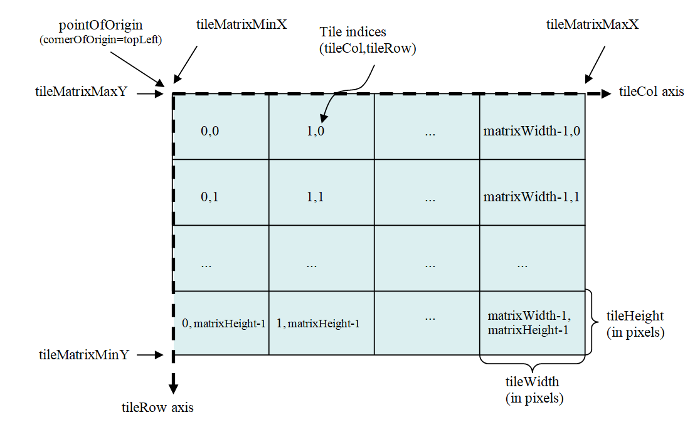
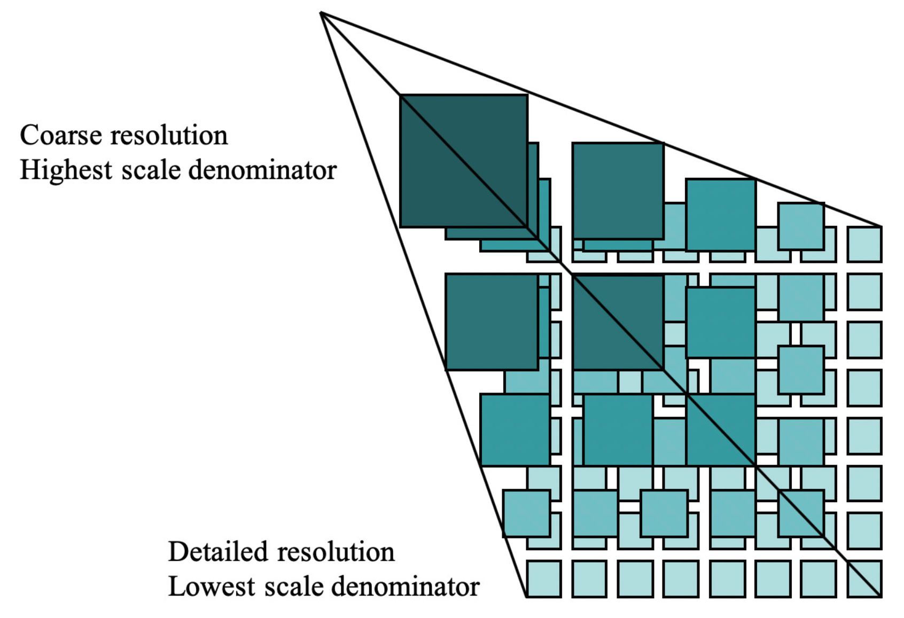
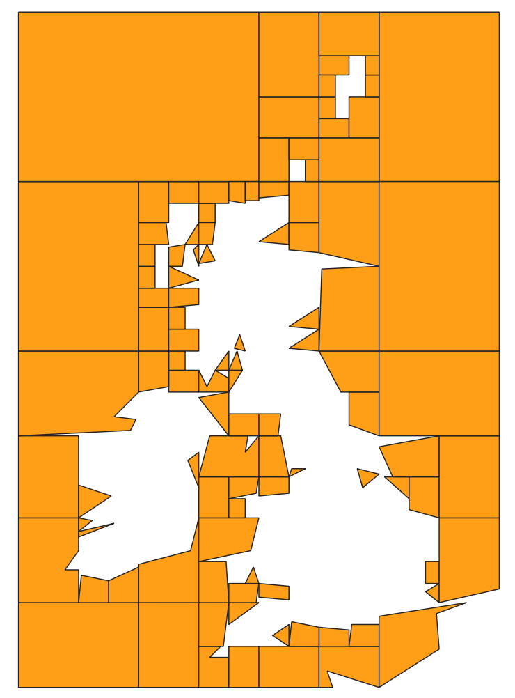
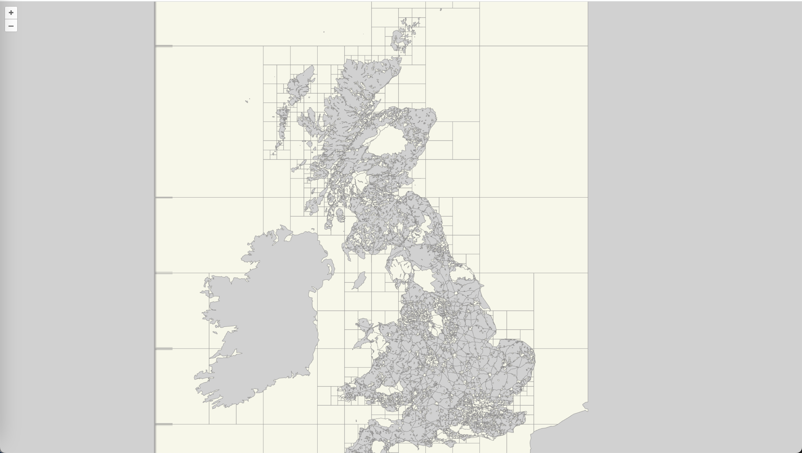
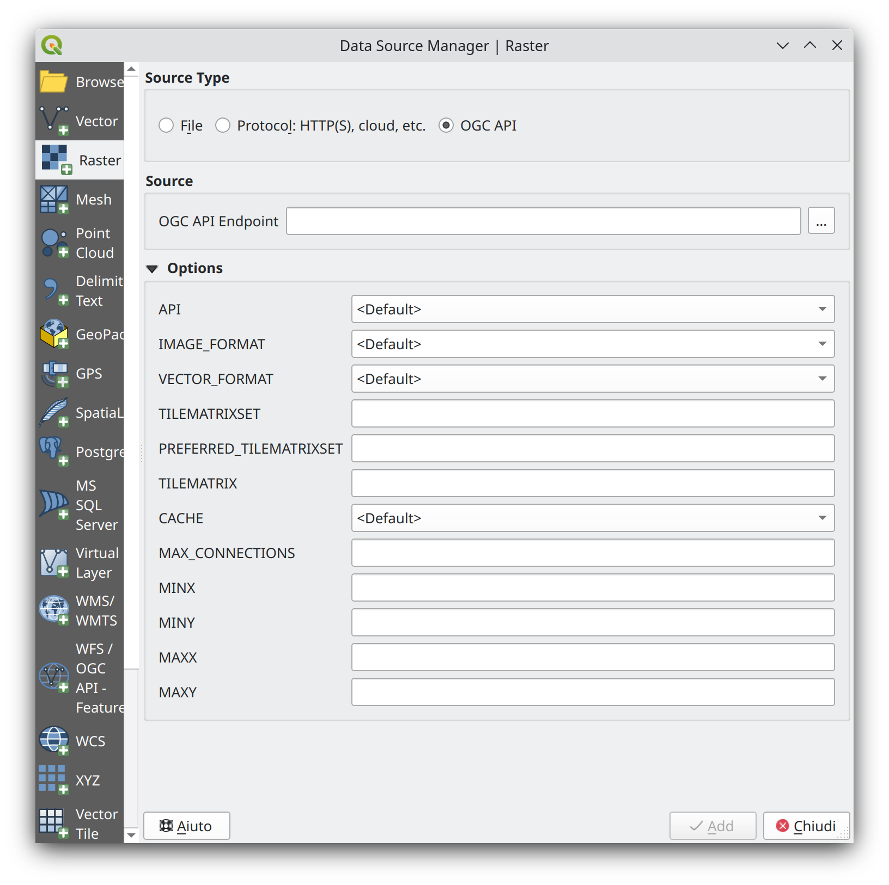

# OGC API - Tiles

!!! abstract "Público-alvo"
    Estudantes familiarizados com serviços web e APIs, que desejam ter
    uma visão geral do standard OGC API - Tiles

!!! abstract "Objetivos de Aprendizagem"
    Ao concluir o módulo, os estudantes serão capazes de:

    - Explicar o que é o standard OGC API - Tiles
    - Descrever o que pode ser feito com implementações do OGC API - Tiles
    - Compreender os principais recursos oferecidos por implementações do OGC API - Tiles
    - Compreender como obter uma descrição das capacidades de uma implementação do OGC API - Tiles
    - Compreender como fazer pedidos a uma implementação do OGC API - Features
    - Conseguir encontrar um endpoint do OGC API - Tiles e utilizá-lo através de um cliente

## Introdução

O [OGC API - Tiles](https://tiles.developer.ogc.org/) é um standard que define blocos de construção para criar APIs
Web que suportam a recuperação de informação geoespacial sob a forma de tiles.
São suportadas diferentes formas de informação geoespacial, como tiles
de entidades vetoriais («tiles vetoriais»), coverages, mapas (ou imagens) e
outros tipos de informação geoespacial. Embora possa ser utilizado
independentemente, os blocos de construção do OGC API - Tiles podem ser combinados
com outros Standards da OGC API e especificações de rascunho para capacidades
adicionais ou para aumentar a interoperabilidade para tipos específicos de dados.
O standard OGC API - Tiles referencia o [Standard OGC Two Dimensional Tile
Matrix Set (TMS) and Tileset Metadata](https://docs.ogc.org/is/17-083r4/17-083r4.html), que define modelos lógicos
e codificações para especificar tile matrix sets e descrever
tilesets.

!!! note
    Este módulo tutorial não tem a intenção de substituir o standard efetivo do
    **OGC API - Tiles - Parte 1: Core**. O tutorial concentra-se
    intencionalmente num subconjunto de capacidades para permitir que o estudante comece
    a utilizar o standard. Consulte o [standard do **OGC API - Tiles - Parte 1:
    Core**](https://docs.ogc.org/is/20-057/20-057.html) para mais detalhes.

Estes conceitos são o cerne deste standard:

- **Esquema de Tilagem:** esquema utilizado para particionar o espaço em tiles individuais, podendo incluir múltiplos níveis de detalhe. Um esquema de tilagem é geralmente definido sobre um SRC, embora possa utilizar outros sistemas de referência espacial.
- **Tile Matrix:** grelha de tilagem num determinado sistema de referência de coordenadas 2D, associada a uma escala específica e a uma particionamento espacial (por exemplo: esquema de tilagem).
  {width="80.0%"}
- **Tile Matrix Set:** esquema de tilagem consistindo num conjunto de tile matrices definidas em diferentes escalas, cobrindo aproximadamente a mesma área e tendo um sistema de referência de coordenadas comum. Um Tile Matrix tem um identificador alfanumérico único no Tile Matrix Set. Algumas implementações baseadas em tiles preferem utilizar o número de nível de zoom.
  {width="80.0%"}
- **Tile Set:** conjunto de tiles resultantes da aplicação de tilagem a dados de acordo com um esquema de tilagem particular.

!!! note

    - Um tile matrix pode ser implementado como um conjunto de ficheiros de imagem (por exemplo, PNG ou JPEG) numa pasta de ficheiros, cada ficheiro a representar um único tile.
    - Em alguns standards, o conceito de Tile Matrix Set é designado por *pirâmide de imagens*.

<iframe
  src="https://emotional.byteroad.net/collections/hex350_grid_cardio_1920/tiles"
  style="width:100%; height:800px;"
></iframe>


### Antecedentes

> Histórico

  O standard OGC API - Tiles é um sucessor do standard Web Map
  Tile Service (WMTS) da OGC, focando-se em blocos de construção REST API simples e reutilizáveis que
  podem ser descritos utilizando a especificação OpenAPI. Enquanto que o WMTS se focava em tiles de mapa, o standard OGC API -
  Tiles foi concebido para suportar qualquer forma de dados em tiles.

> Versões

  A versão 1.0.0 do **OGC API - Tiles - Parte 1: Core** é a versão mais recente

> Suite de testes

  Está disponível uma suite de testes para:

  * [OGC API - Tiles - Parte 1](https://github.com/opengeospatial/ets-ogcapi-tiles10)

> Implementações

  As implementações podem ser encontradas na [página de implementações](https://github.com/opengeospatial/ogcapi-tiles/blob/master/implementations.adoc).

#### Utilização

Existem, pelo menos, duas formas de abordar uma implementação do Standard
OGC API - Tiles.

-   Ler a landing page, procurar ligações, seguir as mesmas e descobrir novas
    ligações até que o recurso desejado seja encontrado
-   Ler um documento de definição de API Web que especifique uma lista de caminhos
    e modelos de caminho para recursos.

Uma vez descobertos os recursos relevantes, recupere a lista
de esquemas de tilagem disponíveis a partir do recurso
```/tileMatrixSets``` para identificar o esquema de
tilagem de interesse. Recupere os detalhes do esquema de tilagem específico
com ```/tileMatrixSets/{tileMatrixSetId}```.

Uma vez identificado um esquema de tilagem de interesse, pode recuperar
os metadados do tileset para esse esquema através de
```/tiles/{tileMatrixSetId}``` e também recuperar
tiles individuais com
```/tiles/{tileMatrixSetId}/{tileMatrix}/{tileRow}/{tileCol}```

#### Relação com outros standards da OGC

Embora o Standard OGC API - Tiles seja concebido como um bloco de construção
que pode ser aproveitado por (ou com) outros Standards da OGC API, adicionando
precisões sobre tipos específicos de dados disponíveis como tiles (por exemplo, o standard OGC
API - Features, e os standards candidatos OGC API - Maps e OGC API -
Coverages), as classes de conformidade definidas neste
Standard são ainda concretas o suficiente para tornar possível suportar
a distribuição e solicitação de vários tipos de dados em tiles, incluindo
coverages, entidades vetoriais e mapas, confiando estritamente no conteúdo
aqui presente e no standard OGC Two Dimensional Tile Matrix Set and Tile Set
Metadata 2.0.

### Visão geral dos recursos

O **OGC API - Tiles - Parte 1: Core** define os recursos listados na
tabela seguinte.


<table>
  <tr>
    <th>Recurso</th>
    <th>Método</th>
    <th>Caminho</th>
  </tr>
  <tr>
    <td>Landing page</td>
    <td>GET</td>
    <td>/</td>
  </tr>
  <tr>
    <td>Declaração de conformidade</td>
    <td>GET</td>
    <td>/conformance</td>
  </tr>
  <tr>
    <td>Definição da API</td>
    <td>GET</td>
    <td>/api</td>
  </tr>
  <tr>
    <td>Conjuntos de tile matrix</td>
    <td>GET</td>
    <td>/tileMatrixSets</td>
  </tr>
  <tr>
    <td>Conjunto de tile matrix</td>
    <td>GET</td>
    <td>/tileMatrixSets/{tileMatrixSetId}</td>
  </tr>
  <tr>
    <td>Tileset de dados</td>
    <td>GET</td>
    <td>/tiles</td>
  </tr>
  <tr>
    <td>Metadados do tileset de dados</td>
    <td>GET</td>
    <td>/tiles/{tileMatrixSetId}</td>
  </tr>
  <tr>
    <td>Tile de entidade de dados</td>
    <td>GET</td>
    <td>/tiles/{tileMatrixSetId}/{tileMatrix}/{tileRow}/{tileCol}</td>
  </tr>
  <tr>
    <td>Lista de tilesets de mapa</td>
    <td>GET</td>
    <td>/map/tiles</td>
  </tr>
  <tr>
    <td>Metadados do tileset de mapa</td>
    <td>GET</td>
    <td>/map/tiles/{tileMatrixSetId}</td>
  </tr>
  <tr>
    <td>Tile de mapa</td>
    <td>GET</td>
    <td>/map/tiles/{tileMatrixSetId}/{tileMatrix}/{tileRow}/{tileCol}</td>
  </tr>
  <tr>
    <td>Coleções</td>
    <td>GET</td>
    <td>/collections</td>
  </tr>
  <tr>
    <td>Coleção</td>
    <td>GET</td>
    <td>/collections/{collectionId}</td>
  </tr>
  <tr>
    <td>Lista de tilesets de entidades</td>
    <td>GET</td>
    <td>/collections/{collectionId}/tiles</td>
  </tr>
  <tr>
    <td>Metadados do tileset de entidades</td>
    <td>GET</td>
    <td>/collections/{collectionId}/tiles/{tileMatrixSetId}</td>
  </tr>
  <tr>
    <td>Tile de entidade</td>
    <td>GET</td>
    <td>/collections/{collectionId}/tiles/{tileMatrixSetId}/{tileMatrix}/{tileRow}/{tileCol}</td>
  </tr>
  <tr>
    <td>Lista de tilesets de mapa</td>
    <td>GET</td>
    <td>/collections/{collectionId}/map/tiles</td>
  </tr>
  <tr>
    <td>Metadados do tileset de mapa</td>
    <td>GET</td>
    <td>/collections/{collectionId}/map/tiles/{tileMatrixSetId}</td>
  </tr>
  <tr>
    <td>Tile de mapa</td>
    <td>GET</td>
    <td>/collections/{collectionId}/map/tiles/{tileMatrixSetId}/{tileMatrix}/{tileRow}/{tileCol}</td>
  </tr>
  <tr>
    <td>Lista de tilesets de coverage</td>
    <td>GET</td>
    <td>/collections/{collectionId}/coverage/tiles</td>
  </tr>
  <tr>
    <td>Metadados do tileset de coverage</td>
    <td>GET</td>
    <td>/collections/{collectionId}/coverage/tiles/{tileMatrixSetId}</td>
  </tr>
  <tr>
    <td>Tile de coverage</td>
    <td>GET</td>
    <td>/collections/{collectionId}/coverage/tiles/{tileMatrixSetId}/{tileMatrix}/{tileRow}/{tileCol}</td>
  </tr>
</table>

### Exemplo

O [servidor de demonstração](https://demo.ldproxy.net/zoomstack/)
publica dados de entidades em tiles através de uma interface que está em conformidade com o OGC
API - Tiles.

Um exemplo de pedido que pode ser utilizado para recuperar dados, referenciados ao
WebMercatorQuad, a partir da coleção OS Zoomstack é
<https://demo.ldproxy.net/zoomstack/tiles/WebMercatorQuad/0/0/0?f=mvt>

Neste caso, os dados são codificados no formato Mapbox Vector Tiles (MVT).

Uma vez descarregados, a aplicação cliente pode, em seguida, exibir ou processar os
dados.

{width="40.0%"}

## Recursos

### Landing page

Dado que o OGC API - Tiles utiliza o OGC API - Common como bloco de construção, consulte o [OGC API - Features](features.md#landing-page) para
uma explicação detalhada de uma implementação de exemplo.

### Declarações de conformidade

Dado que o OGC API - Tiles utiliza o OGC API - Common como bloco de construção, consulte o [OGC API - Features](features.md#conformance-declarations) para
uma explicação detalhada de uma implementação de exemplo.

### Definição da API

Dado que o OGC API - Tiles utiliza o OGC API - Common como bloco de construção, consulte o [OGC API - Features](features.md#api-definition) para
uma explicação detalhada de uma implementação de exemplo.

### Coleções

Dado que o OGC API - Tiles utiliza o OGC API - Common como bloco de construção, consulte o [OGC API - Features](features.md#feature-collections) para
uma explicação detalhada de uma implementação de exemplo.

### Coleção

Dado que o OGC API - Tiles utiliza o OGC API - Common como bloco de construção, consulte o [OGC API - Features](features.md#feature-collection) para
uma explicação detalhada de uma implementação de exemplo.

### Esquemas de Tilagem

Este endpoint recupera uma lista de ligações para as descrições dos tile matrix sets suportados pela API Web da OGC. Podem ser um ou vários dos tile matrix sets bem conhecidos listados no Anexo D do [OGC Two Dimensional Tile Matrix Set and Tile Set Metadata](https://docs.ogc.org/is/17-083r4/17-083r4.html#toc48), ou personalizados.

Como exemplo, podemos ver um excerto da resposta a este pedido:
<https://demo.ldproxy.net/daraa/tileMatrixSets?f=json>

```json
  "tileMatrixSets": [
    {
      "title": "Google Maps Compatible for the World",
      "id": "WebMercatorQuad",
      "uri": "http://www.opengis.net/def/tilematrixset/OGC/1.0/WebMercatorQuad",
      "links": [
        {
          "rel": "self",
          "title": "Tile matrix set 'WebMercatorQuad'",
          "href": "https://demo.ldproxy.net/daraa/tileMatrixSets/WebMercatorQuad"
        }
      ]
    },
    {
      "title": "CRS84 for the World",
      "id": "WorldCRS84Quad",
      "uri": "http://www.opengis.net/def/tilematrixset/OGC/1.0/WorldCRS84Quad",
      "links": [
        {
          "rel": "self",
          "title": "Tile matrix set 'WorldCRS84Quad'",
          "href": "https://demo.ldproxy.net/daraa/tileMatrixSets/WorldCRS84Quad"
        }
      ]
    },
    {
      "title": "World Mercator WGS84 (ellipsoid)",
      "id": "WorldMercatorWGS84Quad",
      "uri": "http://www.opengis.net/def/tilematrixset/OGC/1.0/WorldMercatorWGS84Quad",
      "links": [
        {
          "rel": "self",
          "title": "Tile matrix set 'WorldMercatorWGS84Quad'",
          "href": "https://demo.ldproxy.net/daraa/tileMatrixSets/WorldMercatorWGS84Quad"
        }
      ]
    }
  ]
```

Se adicionarmos o id do tile matrix set a este URL, obteremos a descrição de um tile matrix set específico, como podemos ver no exemplo abaixo, gerado com este pedido:

<https://demo.ldproxy.net/daraa/tileMatrixSets/WebMercatorQuad?f=json>

```json
{
  "title": "Google Maps Compatible for the World",
  "id": "WebMercatorQuad",
  "crs": "http://www.opengis.net/def/crs/EPSG/0/3857",
  "wellKnownScaleSet": "http://www.opengis.net/def/wkss/OGC/1.0/GoogleMapsCompatible",
  "uri": "http://www.opengis.net/def/tilematrixset/OGC/1.0/WebMercatorQuad",
  "tileMatrices": [
    {
      "id": "0",
      "tileWidth": 256,
      "tileHeight": 256,
      "matrixWidth": 1,
      "matrixHeight": 1,
      "scaleDenominator": 559082264.028717,
      "cellSize": 156543.033928041,
      "pointOfOrigin": [
        -20037508.3427892,
        20037508.3427892
      ],
      "cornerOfOrigin": "topLeft"
    },
    {
      "id": "1",
      "tileWidth": 256,
      "tileHeight": 256,
      "matrixWidth": 2,
      "matrixHeight": 2,
      "scaleDenominator": 279541132.014358,
      "cellSize": 78271.5169640204,
      "pointOfOrigin": [
        -20037508.3427892,
        20037508.3427892
      ],
      "cornerOfOrigin": "topLeft"
    },
  }
```
Note que, para além dos metadados descritivos, a resposta também contém uma lista detalhada de tile matrices disponíveis.

### Tilesets de Dados

Estes endpoints definem como uma lista de tilesets pode ser associada a um conjunto de dados / landing page da OGC API.

Para tiles vetoriais, podemos solicitar tiles utilizando o endpoint ```/tiles```. Como exemplo, esta é parte da resposta desencadeada por este pedido:

<https://demo.ldproxy.net/daraa/tiles?f=json>

```json
{
  "title": "Daraa",
  "description": "This is a test dataset used in the Open Portrayal Framework thread in the OGC Testbed-15 as well as the OGC Vector Tiles Pilot Phase 2. The data is based on OpenStreetMap data from the region of Daraa, Syria, converted to the Topographic Data Store schema of NGA.",
  "tilesets": [
    {
      "links": [
        {
          "rel": "self",
          "title": "Access the data as tiles in the tile matrix set 'WebMercatorQuad'",
          "href": "https://demo.ldproxy.net/daraa/tiles/WebMercatorQuad"
        },
        {
          "rel": "http://www.opengis.net/def/rel/ogc/1.0/tiling-scheme",
          "title": "Definition of the tiling scheme",
          "href": "https://demo.ldproxy.net/daraa/tileMatrixSets/WebMercatorQuad"
        },
        {
          "rel": "item",
          "type": "application/vnd.mapbox-vector-tile",
          "title": "Mapbox vector tiles; the link is a URI template where {tileMatrix}/{tileRow}/{tileCol} is the tile in the tiling scheme 'WebMercatorQuad'",
          "href": "https://demo.ldproxy.net/daraa/tiles/WebMercatorQuad/{tileMatrix}/{tileRow}/{tileCol}?f=mvt",
          "templated": true
        }
      ],
```

Podemos solicitar metadados sobre um tileset particular, adicionando o ID do tile matrix set: ```/tiles/{tileMatrixSetId}```. Por exemplo, o exemplo abaixo é desencadeado por este pedido:

<https://demo.ldproxy.net/daraa/tiles/WebMercatorQuad?f=json>

```json
{
  "tilejson": "3.0.0",
  "tiles": [
    "https://demo.ldproxy.net/daraa/tiles/WebMercatorQuad/{z}/{y}/{x}?f=mvt"
  ],
  "vector_layers": [
    {
      "id": "AeronauticCrv",
      "fields": {
        "id": "Integer",
        "F_CODE": "String",
        "ZI001_SDV": "String",
        "UFI": "String",
        "ZI005_FNA": "String",
        "FCSUBTYPE": "Integer",
        "ZI006_MEM": "String",
        "ZI001_SDP": "String"
      },
      "description": "",
      "maxzoom": 18,
      "minzoom": 6,
      "geometry_type": "lines"
    },
```

Finalmente, podemos solicitar os dados efetivos, neste caso um tile vetorial, utilizando ```/tiles/{tileMatrixSetId}/{tileMatrix}/{tileRow}/{tileCol}```.

Podemos reutilizar os mesmos endpoints para tiles de mapa ou de coverage, mas nesses casos precisamos de introduzir ```map``` ou ```coverage``` no caminho.

Lista de tilesets de mapa:

* ```/map/tiles```

Metadados do tileset de mapa:

* ```/map/tiles/{tileMatrixSetId}```

Tile de mapa:

* ```/map/tiles/{tileMatrixSetId}/{tileMatrix}/{tileRow}/{tileCol}```

### Tilesets GeoData

Estes endpoints definem como uma lista de tilesets pode ser associada a uma coleção da OGC API.

Para tiles vetoriais, pode recuperar a lista de tilesets de uma determinada coleção com ```/collections/{collectionId}/tiles```. Por exemplo, a amostra abaixo é extraída da resposta a este pedido:

<https://demo.ldproxy.net/daraa/collections/StructureSrf/tiles?f=json>

```json
{
  "title": "Structure (Surfaces)",
  "tilesets": [
    {
      "links": [
        {
          "rel": "self",
          "title": "Access the data as tiles in the tile matrix set 'WebMercatorQuad'",
          "href": "https://demo.ldproxy.net/daraa/collections/StructureSrf/tiles/WebMercatorQuad"
        },
        {
          "rel": "http://www.opengis.net/def/rel/ogc/1.0/tiling-scheme",
          "title": "Definition of the tiling scheme",
          "href": "https://demo.ldproxy.net/daraa/tileMatrixSets/WebMercatorQuad"
        },
        {
          "rel": "item",
          "type": "application/vnd.mapbox-vector-tile",
          "title": "Mapbox vector tiles; the link is a URI template where {tileMatrix}/{tileRow}/{tileCol} is the tile in the tiling scheme 'WebMercatorQuad'",
          "href": "https://demo.ldproxy.net/daraa/collections/StructureSrf/tiles/WebMercatorQuad/{tileMatrix}/{tileRow}/{tileCol}?f=mvt",
          "templated": true
        }
      ],
```

Os metadados do tileset de um tile matrix set específico podem ser recuperados adicionando o ID do tile matrix set: ```/collections/{collectionId}/tiles/{tileMatrixSetId}```. Por exemplo, a seguinte resposta foi extraída deste pedido:

<https://demo.ldproxy.net/daraa/collections/StructureSrf/tiles/WebMercatorQuad?f=json>

```json

  "links": [
    {
      "rel": "self",
      "type": "application/json",
      "title": "This document",
      "href": "https://demo.ldproxy.net/daraa/collections/StructureSrf/tiles/WebMercatorQuad?f=json"
    },
    {
      "rel": "alternate",
      "type": "application/vnd.mapbox.tile+json",
      "title": "This document as TileJSON",
      "href": "https://demo.ldproxy.net/daraa/collections/StructureSrf/tiles/WebMercatorQuad?f=tilejson"
    },
    {
      "rel": "http://www.opengis.net/def/rel/ogc/1.0/tiling-scheme",
      "title": "Definition of the tiling scheme",
      "href": "https://demo.ldproxy.net/daraa/tileMatrixSets/WebMercatorQuad"
    },
    {
      "rel": "item",
      "type": "application/vnd.mapbox-vector-tile",
      "title": "Mapbox vector tiles; the link is a URI template where {tileMatrix}/{tileRow}/{tileCol} is the tile in the tiling scheme '{{tileMatrixSetId}}'",
      "href": "https://demo.ldproxy.net/daraa/collections/StructureSrf/tiles/WebMercatorQuad/{tileMatrix}/{tileRow}/{tileCol}?f=mvt",
      "templated": true
    }
  ],
  "dataType": "vector",
  "tileMatrixSetId": "WebMercatorQuad",
  "tileMatrixSetURI": "http://www.opengis.net/def/tilematrixset/OGC/1.0/WebMercatorQuad",
  "tileMatrixSetLimits": [
    {
      "tileMatrix": "6",
      "minTileRow": 25,
      "maxTileRow": 25,
      "minTileCol": 38,
      "maxTileCol": 38,
      "numberOfTiles": 1
    },
    {
      "tileMatrix": "7",
      "minTileRow": 51,
      "maxTileRow": 51,
      "minTileCol": 76,
      "maxTileCol": 76,
      "numberOfTiles": 1
    },
```

Finalmente, podemos solicitar os dados efetivos, neste caso um tile vetorial, utilizando ```/collections/{collectionId}/tiles/{tileMatrixSetId}/{tileMatrix}/{tileRow}/{tileCol}```.

Assim como nos tilesets de dados, podemos reutilizar os mesmos endpoints para tiles de mapa ou de coverage, mas nesses casos precisamos de introduzir ```map``` ou ```coverage``` no caminho.

Lista de tilesets de mapa:

* ```/collections/{collectionId}/map/tiles```

Metadados do tileset de mapa:

* ```/collections/{collectionId}/map/tiles/{tileMatrixSetId}```

Tile de mapa:

* ```/collections/{collectionId}/map/tiles/{tileMatrixSetId}/{tileMatrix}/{tileRow}/{tileCol}```

Pode ver [aqui](https://maps.gnosis.earth/ogcapi/collections/blueMarble/map/tiles?f=json) um exemplo de um pedido de uma lista de tilesets (de mapa) e [aqui](https://maps.gnosis.earth/ogcapi/collections/blueMarble/map/tiles/GoogleCRS84Quad?f=json) um exemplo de um pedido de metadados de tilesets (de mapa).

### Utilização por clientes

Nesta secção vamos demonstrar como aceder ao OGC API - Tiles utilizando o cliente OpenLayers.

#### OpenLayers

As versões mais recentes do [OpenLayers](https://openlayers.org) suportam tanto tiles OGC Vector como Map Tiles, com as classes [`OGCVectorTile`](https://openlayers.org/en/latest/apidoc/module-ol_source_OGCVectorTile-OGCVectorTile.html) e [`OGCMapTile`](https://openlayers.org/en/latest/apidoc/module-ol_source_OGCMapTile-OGCMapTile.html).

Um exemplo disto pode ser visto na [página de exemplo no site do OpenLayers](https://openlayers.org/en/latest/examples/ogc-vector-tiles.html).

```javascript
import MVT from 'ol/format/MVT.js';
import Map from 'ol/Map.js';
import OGCVectorTile from 'ol/source/OGCVectorTile.js';
import VectorTileLayer from 'ol/layer/VectorTile.js';
import View from 'ol/View.js';

const map = new Map({
  target: 'map',
  layers: [
    new VectorTileLayer({
      source: new OGCVectorTile({
        url: 'https://demo.ldproxy.net/zoomstack/tiles/WebMercatorQuad',
        format: new MVT(),
      }),
      background: '#d1d1d1',
      style: {
        'stroke-width': 0.6,
        'stroke-color': '#8c8b8b',
        'fill-color': '#f7f7e9',
      },
    }),
  ],
  view: new View({
    center: [0, 0],
    zoom: 1,
  }),
});

```
{width="100.0%"}

[Este](https://ogcincubator.github.io/ogcapi-tiles-map/) exemplo mostra ambos, tiles de Mapa e Vetoriais, que não utilizam o SRC WGS84.

<!-- #### QGIS

Verões recentes do QGIS suportam a adição de OGC API - Tiles ao adicionar `new raster data`.

{width="100.0%"} -->


## Resumo

O OGC API - Tiles especifica um standard para APIs Web que fornecem tiles de informação geoespacial. São suportadas diferentes formas de informação geoespacial, como tiles de entidades vetoriais («tiles vetoriais»), coverages, mapas (ou imagens) e, potencialmente, eventualmente, tipos adicionais de tiles de informação geoespacial. Este aprofundamento proporcionou uma visão geral do standard e dos vários recursos e endpoints suportados. Mostra também um exemplo de como aceder a um endpoint OGC API - Tiles, utilizando um cliente JavaScript.
