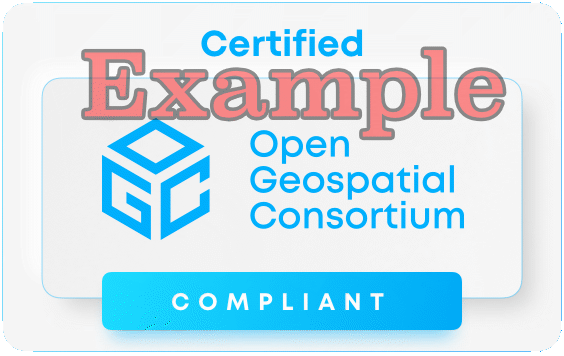

# Compliance and certification

{width="40.0%"}

The [OGC Compliance Program](https://www.ogc.org/compliance) provides the resources, procedures, and policies to certify products for compliance with one or more OGC standards. 

The primary purpose of the program is to increase systems interoperability while reducing technology risks by providing a process whereby compliance with OGC standards can be tested.

You can browse the [OGC compliance product page](https://www.ogc.org/resources/certified-products/) to check the list of products certified by OGC.

## TEAM Engine

In order to be certified, a product needs to passed the tests on the OGC validator. The OGC validation infrastructure is based on [TEAM Engine](https://github.com/opengeospatial/teamengine), a Free and Open Source tool which is being incubated as an [OSGeo project](https://www.osgeo.org/projects/teamengine/). 

Developers can either use the hosted version of TEAM Engine on CITE, or install it/ integrate it into their own pipeline. 

!!! note "OGC API Test Suites"
    We will refer to the available test suites in the context of each standard, during the OGC API Deep Dive.

## Reference implementations

A reference implementation (RI) is a fully functional, licensed copy of a tested, branded software that has passed the test for an associated conformance class in a version of an Implementation Standard and that is free and publicly available for testing via a web service or download. 

* RI do not need to comply to all the conformance classes in the standard, but they should conform at least to the core.
* RI should be available, on a reliable server that has a high treshold for uptime.
* OGC will provide an incentive to the first two RI that pass the test related to a conformance class within a version of an Implementation Standard

More information about RI is available on [Compliance Testing Program Policies & Procedures](https://docs.ogc.org/pol/08-134r11.html#toc26). 

<table style="width:80%; border:0;">
  <tr>
    <td></td>
    <td></td>
    <td></td>
   </tr>
 </table>
