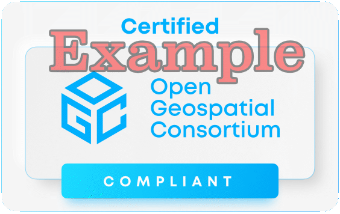

# Conformidade e certificação

{width="40.0%"}

O [Programa de Conformidade da OGC](https://www.ogc.org/compliance) fornece os recursos, procedimentos e políticas para certificar produtos em conformidade com um ou mais padrões da OGC.

A finalidade principal do programa é aumentar a interoperabilidade entre sistemas, reduzindo simultaneamente os riscos tecnológicos, ao proporcionar um processo pelo qual a conformidade com os padrões da OGC pode ser testada.

Pode consultar a [página de produtos de conformidade da OGC](https://portal.ogc.org/public_ogc/compliance/compliant.php?display_opt=1&org_match=Crunchy+Data) para verificar a lista de produtos certificados pela OGC.

## TEAM Engine

Para ser certificado, um produto precisa de passar nos testes do validador da OGC. A infraestrutura de validação da OGC baseia-se no [TEAM Engine](https://github.com/opengeospatial/teamengine), uma ferramenta Livre e de Código Aberto que está a ser incubida como um [projeto OSGeo](https://www.osgeo.org/projects/teamengine/).

Os programadores podem usar a versão alojada do TEAM Engine no CITE, ou instalar e integrar localmente na sua própria pipeline.

!!! note "Suites de teste da OGC API"
    Vamos referir-nos às suites de teste disponíveis no contexto de cada padrão, durante a OGC API Deep Dive.

## Implementações de referência

Uma implementação de referência (IR) é uma cópia totalmente funcional, licenciada, de um software testado e de marca, que tenha passado no teste para uma classe de conformidade associada numa versão de um Padrão de Implementação, e que seja gratuito e publicamente disponível para testes através de um serviço web ou descaga.

* As IR não precisam de estar em conformidade com todas as classes de conformidade do padrão, mas deverão estar pelo menos em conformidade com o núcleo.
* As IR deverão estar disponíveis, num servidor fiável que tenha um limiar alto de tempo de atividade.
* A OGC vai fornecer um incentivo às duas primeiras IR que passem no teste relacionado com uma classe de conformidade dentro de uma versão de um Padrão de Implementação

Mais informações sobre IR estão disponíveis nas [Políticas e Procedimentos do Programa de Testes de Conformidade](https://docs.ogc.org/pol/08-134r11.html#toc26).

<table style="width:80%; border:0;">
  <tr>
    <td></td>
    <td></td>
    <td></td>
   </tr>
 </table>

## Resumo

A conformidade e certificação da OGC fornecem a uma organização um nível de confiança de que um produto foi considerado compatível para
máxima interoperabilidade face a um dado especificação da OGC.
