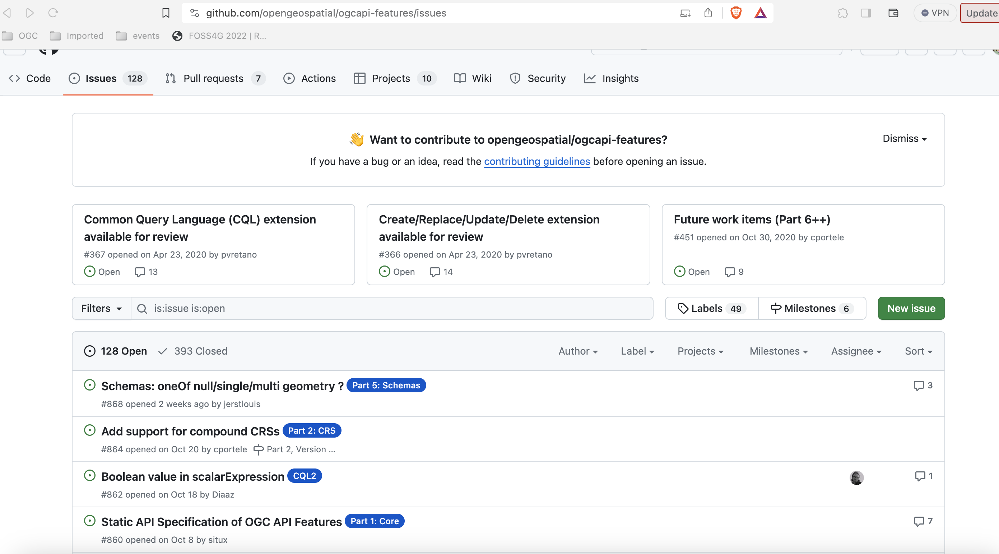
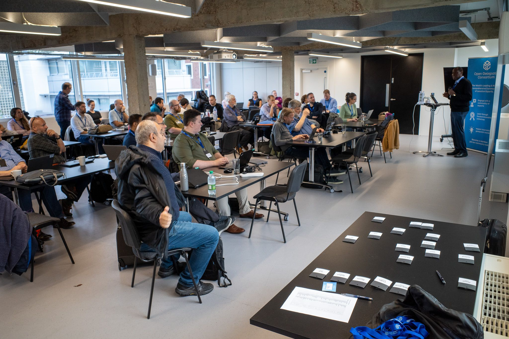
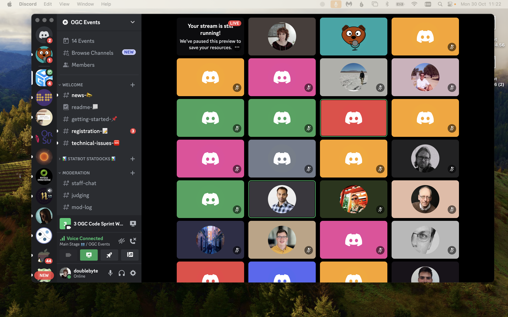

# Getting involved

There are different ways to get involved with the development of OGC API. If you want to attend the Working Group meetings, and take part of the most formal component of standards development (including voting), you need to be an [OGC member](https://www.ogc.org/join/). However there are other opportunities to get involved that do not require an OGC membership. We present some of those bellow.

## Specifications / GitHub

Most of the OGC API development takes place on public [GitHub repositories](https://github.com/orgs/opengeospatial/repositories?q=ogcapi&type=all&language=&sort=). This means anyone can follow the development of the standards, from their early stages and even contribute through the usual git mechanisms (e.g.: issue tracker, pull requests)

{width="100.0%"}

## OGC Code sprints

The OGC Code sprints are an important part of the standards development process, as they provide a feedback loop from the developer community. During these events, working group members and developers join forces towards the common goal of pushing the standards development forward. This is done through discussions and prototyping. These are some characteristics of code sprints:

* Held regularly (around three times a year).
* Three-day collaborative, virtual/hybrid, events.
* Inclusive to all OGC standards.
* Often co-organised with alliance partners (e.g.: [ISO](https://www.iso.org/home.html), [OSGeo](https://www.osgeo.org/), [ASF](https://www.apache.org/)).
* Feature developers from across the globe.
* Feature a mentor stream, to onboard newcomers.
 
{width="100.0%"}

!!! note "Not *only* code!"
    Although most of the participants spend time coding (that is "why" it is called a code sprint, after all), we also welcome no-code activities, such as working on documentation, testing or GitHub issues.

## OGC Events discord server

The [OGC Events discord server](https://discord.gg/3uyaZZuXr3) provides a platform for running the code sprints. Its channel structure, facilitates focused discussions and we leverage the audio channels to run the code sprint meetings. In between code sprints, the discord server also provides a meeting place to discuss topics related to OGC standards development and implementations.

{width="100.0%"}

## Developer resources

You can learn more about the OGC API (and other OGC standards), from a developer-centric perspective in the OGC developer website:

<https://developer.ogc.org>

You can learn more about past and upcoming developer events (including code sprints) in the developer events wiki page:

<https://github.com/opengeospatial/developer-events/wiki>
