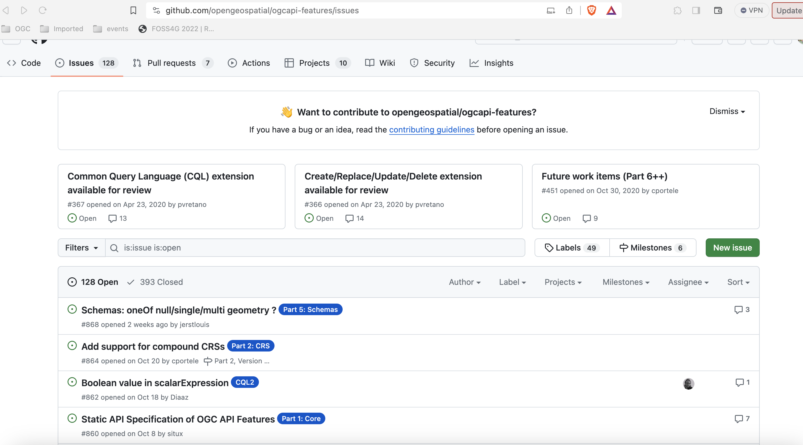
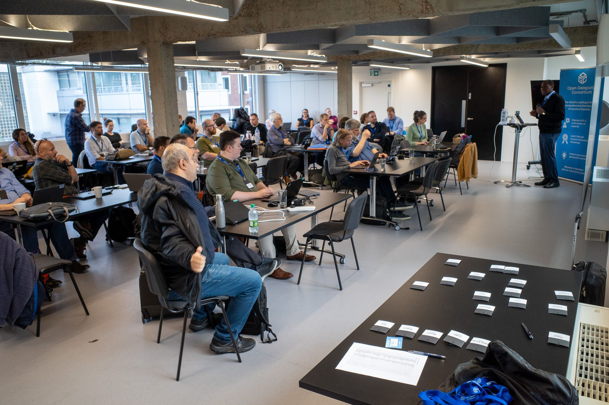
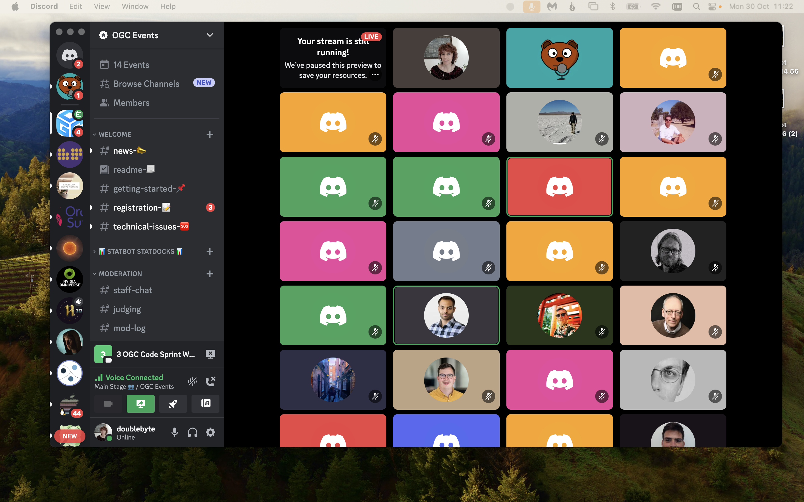

# Como participar

Existem inúmeras formas de se envolver no desenvolvimento das OGC APIs. Se pretende participar nas reuniões do Grupo de Trabalho de Padrões (SWG), e fazer parte do componente mais formal do desenvolvimento de padrões (incluindo votação), é necessária uma [adesão ao OGC](https://www.ogc.org/join/). No entanto, existem outras oportunidades para se envolver que não requerem adesão ao OGC. Apresentamos algumas delas abaixo.

## Especificações / GitHub

A maior parte do desenvolvimento de OGC API tem lugar em [repositórios públicos no GitHub](https://github.com/orgs/opengeospatial/repositories?q=ogcapi&type=all&language=&sort=). Isto significa que qualquer pessoa pode acompanhar o desenvolvimento dos padrões, desde as suas fases iniciais e até contribuir através dos mecanismos habituais (e.g.: rastreador de issues, pull requests)

{width="100.0%"}

## Code sprints do OGC

Os Code sprints do OGC são uma parte importante do processo de desenvolvimento de padrões, uma vez que proporcionam um ciclo de feedback da comunidade de desenvolvedores. Durante estes eventos, membros do grupo de trabalho e desenvolvedores juntam forças rumo ao objetivo comum de impulsionar o desenvolvimento de padrões para a frente. Isto é feito através de discussões e prototipagem. Estas são algumas características dos code sprints:

* Realizados regularmente (cerca de três vezes por ano)
* Eventos colaborativos, virtuais/híbridos, de três dias
* Inclusivos para todos os padrões do OGC
* Frequentemente co-organizados com parceiros da aliança (e.g.: [ISO](https://www.iso.org/home.html), [OSGeo](https://www.osgeo.org/), [ASF](https://www.apache.org/))
* Com desenvolvedores de todo o mundo
* Incluem um fluxo de mentoria, para integrar novos participantes
 
{width="100.0%"}

!!! note "Não *apenas* código!"
    Embora a maior parte dos participantes passe tempo a codificar (é "por isso" que se chama code sprint, afinal), também damos boas-vindas a atividades sem código, como trabalhar em documentação, testes ou issues do GitHub.

## Servidor Discord dos Eventos do OGC

O [servidor Discord dos Eventos do OGC](https://discord.gg/3uyaZZuXr3) fornece uma plataforma para realizar os code sprints. A sua estrutura de canais, facilita discussões focadas e aproveitamos os canais de áudio para realizar as reuniões dos code sprints. Entre code sprints, o servidor Discord também fornece um local de encontro para discutir tópicos relacionados com desenvolvimento e implementações de padrões do OGC.

{width="100.0%"}

## Recursos para desenvolvedores

Pode aprender mais sobre a OGC API (e outros padrões do OGC), numa perspetiva centrada no desenvolvedor, no site de desenvolvedores do OGC:

<https://developer.ogc.org>

Pode aprender mais sobre eventos de desenvolvedores passados e futuros (incluindo code sprints) na página wiki de eventos de desenvolvedores:

<https://github.com/opengeospatial/developer-events/wiki>
