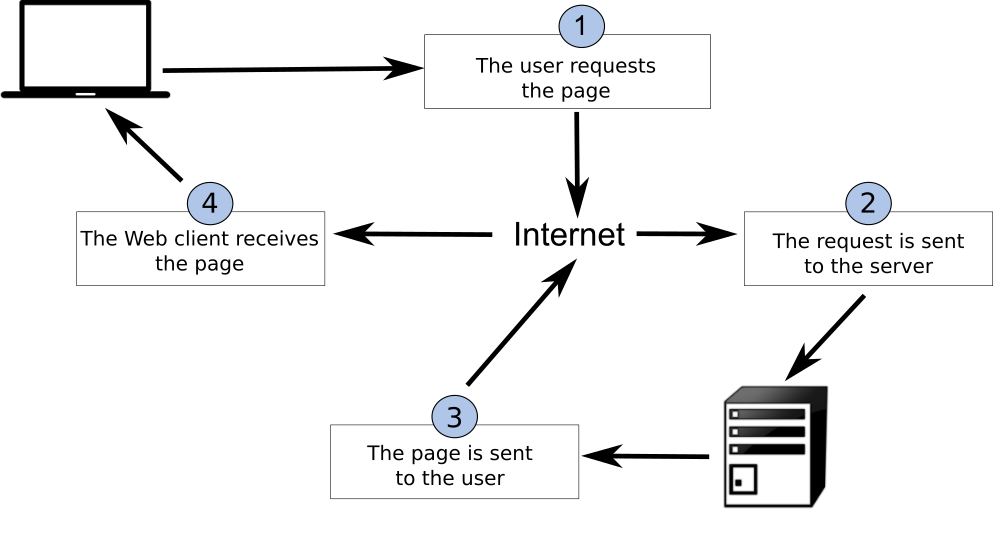
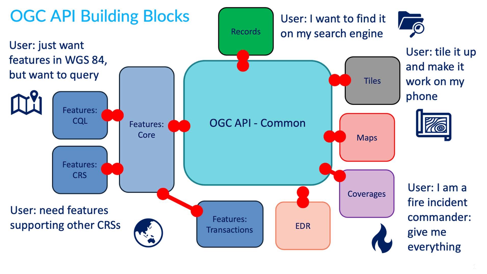
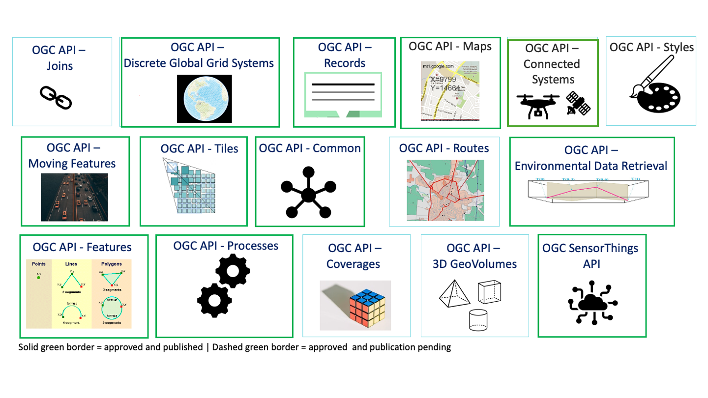

# Visão geral e conceitos principais

O cerne das APIs Web pode ser resumido como:

- interfaces: a forma como se estabelecem "conversações" entre as APIs e os clientes das mesmas
- codificações: os "formatos" dos conteúdos fornecidos por uma API

## Cliente / servidor

Num ambiente típico de cliente / servidor, um cliente pede a um servidor para executar uma ação (por exemplo, solicitar dados), com a capacidade de adicionar instruções adicionais, como consultas, filtragem e qual formato a API deve fornecer como parte da resposta.

A imagem abaixo, retirada de [Introdução ao SIG](https://volaya.github.io/gis-book/en/), ilustra
o conceito do ciclo de vida de pedido / resposta entre um cliente e um servidor.

{width="80.0%"}

## Arquitetura Web

### REST

A Transferência de Estado Representacional (REST, do inglês *REpresentational State Transfer*) é um estilo arquitetónico para a Web. Os conceitos fundamentais do REST são:

- verbos HTTP (GET/PUT/POST/DELETE)
- códigos HTTP (200, 201, 404, etc.)
- URIs para identificar recursos
- Negociação de conteúdo (tipos de conteúdo)
- Estado (stateless)

A implementação do REST resulta numa arquitetura mais simples, com barreiras de entrada baixas, baseada em primitivas web. Isto permite que os
sistemas e aplicações se concentrem mais nos requisitos de domínio/negócios.

!!! note "Conheça o seu HTTP!"
    - verbos: <https://http.dev/methods>
    - códigos de estado: <https://http.dev/status>

### JSON

JSON (JavaScript Object Notation) é uma codificação compacta e muito fácil de compreender, muito popular entre
desenvolvedores web. O JSON é a codificação primária utilizada em serviços e APIs web RESTful, sendo por natureza extensível.

Vamos comparar JSON e XML num exemplo simples:

Um exemplo de documento XML (75 bytes):

```xml
<order>
    <orderID>123</orderID>
    <status>completed</status>
</order>
```

O mesmo documento em JSON (46 bytes):

```json
{
  "orderID": 123,
  "status": "completed"
}
```

Aqui, vemos uma representação mais compacta usando JSON. Além disso, é mais fácil determinar os literais do tipo
de dados subjacente (inteiros, strings, etc.) através da análise do próprio documento.

!!! note "Esquema JSON"
    O [JSON Schema](https://json-schema.org) é o equivalente em JSON ao Esquema XML da W3C, fornecendo uma linguagem para definir o modelo de conteúdo de
    um documento JSON. Um documento JSON pode optar por implementar um JSON Schema, ou não, dependendo dos requisitos da aplicação em questão
    para validação e integridade de dados.

## OGC APIs

Esta secção fornece uma visão de conjunto da família de padrões da OGC API.

!!! cite

    A família de padrões OGC API está a ser desenvolvida para facilitar a qualquer pessoa o fornecimento de dados geoespaciais à web. Estes padrões constroem sobre a herança dos padrões de Serviços Web da OGC (WMS, WFS, WCS, WPS, etc.), mas definem APIs centradas em recursos que aproveitam as práticas modernas de desenvolvimento web. Esta página web fornece informação sobre estes padrões num local consolidado.

    Estes padrões estão a ser construídos como "blocos de construção" que podem ser utilizados para montar APIs inovadoras para acesso web a conteúdo geoespacial. Os blocos de construção não são definidos apenas pelos requisitos dos respetivos padrões, mas também através de prototipagem e testes de interoperabilidade no Programa de Inovação da OGC.

### OGC API - Common

A [OGC API - Common](https://ogcapi.ogc.org/common/) é um quadro comum utilizado em todas as APIs da OGC.
A OGC API - Common fornece as seguintes funcionalidades:

- baseada na especificação [OpenAPI 3.0](https://spec.openapis.org/oas/latest.html)
- HTML e JSON como codificações dominantes, sendo possíveis codificações alternativas
- endpoints comuns e partilhados, tais como:
    - `/` (página de aterragem)
    - `/conformance`
    - `/openapi`
    - `/collections`
    - `/collections/foo`
- aspetos comuns, como paginação, ligações entre recursos, filtragem básica, parâmetros de consulta (`bbox`, `datetime`, etc.)

A OGC API - Common permite aos desenvolvedores de especificações concentrarem-se na funcionalidade principal de uma dada API (isto é, acesso a dados, etc.)
enquanto utilizam construções comuns. Isto harmoniza os padrões da OGC API e permite uma integração mais profunda com menos código. Isto também
permite que o software cliente da OGC API seja mais eficiente.

Para mais detalhes sobre este padrão, consulte a [secção OGC API - Common](https://ogcapi-workshop.ogc.org/api-deep-dive/common/).

### Padrões aprovados

Os seguintes padrões OGC API foram aprovados e estão disponíveis para utilização. Note que estes padrões têm 1 ou mais "Partes" ou extensões que permitem funcionalidades específicas. A "Parte 1" de um dado padrão representa as capacidades mais básicas. Partes adicionais também podem ser implementadas como [blocos de construção](#blocos-de-construcao-da-ogc-api).

- A [OGC API - Features](https://ogcapi.ogc.org/features) oferece a capacidade de criar, modificar e consultar dados espaciais na Web e especifica requisitos e recomendações para APIs que pretendam seguir uma maneira padrão de partilhar dados de entidades
- A [OGC API - Environmental Data Retrieval](https://ogcapi.ogc.org/edr) fornece um conjunto de interfaces leves para aceder a recursos de Dados Ambientais. Cada recurso endereçado por uma API EDR corresponde a um padrão de consulta definido
- A [OGC API - Maps](https://ogcapi.ogc.org/maps) oferece uma abordagem moderna ao padrão Web Map Service (WMS) da OGC para a prestação de mapas e conteúdo raster
- A [OGC API - Processes](https://ogcapi.ogc.org/processes) permite que ferramentas de processamento sejam chamadas e combinadas a partir de múltiplas fontes e aplicadas a dados em outros recursos da OGC API através de uma API simples
- A [OGC API - Tiles](https://ogcapi.ogc.org/tiles) fornece funcionalidade estendida a outros Padrões da OGC API para entregar tiles vetoriais, tiles de mapas e outros dados em tiles
- A [OGC API - Moving Features](https://ogcapi.ogc.org/movingfeatures) define uma API que fornece acesso a dados que representam entidades que se deslocam como corpos rígidos
- A [OGC API - Records](https://ogcapi.ogc.org/records) fornece descoberta e acesso a metadados sobre recursos geoespaciais
- A [OGC API - Discrete Global Grid Systems](https://ogcapi.ogc.org/dggs) permite que aplicações organizem e acedam a dados organizados de acordo com um Sistema de Grelha Global Discreta (DGGS)
- A [OGC API - Connected Systems](https://ogcapi.ogc.org/connectedsystems/) pretende atuar como uma ponte entre dados estáticos (entidades geográficas e de outros domínios) e dados dinâmicos (observações das propriedades dessas entidades, e comandos/atuadores que alteram essas propriedades)

### Blocos de construção da OGC API

A abordagem da OGC API permite a modularidade e a "perfuração" de APIs consoante os vossos requisitos. Isto significa que
pode misturar e combinar OGC APIs entre si.



Pode ler mais sobre este tópico no [sítio web de blocos de construção](https://opengeospatial.github.io/bblocks/).

### Em desenvolvimento

O esforço da OGC API está a evoluir rapidamente. Inúmeros padrões OGC API estão em desenvolvimento:

- A [Routes](https://ogcapi.ogc.org/routes) fornece acesso a dados de rotas
- A [Styles](https://ogcapi.ogc.org/styles) define uma API Web que permite a servidores de mapas, clientes, bem como editores de estilos visuais, gerir e obter estilos
- A [3D GeoVolumes](https://ogcapi.ogc.org/geovolumes) facilita a descoberta eficiente e o acesso a conteúdo 3D em múltiplos formatos com base numa perspetiva centrada no espaço
- A [Joins](https://ogcapi.ogc.org/joins) suporta a junção de dados, a partir de múltiplas fontes, com coleções de entidades ou diretamente com outros ficheiros de entrada



### OpenAPI

O cerne da OGC API - Common é a [iniciativa OpenAPI](https://www.openapis.org/about) para ajudar
a descrever e documentar uma API. O OpenAPI define a sua estrutura num documento OpenAPI.
A OGC API - Common sugere que este documento esteja localizado em `/openapi`. Por exemplo, com o [pygeoapi](https://pygeoapi.io), num navegador
[a esta URL](https://demo.pygeoapi.io/master/openapi) abre-se uma página HTML interativa que facilita
a consulta da API. Adicione `?f=json` para ver o documento em JSON. O documento OpenAPI indica quais
os endpoints disponíveis no serviço, quais os parâmetros que aceita e
que tipos de resposta podem ser esperados. O documento OpenAPI é um conceito semelhante ao XML de Capacidades
como parte dos padrões de Serviços Web da OGC de primeira geração.

!!! question "Análise da Especificação OpenAPI num navegador"

    Uma abordagem comum para interagir com APIs Open utilizando JSON é usar um programa como
    o [Postman](https://www.postman.com/). Também existem plugins para navegadores que permitem definir pedidos de API
    de forma interativa dentro do navegador. Para o Firefox, descarregue o plugin
    [poster](https://pluginsaddonsextensions.com/mozilla-firefox/poster-mozilla-addon). Para Chrome
    e Edge, utilize o [Boomerang](https://microsoftedge.microsoft.com/addons/detail/boomerang-soap-rest-c/bhmdjpobkcdcompmlhiigoidknlgghfo?hl=en-US).
    No Boomerang, pode criar pedidos web individuais, mas também carregar o documento de especificação
    open api e interagir com qualquer um dos endpoints anunciados.

A comunidade OpenAPI fornece várias ferramentas, como um validador para documentos OAS ou
[gerar código](https://swagger.io/tools/swagger-codegen/) como ponto de partida para o desenvolvimento de clientes.

## Padrões de conteúdo e formato

As OGC APIs são normalmente agnósticas quanto ao formato dos dados. Isto significa que uma OGC API pode fornecer qualquer formato de dados
ou metadados (JSON, YAML, XML, HTML, etc.).

O JSON é um formato central que é legível por máquina e fácil de analisar e tratar
por software cliente e ferramentas. O JSON é facilmente decodificado/encoded em objetos nativos em inúmeras
linguagens de programação (dicionários Python, objetos JavaScript, etc.). A OGC API - Common fornece
formatos JSON uniformes para os vários endpoints que suporta.

Padrões específicos da OGC API podem especificar formatos específicos de domínio (por exemplo,
GeoJSON para OGC API - Features, GeoTIFF para OGC API - Coverages, ISO 19115/19139 para OGC API - Records, etc.),
dependendo do(s) tipo(s) de dados ou metadados.

## Resumo

As OGC APIs aproveitam os princípios fundamentais da arquitetura Web, proporcionando suporte para descoberta, acesso, visualização, processamento
de dados geoespaciais, em conformidade com padrões do setor, para máxima interoperabilidade na Web.
