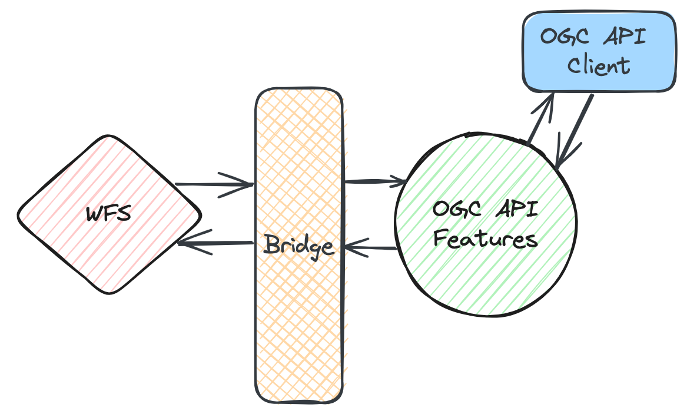

# Transição e migração

De acordo com as [Políticas e Procedimentos do Comité Técnico da OGC](https://docs.ogc.org/pol/05-020r29/05-020r29.html), se um Padrão existente for substituído, parcial ou totalmente, por um ou mais novos Padrões, então um caso especial de depreciação pode ocorrer, resultando no Padrão original ser rotulado como "Padrão Legado".

Poderá ser este o caso de muitos [padrões OWS](https://developer.ogc.org/ows.html), uma vez que estão a ser substituídos por OGC APIs mais modernas e mais completas.

Assim como com os Padrões depreciados, os Padrões Legados já não são suportados, mas permanecem no sítio web da OGC com uma notificação de que as capacidades do Padrão foram substituídas, total ou parcialmente, por novos Padrões. A notificação indicará claramente que o Padrão Legado não é inválido, mas que novas implementações das capacidades do Padrão serão melhor servidas pelos novos Padrões identificados.

Na [Workshop Diving into pygeoapi](https://dive.pygeoapi.io), pode encontrar
uma secção sobre o [uso de pontes para facilitar a migração de OWS para OGC
API](https://dive.pygeoapi.io/advanced/bridges/).

{width="80.0%"}
