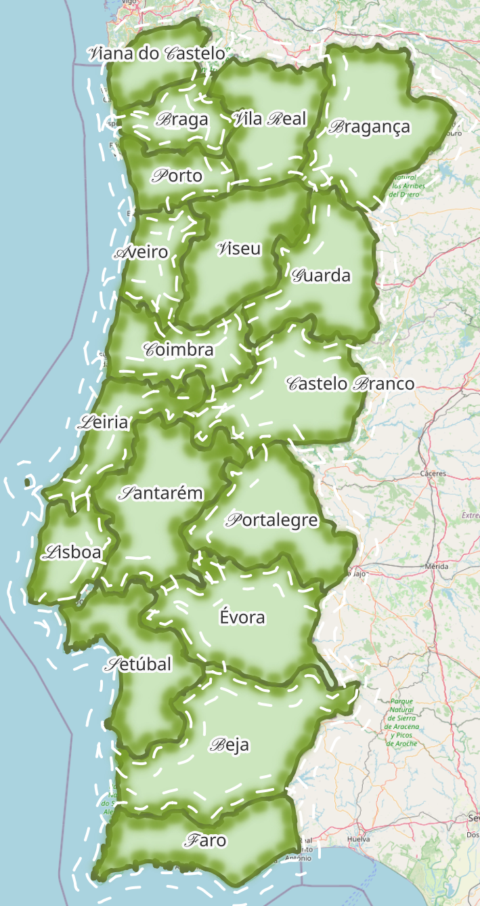
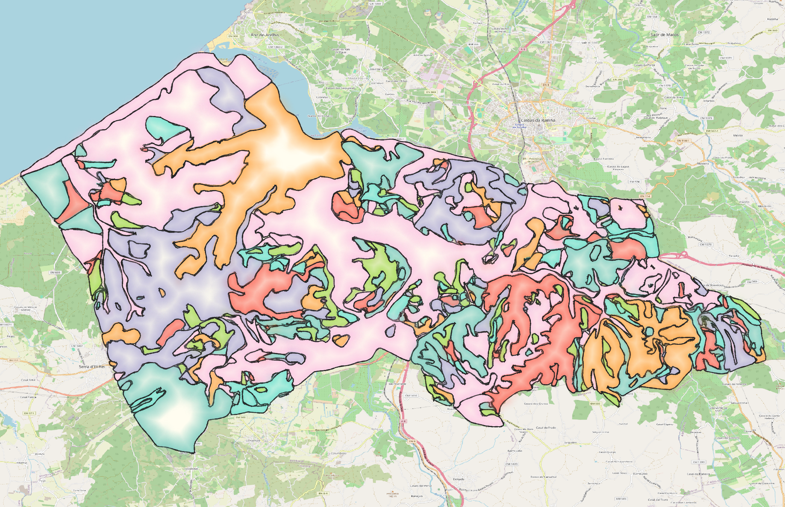
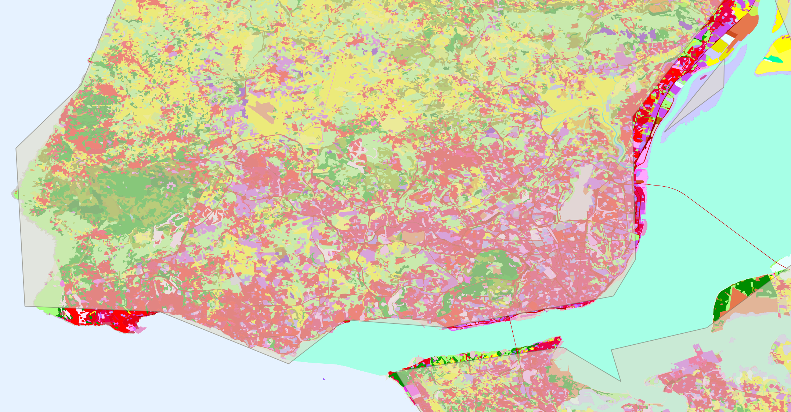
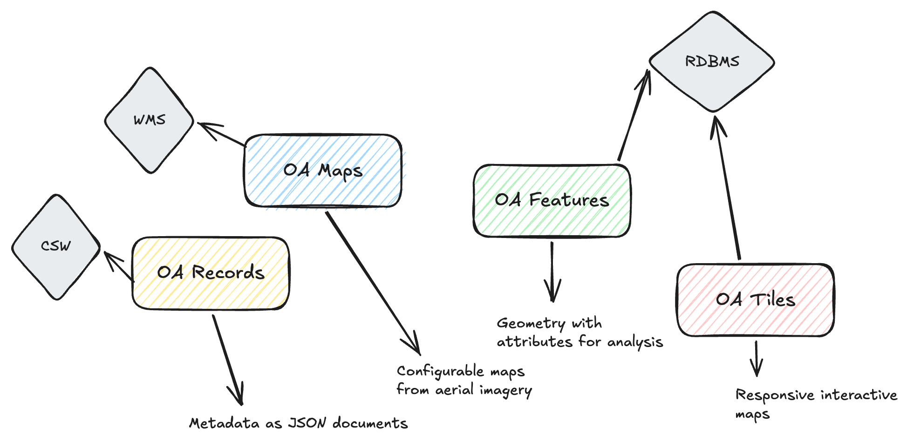
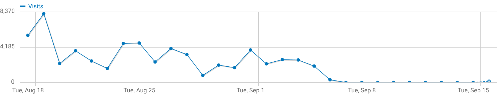

# Use Cases

This section compiles use cases that illustrate the application of OGC API to solve real world problems. If you know of a use case that should be featured here, please contribute through a [Pull Request](https://github.com/opengeospatial/ogcapi-workshop/pulls).

## Direção-Geral do Território (DGT)

|  Description | URL  |
|---|---|
| Landing Page  | https://ogcapi.dgterritorio.gov.pt/  |
| Conformance declaration | https://ogcapi.dgterritorio.gov.pt/conformance |
| API documentation | https://ogcapi.dgterritorio.gov.pt/openapi |
| User facing documentation (Portuguese) | https://dgterritorio.github.io/ogcapi-user/ |

DGT is the Portuguese national mapping agency, producing authoritative geospatial information as Open Data.

Its datasets include: cadastral information, administrative limits, road network and other critical datasets that are reused by public and private parties. It also publishes high resolution satellite and aerial imagery for the entire country.

From 2024 DGT started publishing its datasets as APIs, following the [High Value Dataset Directive](https://eur-lex.europa.eu/eli/reg_impl/2023/138/oj/eng).

<!-- | [NUTSIII](https://ogcapi.dgterritorio.gov.pt/collections/nuts3/items) | [CRUS](https://ogcapi.dgterritorio.gov.pt/collections/crus) |
|:--:|:--:|
|  |  |
  -->
{width="100.0%"}

The 70+ datasets are published using the following standards:

* **OGC API - Features**: for feature data such as roads, administrative limits, cadastral information, etc.
* **OGC API - Tiles**: the same feature data is published as vector tiles, to enable responsive web mapping applications.
* **OGC API - Maps**: for raster data, such as satellite images or aerial photography.
* **OGC API - Records**: for metadata records of every dataset.

{width="100.0%"}

In the diagram above, the parts in gray illustrate components of the system that existed prior to the OGC API deployment. See [Transition and Migration](./transition-and-migration.md) for more details about migrating from a OW*s SDI to a OGC API SDI.

The DGT OGC API deployment receives more than 4k visits per day.

{width="100.0%"}